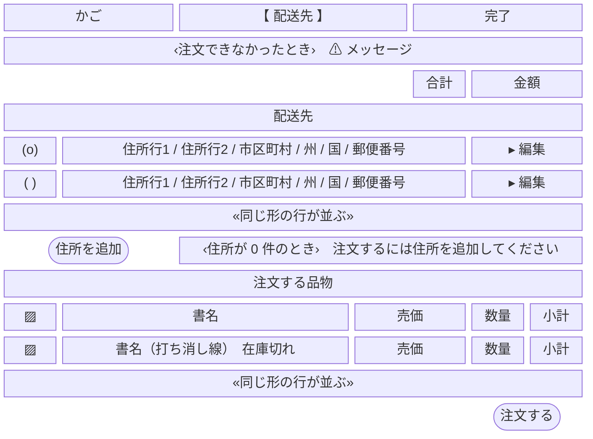
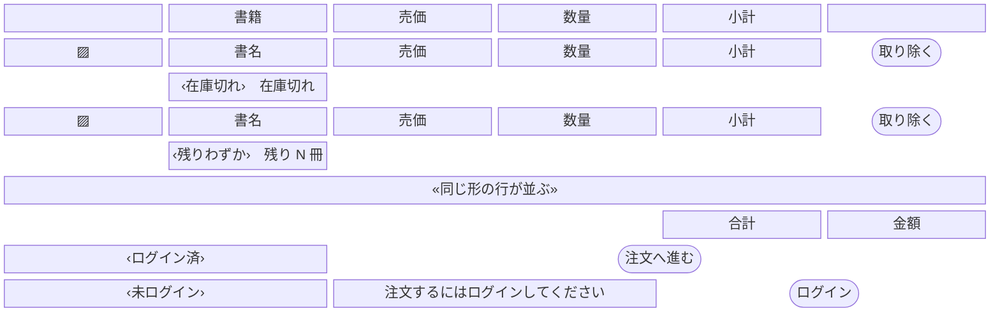
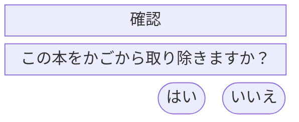

# 実験：Mermaid で版面を描く

[本書式](README.md) §3.1 は「ASCII の罫線で描く。**図の生成器を使わない**」と定めている。
本書はその規約に対する変更案であり、[HTML の実験](EXPERIMENT-html.md)と同じ 2 枚を Mermaid で描いたものである。

> **これは正ではない。** 版面の正は [customer/](customer/) の各ファイルである。
> 採用する場合は README §3 を書き換え、本書は破棄する。

本書の図は**実際に描画して確認した上で載せている**。描画結果を見ずに構文だけを整えると、
後述する入れ子の破綻を見落とす。

## 1. 図種と構文

Mermaid の図種のうち、**版面に使える可能性があるのは `block-beta` だけ**である。

| 図種 | 版面に使えるか |
| --- | --- |
| `flowchart` / `graph` | 使えない。配置を自動決定するため、要素の順序も並びも作者が決められない |
| `block-beta` | **列数と占有幅を宣言できる唯一の図種**。以下はこれで描く |
| その他（`sequence`, `class`, `er` 等） | 対象が違う |

宣言キーワードは **`block-beta`** である。Mermaid の最新の文書は `block` と書いているが、
現行の描画系では構文誤りになる（実際に両方を描画して確認した）。**版に依存する。**

### 1.1 入れ子は使えない

`block:id ... end` で領域を入れ子にし、内側に別の `columns` を持たせる書き方は、
**描画すると箱が重なり、ラベルが途中で切れる**。`SCR-CHECKOUT` の配送先の行は
「住所行1 / 住所行2 / 市区町村 / 州 / 国」までしか出ず、郵便番号が消えた。

そのため本書の版面は、**画面全体を一つの平坦なグリッドで組んでいる**。
これは回避策であって、選んだ設計ではない。代償は [§5.2](#52-失ったもの) に挙げる。

## 2. 記法の対応

[README §3.2](README.md) の記法を `block-beta` の語彙に割り当てたもの。

| 意味 | ASCII | Mermaid | 表せるか |
| --- | --- | --- | --- |
| ボタン | `[ 保存 ]` | `id(["保存"])`（角丸） | ○ 形で区別でき、描画でもボタンに見える |
| 列の重み | 罫線の長さ | `id["…"]:n`（占有列数） | ○ 単一グリッドの中でなら効く |
| 空き | 空白 | `space` / `space:n` | ○ 右寄せもこれで作れる |
| 画像 | `▨` | `id["▨"]` | ○ |
| リンク | `▸ 詳細` | `id["▸ 詳細"]` | △ 文字で示すだけ |
| 繰り返し | `« … »` | `id["« … »"]` | △ 文字で示すだけ |
| 条件付き | `‹ … ›` | `id["‹ … ›"]` | △ 文字で示すだけ |
| ラジオ・チェック | `(o) ( )` | 文字として書く | △ |
| 領域の入れ子 | 罫線 | `block:id ... end` | **✗ 描画が破綻する（§1.1）** |
| 自由入力 | `[__________]` | **無い** | ✗ 表示項目と同じ箱になる |
| 選択 | `[ 選択 v]` | **無い** | ✗ 同上 |
| 打ち消し | 無い | **無い** | ✗ |
| 確認ダイアログ | 本文の後に別枠 | 別の図として描く | ✗ 重ねられない |

---

## 3. SCR-CHECKOUT — 配送先の選択と注文確定

項目と操作は [UC-CUST-12](../use-cases/customer-checkout.md#uc-cust-12--配送先を選んで注文する) の【Boundary】節が正である。
[ASCII 版](customer/SCR-CHECKOUT.md)と同じ要素を同じ順序で並べている。

3 つの領域（進行・配送先・注文する品物）は列の割り方が違うが、入れ子が使えないため
**10 列の単一グリッドを全領域で共有**し、領域ごとの列境界を占有幅で表している。

在庫切れの明細は `~~書名~~` に当たる書き方が無く、**「（打ち消し線）」と文字で書くほかなかった**。

## 4. SCR-CART — 買い物かご

項目と操作は [UC-CUST-06](../use-cases/customer-cart.md#uc-cust-06--かごの中身を確認する) /
[UC-CUST-07](../use-cases/customer-cart.md#uc-cust-07--かごから取り除く) の【Boundary】節が正である。

在庫の断りを書名の下に入れる形（`space` ＋ 1 マス ＋ `space:4`）は素直に効く。
**この画面は Mermaid でもよく描ける。** 表が 1 つで、領域の入れ子が無いためである。

取り除くときの確認。**別の図として描くほかない**（版面の中に重ねられない）。

---

## 5. 評価

### 5.1 得たもの

| 点 | 内容 |
| --- | --- |
| **GitHub が素で描画する** | サニタイザを通らない。[screens.md](../screens.md) で既に使っている記法で、新しい依存が増えない |
| **桁合わせが要らない** | ASCII の全角桁数を数える作業が消える |
| **列の重みが宣言になる** | `書名:5` と `数量:1` が描画に反映される。**相対的な重みは表せる** |
| **ボタンが形で区別される** | 角丸 `(["…"])` は描画でもボタンに見える。ASCII の `[ … ]` と一対一で対応する |
| **差分が読める** | 1 行 1 行が版面の 1 行に対応し、`git diff` で追える。ここは HTML より明確に良い |

### 5.2 失ったもの

| 点 | 内容 |
| --- | --- |
| **入力項目と表示項目が見分けられない** | `[__________]` `[ 選択 v]` に当たる形が無く、どちらも同じ箱になる。`SCR-ADDRESS-EDIT` や `SCR-RESALE-NEW` のような入力主体の画面は**版面として成立しない**。13 枚中 2 枚が書けない |
| **領域を入れ子にできない** | §1.1 のとおり描画が破綻する。回避策として全領域が単一グリッドを共有するため、**ある領域の列を変えると無関係な領域の見た目が動く**。領域の独立性が失われる |
| **打ち消し線が書けない** | ASCII と同じ穴が残る |
| **確認ダイアログを重ねられない** | 別の図に分けるほかなく、「呼ばれるまで出ない」ことは表せない |
| **縦の比率が作れない** | 行の高さが一定で、どの行も同じ高さの箱になる。1 画面が縦に長い画像になり、**版面としての縦の重みが表せない** |
| **すべてが同じ箱になる** | 罫線は表の枠と領域の枠を描き分けられるが、`block-beta` は見出しも明細も同じ矩形になる |
| **版依存がある** | `block-beta` でしか通らず、文書上の `block` は現行の描画系で構文誤りになる。描画系の版が上がると壊れうる |
| **原文が版面に見えない** | ASCII はそのままで版面だが、Mermaid は描画しないと読めない |

### 5.3 所見

**画面による。** これが 3 書式の中で Mermaid だけに出た性質である。

| 画面の性質 | Mermaid の可否 |
| --- | --- |
| 一覧・表が 1 つで、領域が入れ子にならない（`SCR-CART`, `SCR-ORDERS`, `SCR-WISH`） | **よく描ける** |
| 領域が複数あり、列の割り方が違う（`SCR-CHECKOUT`） | 単一グリッドに畳めば描けるが、領域の独立性を失う |
| 入力が主体（`SCR-ADDRESS-EDIT`, `SCR-RESALE-NEW`） | **描けない**。入力欄を表す形が無い |

書式は画面ごとに選べるものではない。**13 枚のうち 2 枚が書けない時点で、版面の書式としては採れない。**

なお、`screens.md` の画面遷移図で Mermaid が適しているのは、そこで描いているのが**関係**だからである。
遷移図は配置に意味が無いので自動配置でよい。版面は配置そのものが意味である。
`block-beta` はその中間にあり、**配置を宣言できるが、部品の種類を区別できない**。

### 5.4 3 書式の比較

| | ASCII | HTML | Mermaid |
| --- | --- | --- | --- |
| 入力項目と表示項目の区別 | **○** | **○** | ✗ |
| 領域の入れ子 | **○** | **○** | ✗ |
| 列の相対的な重み | ○ | ○ | ○ |
| 縦の重み | ○ | △ | ✗ |
| 打ち消し線 | ✗ | **○** | ✗ |
| 確認ダイアログの出方 | △ | **○** | ✗ |
| 差分が読める | **○** | ✗ | ○ |
| 原文がそのまま版面に見える | **○** | ✗ | ✗ |
| 桁合わせの手間 | ✗ | ○ | ○ |
| GitHub での描画 | ○ | ○（CSS 不可） | ○ |

## 6. 決めること

| 問い | 内容 |
| --- | --- |
| Mermaid の採否 | **採らないことを推す。** 入力主体の画面が書けず、領域の入れ子が壊れる |
| Mermaid の使い道 | 遷移図（`screens.md`）に限る、という線を README §3.1 に明記するか |
| 記法の穴 | 打ち消し線と確認ダイアログを ASCII の記法表（[README §3.2](README.md)）に足すか。**3 書式で唯一 HTML だけが表せた 2 点**である |
| 実験の後始末 | 本書と [EXPERIMENT-html.md](EXPERIMENT-html.md) を破棄するか、判断材料として残すか |
