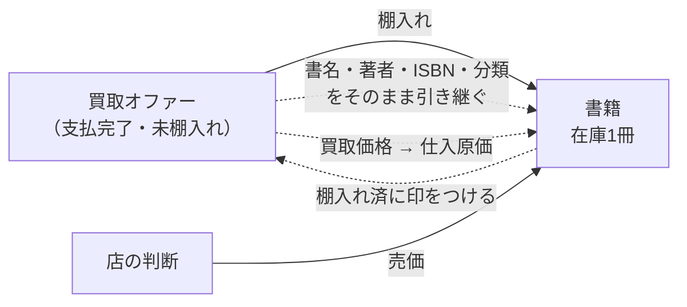
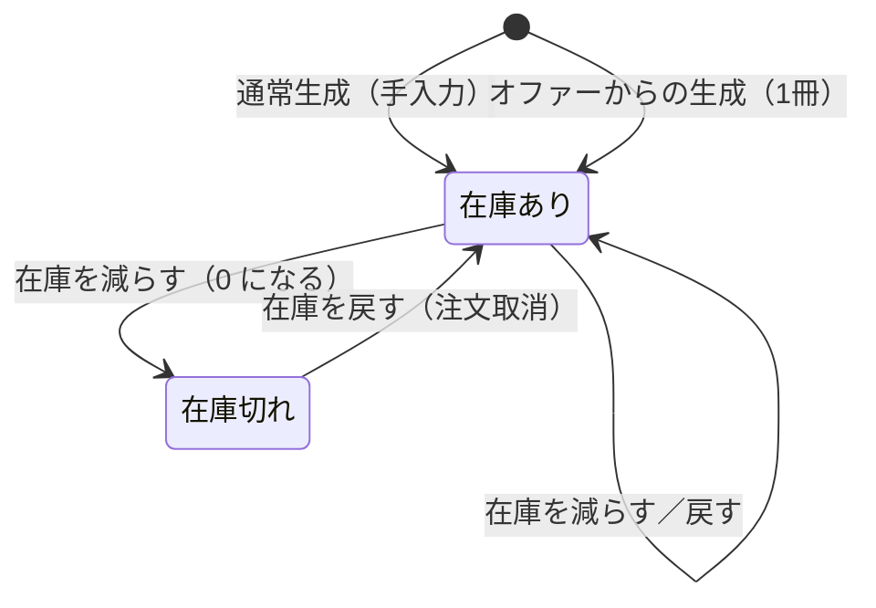

# AGG-BOOK — 書籍集約

## 1. 責務

**販売可能な在庫**を表す。中古書店における「書籍」は書誌情報であると同時に**現物の手持ち**でもあり、
この集約は両方を担う。さらに、その1冊が**いくらで仕入れられたか**を記録することで、
事業の成否（粗利）を測る土台になる。

## 2. 構造

### 2.1 集約ルート: 書籍 (Book)

| 属性 | 論理型 | 要否 | 意味 |
| --- | --- | --- | --- |
| 識別子 | 識別子 | ● | |
| 書名 | テキスト | ● | |
| 著者 | テキスト | ● | |
| ISBN | テキスト | ● | |
| 出版年 | 年 | ○ | |
| 分類 | [VO-CLASSIFICATION](building-blocks.md) | ● | 出版社・書籍種別・ジャンル・状態の4軸 |
| 概要 | テキスト | ○ | |
| 表紙画像 | 外部資源参照 | ○ | |
| 売価 | [VO-MONEY](building-blocks.md) | ● | |
| 在庫数 | [VO-QUANTITY](building-blocks.md) | ● | 0 を許す |
| 供給元オファー | 参照 | ○ | どの買取オファーから生まれたか。手入力の書籍では未設定 |
| 仕入原価 | [VO-MONEY](building-blocks.md) | ○ | 棚入れ時にオファーから写し取った金額。供給元オファーがなければ未設定 |
| （内部数値属性） | | ▲ | 売価・在庫数・仕入原価の素の数（[03](building-blocks.md) §8） |
| （基底属性） | | | [03](building-blocks.md) §1 |

### 2.2 派生属性

| 名称 | 論理型 | 定義 |
| --- | --- | --- |
| 粗利見込 (Margin) | **差額** | 仕入原価が既知なら 売価 − 仕入原価、未知なら未定義 |
| 在庫あり (IsInStock) | 真偽 | 在庫数が 0 でない |
| 在庫僅少 (IsLowInStock) | 真偽 | 在庫数 ≦ しきい値 (5)。**0 を含む** |

### 2.3 定数

| 名称 | 値 | 意味 |
| --- | --- | --- |
| 在庫僅少しきい値 | 5 | 補充判断の基準 |

## 3. 「在庫僅少」が 0 を含む理由

**在庫僅少は仕入担当の関心事**である。「この本は補充の判断が要るか」という問いに対して、
完全に売り切れた本は、残り少ない本と**同じかそれ以上に**補充の判断を要する。
したがって 0 を含めるのが正しい。

一方、読み取りモデルには**別の問い**がある。「どの本が在庫切れに近づいているか」という
分析上の問いであり、こちらは 0 を除外しなければならない。同じ言葉が二つの意味を持たないよう、
読み取り側の概念には**在庫僅少（販売可）**という別名が与えられている
（[13-read-models-and-statistics.md](read-models.md) §2.1）。

## 4. 振る舞い

### 4.1 生成

| 操作 | 引数 | 効果 |
| --- | --- | --- |
| 通常生成 | 書名、著者、ISBN、分類、売価、在庫数、（出版年、概要、表紙画像） | 供給元オファーと仕入原価を持たない書籍を作る |
| **オファーからの生成 (CreateFromOffer)** | オファー、売価、（出版年、概要） | 下記 §4.2 |

### 4.2 オファーからの生成 — 買取と販売の唯一の接点

| 項目 | 引き継ぎ元 |
| --- | --- |
| 書名・著者・ISBN・分類 | オファーの記載をそのまま |
| 在庫数 | **常に 1**（オファーは中古の現物1冊を指すため） |
| 仕入原価 | オファーの買取価格 |
| 供給元オファー | そのオファーの識別子 |
| 売価 | **店の決定**。買取価格から導出されない |
| 出版年・概要 | 棚入れ時に新たに与える（オファーからは引き継がない） |

**この操作はオファーを棚入れ済に変更することを含む**。したがって書籍は
**支払完了かつ未棚入れのオファーからしか生まれない**（[INV-OFFER-05](aggregate-offer.md)）。

> **引き継がれないもの**: オファーの概要 (Summary)、オファーの表紙画像 (FrontUrl)。
> いずれも棚入れ時に改めて与える設計になっている。

### 4.3 在庫の増減

| 操作 | 引数 | 効果 |
| --- | --- | --- |
| 在庫を減らす (ReduceStockLevel) | 数量 | 在庫数から差し引く。**在庫数を超える出庫は拒否** |
| 在庫を戻す (RestoreStockLevel) | 数量 | 在庫数に加える |

在庫を減らす操作が**0 に飽和せず拒否する**のは意図的である。飽和させると、
在庫不足という事実が「常に非負に見える在庫数」の裏に隠れてしまう。

## 5. 不変条件

| 識別子 | 不変条件 | 強制レベル | 根拠 |
| --- | --- | --- | --- |
| `INV-BOOK-01` | 在庫数は 0 以上 | **[強制]** | [VO-QUANTITY](building-blocks.md) が生成時に保証 |
| `INV-BOOK-02` | 売価は 0 以上、通貨最小単位に丸められている | **[強制]** | [VO-MONEY](building-blocks.md) が生成時に保証 |
| `INV-BOOK-03` | 出庫は在庫数を超えられない | **[強制]** | 在庫を減らす操作が拒否する |
| `INV-BOOK-04` | 分類の4軸は検証済みである | **[強制]** | 分類は [VO-CLASSIFICATION](building-blocks.md) 経由でしか設定できない |
| `INV-BOOK-05` | 供給元オファーと仕入原価は、両方あるか両方ないかのいずれか | **[強制]** | 両者は外部から設定できず、オファーからの生成でのみ同時に設定される |
| `INV-BOOK-06` | オファー由来の書籍は在庫 1 冊で生まれる | **[強制]** | オファーからの生成が固定値を用いる |
| `INV-BOOK-07` | 在庫の増減は在庫操作を通じて行われる | **[表明]** | 在庫数は外部から直接代入できる（[ISSUE-01](../issues.md)） |
| `INV-BOOK-08` | 仕入原価は棚入れ後に変化しない | **[強制]** | 外部から設定できない |

## 6. ライフサイクル

**廃棄・削除は存在しない。** 在庫 0 の書籍はカタログに残り続ける。

## 7. 他の集約との関係

| 関係先 | 関係 | 方向 |
| --- | --- | --- |
| AGG-REFDATA | 分類4軸として参照する | 書籍 → 参照データ |
| AGG-OFFER | 棚入れによって生成される／オファーを棚入れ済に変更する | 双方向 |
| AGG-CART | かご明細が書籍を参照し、売価と在庫状況を読む | かご → 書籍 |
| AGG-ORDER | 注文明細が書籍を参照し、注文確定時に在庫を減らし、取消時に在庫を戻す | 注文 → 書籍（**変更を伴う**） |

## 8. 照会

| 照会 | 引数 | 戻り |
| --- | --- | --- |
| 単件取得 | 識別子 | 書籍 |
| 一覧取得（絞り込み） | 絞り込み条件、頁番号、頁サイズ | ページ化された書籍 |
| 一覧取得（検索） | 検索文字列、並べ替えキー、頁番号、頁サイズ | ページ化された書籍 |
| ベストセラー | 件数 | 売れ筋の書籍（注文側から算出） |
| 統計 | — | [RM-BOOK-STATS](read-models.md) |

### 8.1 絞り込み条件

| 条件 | 論理型 | 意味 |
| --- | --- | --- |
| 書名 | テキスト | 部分一致（照合方式はドメイン未定義） |
| 著者 | テキスト | 同上 |
| 出版社／ジャンル／書籍種別／状態 | 参照 | 各軸での絞り込み |
| 在庫僅少 | 真偽 | 在庫数 ≦ しきい値。**在庫切れを含む** |
| 在庫切れ | 真偽 | 在庫数 = 0 のみ |

在庫僅少と在庫切れが別の条件として提供されているのは、
在庫切れだけを見たい呼び出し側に、単に在庫の少ない書籍まで返さないためである。
