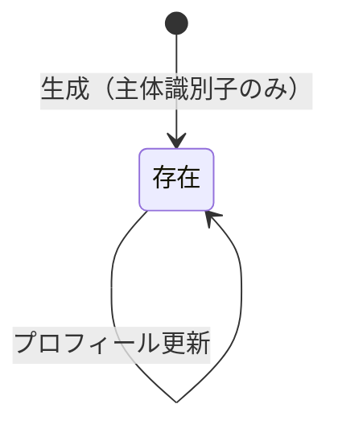
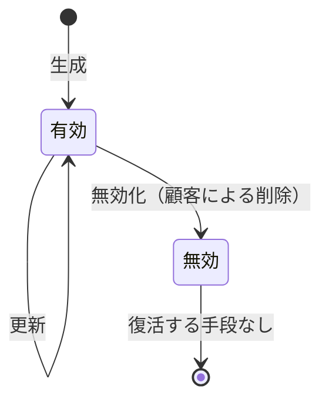
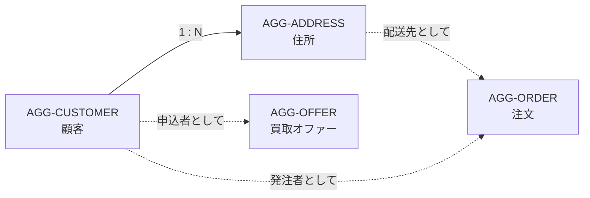

# AGG-CUSTOMER / AGG-ADDRESS — 顧客・住所集約

## 1. 責務

**顧客**は、この店と取引する相手の同一性を表す。買う側にも売る側にもなる。
**住所**は、顧客の配送先を表す。両者は別の集約であり、住所は独自のリポジトリを持つ。

## 2. AGG-CUSTOMER — 顧客集約

### 2.1 集約ルート: 顧客 (Customer)

| 属性 | 論理型 | 要否 | 変更 | 意味 |
| --- | --- | --- | --- | --- |
| 識別子 | 識別子 | ● | 不可 | 内部的な採番 |
| **主体識別子 (Sub)** | テキスト | ● | **不可** | 外部認証基盤が発行した不変の識別子 |
| ユーザ名 | テキスト | ○ | 可 | |
| 名 | テキスト | ○ | 可 | |
| 姓 | テキスト | ○ | 可 | |
| メールアドレス | テキスト | ○ | 可 | |
| 生年月日 | 日時 | ○ | 可 | |
| 電話番号 | テキスト | ○ | 可 | |
| （基底属性） | | | | [共通構成要素](building-blocks.md) §1 |

### 2.2 派生属性

| 名称 | 定義 |
| --- | --- |
| 氏名 (FullName) | 名 と 姓 を空白で連結したもの |

### 2.3 二つの識別子

顧客には**識別子が二つある**。この区別はモデルの理解に不可欠である。

| 識別子 | 発行者 | 用途 |
| --- | --- | --- |
| 主体識別子 (Sub) | 外部認証基盤 | **顧客向けの全操作**がこれで顧客を特定する。注文・オファー・住所の所有者判定 |
| 識別子 (Id) | このシステム | **集約内部の参照**。注文・オファー・住所が保持する外部キー |

顧客向けの操作は主体識別子で入ってきて、集約の識別子に変換される。
この変換を行うのが顧客リポジトリである。

### 2.4 不変条件

| 識別子 | 不変条件 | 強制レベル | 根拠 |
| --- | --- | --- | --- |
| `INV-CUST-01` | 顧客は主体識別子なしには存在できない | **[強制]** | 生成時に必須。主体識別子を持たない生成手段がない |
| `INV-CUST-02` | 主体識別子は生成後変更できない | **[強制]** | 外部から書き換えられない |
| `INV-CUST-03` | 主体識別子以外のすべての属性は未設定を許す | **[強制]** | 定義上すべて任意 |

**INV-CUST-01 が重要な理由**: 主体識別子が後から代入される余地があると、
一瞬でも「認証基盤と結びついていない顧客」が存在しうる。そのような顧客は
どの顧客向け操作からも到達できない孤児になる。

### 2.5 ライフサイクル

**削除は存在しない。**

顧客が生成される契機は二つある。

| 契機 | 操作 | 補足 |
| --- | --- | --- |
| プロフィールの登録・更新 | `CreateOrUpdateCustomerAsync` | 存在しなければ作ってから更新する |
| **住所の登録** | `FindOrCreateAsync` 経由 | 顧客の最初の住所登録が、その顧客のドメインへの初回接触であることが多いため |

注文と買取オファーは、**顧客がすでに存在することを前提とする**。存在しなければ失敗する
（[RULE-SERVICE-01](services-and-policies.md)）。

## 3. AGG-ADDRESS — 住所集約

### 3.1 集約ルート: 住所 (Address)

| 属性 | 論理型 | 要否 | 意味 |
| --- | --- | --- | --- |
| 識別子 | 識別子 | ● | |
| 所有顧客 | 参照 | ● | 生成時に顧客を与える |
| 住所行1 | テキスト | ● | |
| 住所行2 | テキスト | ○ | **唯一の任意項目** |
| 市区町村 | テキスト | ● | |
| 州・都道府県 | テキスト | ● | |
| 国 | テキスト | ● | |
| 郵便番号 | テキスト | ● | |
| 有効フラグ | 真偽 | ● | 既定 有効 |
| （基底属性） | | | [共通構成要素](building-blocks.md) §1 |

### 3.2 振る舞い

| 操作 | 効果 |
| --- | --- |
| 生成 | 顧客と住所各項目を与えて作る。有効な状態で生まれる |
| 無効化 (Deactivate) | 有効フラグを下ろす |

**有効化に戻す操作は存在しない。**

### 3.3 論理削除である理由

住所は**物理的に削除されない**。すでにその住所を配送先として使った注文が、
配送先を失ってしまうためである。注文は住所を識別子で参照しており、
その参照先が消えると注文の記録が不完全になる。

### 3.4 不変条件

| 識別子 | 不変条件 | 強制レベル | 根拠 |
| --- | --- | --- | --- |
| `INV-ADDR-01` | 住所は必ず顧客に属する | **[強制]** | 生成時に顧客を要求する |
| `INV-ADDR-02` | 生成時の住所は有効である | **[強制]** | 既定値が有効 |
| `INV-ADDR-03` | 住所の削除は無効化のみであり、物理的な削除は行われない | **[強制]** | 削除操作が無効化に写像される |
| `INV-ADDR-04` | 有効／無効の切り替えは集約の振る舞いを通じてのみ行われる | **[強制]** | 有効フラグは外部から書き換えられない |
| `INV-ADDR-05` | 住所行2 以外のすべての住所項目は必須 | **[強制]** | 生成時に要求する |
| `INV-ADDR-06` | 注文が参照している住所は、無効化されても注文からは引き続き参照できる | **[強制]** | 物理削除がないため |

### 3.5 ライフサイクル

### 3.6 照会

| 照会 | 引数 | 特徴 |
| --- | --- | --- |
| 単件取得 | **主体識別子**、識別子 | **必ず所有者で絞り込む**。他人の住所は取得できない |
| 一覧取得 | **主体識別子** | 同上 |

住所には**所有者で絞り込まない照会が存在しない**。これは注文・オファーとの重要な違いである
（注文とオファーはスタッフ向けに絞り込まない照会を持つ）。

## 4. 二つの集約の関係

住所は顧客に属するが、**顧客集約の内部エンティティではない**。
独自のリポジトリを持ち、独立に取得・更新される。この選択の是非は
[ISSUE-15](../issues.md) を参照。

## 5. 未定義の事項

| 事項 | 現状 |
| --- | --- |
| 既定の配送先 | 概念なし。注文のたびに住所を指定する |
| 住所の書式検証 | 国・郵便番号の妥当性検査はない |
| 顧客あたりの住所数の上限 | 制限なし |
| メールアドレス・電話番号の書式 | 検証なし |
| 主体識別子の一意性 | ドメインでは強制されない（永続化層の責務） |
