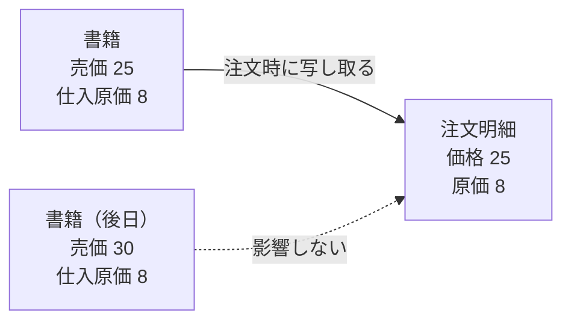
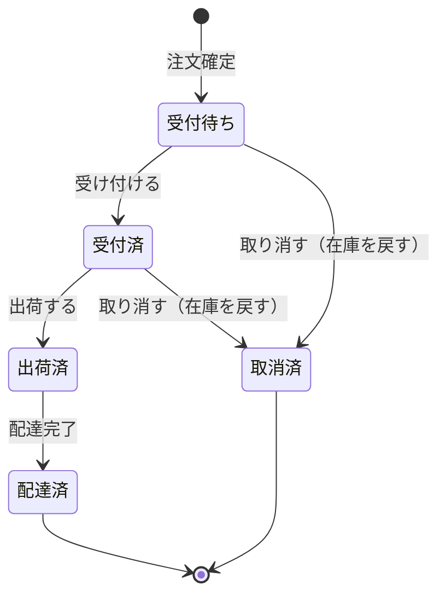

# AGG-ORDER — 注文集約

## 1. 責務

顧客と店の間で成立した**売買の合意**を表す。合意である以上、
**合意時点の条件が後の変更に追随してはならない**。この原則が、注文明細が
価格と原価を写し取って保持する理由である。

## 2. 構造

### 2.1 集約ルート: 注文 (Order)

| 属性 | 論理型 | 要否 | 意味 |
| --- | --- | --- | --- |
| 識別子 | 識別子 | ● | |
| 顧客 | 参照 | ● | 発注者 |
| 配送先住所 | 参照 | ● | |
| 明細 | 明細の列 | ● | 外部からは読み取り専用 |
| 納品予定日 | 日時 | ● | 生成時の UTC から 7 日後 |
| 状態 | 列挙 | ● | 既定 受付待ち |
| （基底属性） | | | [共通構成要素](building-blocks.md) §1 |

### 2.2 内部エンティティ: 注文明細 (OrderItem)

| 属性 | 論理型 | 要否 | 変更 | 意味 |
| --- | --- | --- | --- | --- |
| 識別子 | 識別子 | ● | 不可 | |
| 所属注文 | 参照 | ● | 不可 | |
| 書籍 | 参照 | ● | 不可 | |
| 数量 | [VO-QUANTITY](building-blocks.md) | ● | **不可** | 1 以上 |
| **価格** | [VO-MONEY](building-blocks.md) | ● | **不可** | 注文時点の書籍の売価を写し取ったもの |
| **原価** | [VO-MONEY](building-blocks.md) | ○ | **不可** | 注文時点の書籍の仕入原価を写し取ったもの。書籍がオファー由来でなければ未設定 |
| （内部数値属性） | | ▲ | | 数量・価格・原価の素の数 |

**派生属性**

| 名称 | 論理型 | 定義 |
| --- | --- | --- |
| 小計 (SubTotal) | 金額 | 価格 × 数量 |
| 粗利 (GrossProfit) | **差額** | 原価が既知なら (価格 − 原価) × 数量、未知なら**未定義** |

### 2.3 定数

| 名称 | 値 |
| --- | --- |
| 税率 | 0.1（10%） |

## 3. 金額の凍結

**注文明細の価格・原価は、書籍を読みに行くのではなく写し取った値である。**

| 対象 | 凍結の理由 |
| --- | --- |
| 価格 | 注文は合意であり、後日の値上げが過去の注文の金額を変えてはならない |
| 原価 | 販売時の利益は販売の瞬間に確定する。同じ書籍が別の原価で再入荷しても、過去の粗利は変わらない |

**原価が未定義であることと、原価が 0 であることは異なる。** 手入力された書籍は
店がいくらで仕入れたかをドメインが知らないため、粗利は「0」ではなく「未知」になる。

## 4. 金額の算出

| 名称 | 定義 |
| --- | --- |
| 小計 (SubTotal) | すべての明細の小計の合計 |
| 税 (Tax) | 小計 × 税率。**通貨最小単位に丸められる** |
| 合計 (Total) | 小計 ＋ 税 |

**`RULE-ORDER-01`**: 注文金額は 小計 → 税 → 合計 の順に導出され、各段階で通貨最小単位に丸められる。

## 5. 振る舞い

### 5.1 生成と明細追加

| 操作 | 引数 | 効果 |
| --- | --- | --- |
| 生成 | 顧客識別子、住所識別子 | 受付待ちの注文を作る。納品予定日は 7 日後 |
| 明細を追加 (AddOrderItem) | 書籍、数量 | 数量が 0 なら**拒否**。書籍の売価と仕入原価を写し取って明細を作る |

> **注意**: 明細の追加は**在庫を減らさない**。在庫の引き当ては
> 注文サービスの責務である（[ISSUE-05](../issues.md)）。

### 5.2 状態遷移

| 操作 | 遷移元 | 遷移先 | 副作用 |
| --- | --- | --- | --- |
| 受け付ける (Accept) | 受付待ち | 受付済 | — |
| 出荷する (Ship) | 受付済 | 出荷済 | — |
| 配達完了 (Deliver) | 出荷済 | 配達済 | — |
| 取り消す (Cancel) | 受付待ち **または** 受付済 | 取消済 | **各明細の数量を書籍の在庫に戻す** |

遷移元の状態が一致しなければ**拒否される**。

### 5.3 判定

| 名称 | 定義 |
| --- | --- |
| 売上計上対象 (CountsAsSale) | 状態が取消済**でない** |
| 納期超過 (IsPastDue) | 納品予定日を過ぎており、かつ配達済でも取消済でもない |

**納期超過の基準時刻は引数として渡される。** 注文が現在時刻を読みに行かないため、
ルールが検証可能であり、かつ呼び出し側が基準（UTC）を決められる。

## 6. 読み取り側との整合

注文集約は、上記の判定を**問い合わせ形式でも公開している**。

| 名称 | 対応する判定 |
| --- | --- |
| 売上絞り込み (SalesFilter) | 売上計上対象 |
| 納期超過絞り込み (PastDueAsOf) | 納期超過 |

これは、ダッシュボードの集計が**注文自身の定義から離れて別の意味になることを防ぐ**ための構造である。
両者が同じ答えを返すことはテストで固定されている（[SPEC-ORDER](verified-by-test.md)）。

## 7. 不変条件

| 識別子 | 不変条件 | 強制レベル | 根拠 |
| --- | --- | --- | --- |
| `INV-ORDER-01` | 注文は顧客と配送先を必ず持つ | **[強制]** | 生成時に必須 |
| `INV-ORDER-02` | 生成された注文の状態は受付待ち | **[強制]** | 既定値 |
| `INV-ORDER-03` | 状態は 受付待ち→受付済→出荷済→配達済 の順にのみ進む | **[強制]** | 各遷移が遷移元を検査する |
| `INV-ORDER-04` | 取消は受付待ちまたは受付済からのみ可能 | **[強制]** | 取消操作が検査する |
| `INV-ORDER-05` | 状態は集約の振る舞いを通じてのみ変化する | **[強制]** | 状態は外部から書き換えられない |
| `INV-ORDER-06` | 明細の数量は 1 以上 | **[強制]** | 追加時に 0 を拒否。復元時も 1 以上を要求 |
| `INV-ORDER-07` | 明細の価格・原価・数量は追加後変化しない | **[強制]** | 外部から書き換えられない |
| `INV-ORDER-08` | 取消時、各明細の数量が対応する書籍の在庫に戻される | **[強制]** | 取消操作の副作用 |
| `INV-ORDER-09` | 在庫の返却は取消が実際に成立した場合にのみ起こる | **[強制]** | 状態検査が先に行われる |
| `INV-ORDER-10` | 注文は最低 1 明細を持つ | **[外部]** | 集約単体では空の注文を作れる。注文サービスが保証する |
| `INV-ORDER-11` | 納品予定日は注文時点の UTC から 7 日後 | **[表明]** | 生成時にそう設定されるが、外部から書き換えられる |
| `INV-ORDER-12` | 明細の価格・原価は書籍の現在値に追随しない | **[強制]** | 写し取られた値であり、書籍を読まない |

## 8. 状態遷移

### 8.1 遷移可否の一覧

| 現在の状態＼操作 | 受け付ける | 出荷する | 配達完了 | 取り消す |
| --- | --- | --- | --- | --- |
| 受付待ち | ✓ | ✗ | ✗ | ✓ |
| 受付済 | ✗ | ✓ | ✗ | ✓ |
| 出荷済 | ✗ | ✗ | ✓ | ✗ |
| 配達済 | ✗ | ✗ | ✗ | ✗ |
| 取消済 | ✗ | ✗ | ✗ | ✗ |

**出荷済の注文が取り消せない**ことは在庫の整合性にとって決定的である。
すでに顧客に向かっている現物が、取消操作によって販売可能な在庫として
再び現れてはならない。

### 8.2 状態と業務上の意味

| 状態 | 売上計上対象 | 納期超過の判定対象 | 在庫の所在 |
| --- | --- | --- | --- |
| 受付待ち | ○ | ○ | 注文が引き当て済 |
| 受付済 | ○ | ○ | 注文が引き当て済 |
| 出荷済 | ○ | ○ | 出荷済（店にない） |
| 配達済 | ○ | ✗（届いている） | 顧客の手元 |
| 取消済 | **✗** | ✗（届く予定がない） | 書籍に返却済 |

**取消済が売上でない理由**は、代金が請求されておらず、在庫も戻っているためである。
それ以外の状態はすべて売上である——**注文は確定した時点で合意だからである**。

## 9. 他の集約との関係

| 関係先 | 関係 |
| --- | --- |
| AGG-CUSTOMER | 発注者を識別子で参照する |
| AGG-ADDRESS | 配送先を識別子で参照する |
| AGG-BOOK | 明細が書籍を参照する。**注文確定時に在庫を減らし、取消時に在庫を戻す** |
| AGG-CART | 注文はかごの明細から生成される |

**注文集約が書籍集約を直接変更する**（取消時の在庫返却）点は、
DDD の一般原則からの意図的な逸脱である。詳細は [ISSUE-03](../issues.md)。

## 10. 照会

| 照会 | 引数 | 対象アクター |
| --- | --- | --- |
| 一覧取得（絞り込み） | 絞り込み条件、頁番号、頁サイズ | スタッフ |
| 一覧取得（顧客別） | 主体識別子 | 顧客 |
| 単件取得（絞り込みなし） | 識別子 | **スタッフのみ** |
| 単件取得（所有者で絞り込み） | 主体識別子、識別子 | **顧客** |
| 統計 | — | スタッフ |

### 10.1 絞り込み条件

| 条件 | 論理型 | 意味 |
| --- | --- | --- |
| 状態 | 列挙 | 注文状態での絞り込み |
| 注文日 From / To | 日時 | 期間での絞り込み |
| 納期超過 | 真偽 | 納期超過絞り込みによる判定 |

> **注文日という属性は存在しない。** 期間絞り込みと「今月の注文数」は
> 基底属性の作成日時に依拠している（[ISSUE-11](../issues.md)）。

## 11. 未定義の事項

| 事項 | 現状 |
| --- | --- |
| 決済 | 概念なし。金額は算出されるが請求・入金の記録はない |
| 配送業者・追跡番号 | 概念なし |
| 返品・返金 | 概念なし。取消のみ |
| 税率の変動 | 定数。時期・地域による差異を表現できない（[ISSUE-10](../issues.md)） |
| 送料・割引 | 概念なし |
| 部分出荷 | 概念なし。注文単位でのみ状態が進む |
