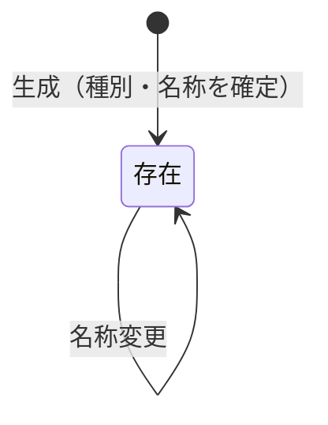

# AGG-REFDATA — 参照データ集約

## 1. 責務

書籍と買取オファーを分類するための**選択肢の集合**を維持する。
出版社・書籍種別・ジャンル・状態という4つの軸は、**すべて同一の概念で表現される**。

## 2. 構造

### 2.1 集約ルート: 参照データ項目 (ReferenceDataItem)

| 属性 | 論理型 | 要否 | 変更 | 意味 |
| --- | --- | --- | --- | --- |
| 識別子 | 識別子 | ● | 不可 | |
| 種別 | 列挙 | ● | **不可** | この項目が4軸のどれに属するか |
| 名称 | テキスト | ● | 可 | 画面に表示される文言 |
| （基底属性） | | | | [共通構成要素](building-blocks.md) §1 |

### 2.2 種別の値

| 値 | 日本語 | 用途 |
| --- | --- | --- |
| Publisher | 出版社 | 分類の第1軸 |
| Condition | 状態 | 分類の第4軸 |
| BookType | 書籍種別 | 分類の第2軸 |
| Genre | ジャンル | 分類の第3軸 |

## 3. 振る舞い

| 操作 | 引数 | 効果 |
| --- | --- | --- |
| 生成 | 種別、名称 | 種別と名称を確定した項目を作る |
| 名称変更 (Rename) | 名称 | 名称のみを差し替える |

**項目に対してできることは、名称を変えることだけである。**

## 4. 不変条件

| 識別子 | 不変条件 | 強制レベル | 根拠 |
| --- | --- | --- | --- |
| `INV-REFDATA-01` | 項目は種別と名称を必ず持つ | **[強制]** | 生成時に両方を要求する |
| `INV-REFDATA-02` | 項目の種別は生成時に確定し、以後変更できない | **[強制]** | 種別は外部から書き換えられず、更新の入力にも種別が含まれない |
| `INV-REFDATA-03` | 項目に対する変更操作は名称変更のみ | **[強制]** | 他に状態を変える振る舞いが存在しない |

### 4.1 INV-REFDATA-02 が重要な理由

4軸がすべて同一の項目群から供給されるため、種別が変更可能だと
**すでに多数の書籍が「ジャンル」として参照している項目が、ある日「出版社」に変わる**
という事態が起こる。そのとき既存の書籍の分類は、検査を通ることなく不正になる。
種別を生成時に固定することで、[INV-CLASS-01](building-blocks.md) が
**過去に遡って破られない**ことが保証される。

## 5. ライフサイクル

**削除は存在しない。** 項目を消す手段はドメインに用意されていない。
使用中の項目が消えて書籍の分類が壊れることは、構造上起こりえない。

## 6. 他の集約との関係

| 関係先 | 関係 |
| --- | --- |
| AGG-BOOK | 書籍の分類4軸として参照される（識別子による参照） |
| AGG-OFFER | オファーの分類4軸として参照される（識別子による参照） |

参照方向は**常に書籍・オファーから参照データへ**である。
参照データ項目は、自分がどこから参照されているかを知らない。

## 7. 照会

| 照会 | 引数 | 戻り |
| --- | --- | --- |
| 全件取得 | — | すべての項目。**分類の検証にはこれが必要**（[VO-CLASSIFICATION](building-blocks.md) §4.2） |
| 一覧取得 | 絞り込み（種別）、頁番号、頁サイズ | ページ化された項目 |
| 単件取得 | 識別子 | 項目 |

## 8. 未定義の事項

以下はドメインに規定がない。

| 事項 | 現状 |
| --- | --- |
| 名称の一意性 | 同一種別に同名の項目を複数登録できる |
| 名称の書式・長さ | 制約なし。空文字も拒否されない |
| 項目の廃止 | 手段なし。使わなくなった選択肢を隠す方法がない |
| 表示順 | 概念なし |

詳細は [ISSUE-12](../issues.md)。
