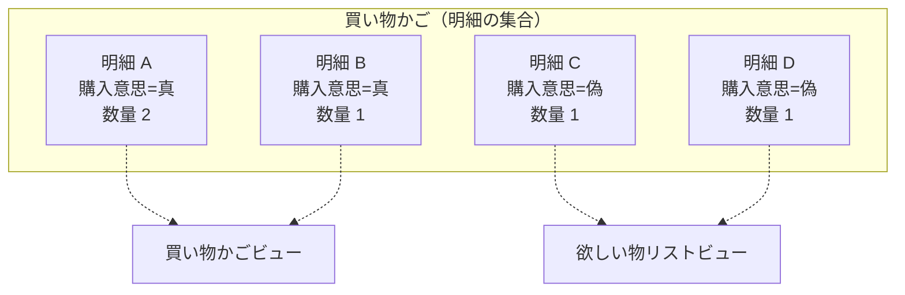
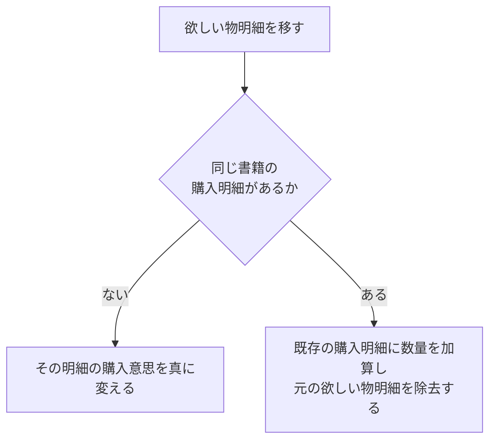
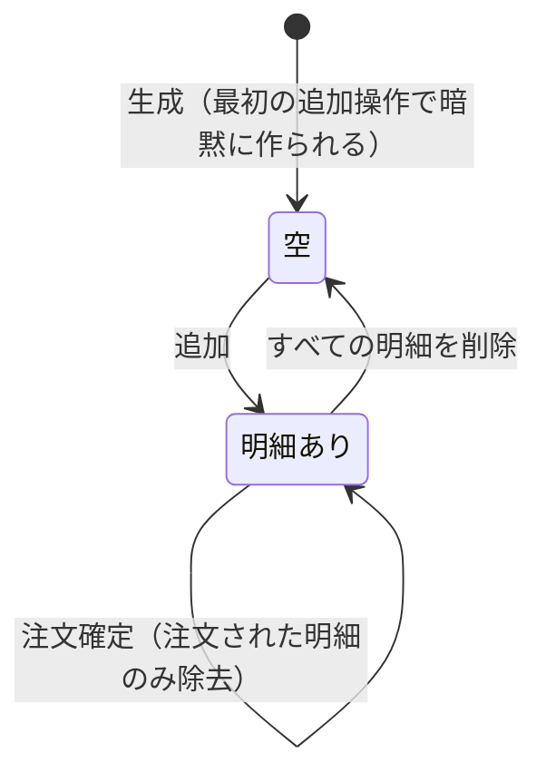

# AGG-CART — 買い物かご集約

## 1. 責務

顧客が**購入しようとしている書籍**と、**今は買わないが記憶しておきたい書籍**を保持する。
この二つは別のリストではなく、**同一の明細集合に立てられた一つの印**で区別される。

## 2. 構造

### 2.1 集約ルート: 買い物かご (ShoppingCart)

| 属性 | 論理型 | 要否 | 意味 |
| --- | --- | --- | --- |
| 識別子 | 識別子 | ● | |
| **かご相関識別子** | テキスト | ● | かごを特定する不透明な鍵 |
| 明細 | 明細の列 | ● | 既定は空 |
| （基底属性） | | | [共通構成要素](building-blocks.md) §1 |

### 2.2 内部エンティティ: かご明細 (ShoppingCartItem)

| 属性 | 論理型 | 要否 | 意味 |
| --- | --- | --- | --- |
| 識別子 | 識別子 | ● | |
| 所属かご | 参照 | ● | |
| 書籍 | 参照 | ● | |
| 数量 | [VO-QUANTITY](building-blocks.md) | ● | 1 以上 |
| **購入意思 (WantToBuy)** | 真偽 | ● | 真＝買い物かご、偽＝欲しい物リスト |
| （内部数値属性） | | ▲ | 数量の素の数（[共通構成要素](building-blocks.md) §8） |

**派生属性**

| 名称 | 定義 |
| --- | --- |
| 小計 (SubTotal) | 書籍の売価 × 数量 |

### 2.3 かご相関識別子について

かごは**顧客に紐づいていない**。特定するのはかご相関識別子だけである。
これにより、ログインしていない訪問者にもかごを持たせることができる。

その代償として、**かごの所有者はドメインでは判定できない**。注文の確定時、
かごの相関識別子と顧客の主体識別子は独立した入力として与えられ、
両者が同一人物のものであるかは検証されない（[ISSUE-02](../issues.md)）。

## 3. 一つの集合に二つの意味

| 概念 | 定義 |
| --- | --- |
| 買い物かごの中身 | 購入意思が**真**の明細 |
| 欲しい物リストの中身 | 購入意思が**偽**の明細 |

**同一の書籍が両方に存在しうる**。購入意思が真の明細と偽の明細は別々に管理され、
買い物かごへの追加は欲しい物リストの明細に触れない。

## 4. 振る舞い

### 4.1 明細の取得

| 操作 | 引数 | 戻り |
| --- | --- | --- |
| かご明細の取得 | 在庫切れフィルタ | 購入意思が真の明細。フィルタが「除外」なら在庫のある書籍のみ |
| 欲しい物リストの取得 | — | 購入意思が偽の明細 |

**在庫切れフィルタ**

| 値 | 意味 |
| --- | --- |
| 在庫切れを含む | 在庫状況を問わない |
| 在庫切れを除く | 書籍の在庫が 1 以上の明細のみ |

### 4.2 明細の追加

| 操作 | 引数 | 効果 |
| --- | --- | --- |
| かごに追加 | 書籍、数量 | 数量が 0 なら**拒否**。同一書籍の購入明細があれば**数量を加算**、なければ新しい行を作る |
| 欲しい物リストに追加 | 書籍 | 同一書籍の欲しい物明細がすでにあれば**何もしない**。なければ数量 1 の行を作る |

### 4.3 明細の移動と削除

| 操作 | 引数 | 効果 |
| --- | --- | --- |
| 欲しい物明細をかごへ移す | 明細識別子 | 下記 §4.4。**明細が存在しなければ失敗** |
| 明細を削除する | 明細識別子 | 明細を除去。**明細が存在しなければ失敗** |

### 4.4 欲しい物明細をかごへ移す

いずれの経路でも、**同一書籍の購入明細は1行に保たれる**。

> **注意**: 移動対象の明細は**かごの全明細から**探される。欲しい物明細に限定されていない。
> 購入明細の識別子を渡すと、その明細が自分自身と「合流」したうえで除去され、
> **黙って削除される**（[ISSUE-21](../issues.md)）。

### 4.5 金額の算出

| 操作 | 引数 | 定義 |
| --- | --- | --- |
| 小計 (GetSubTotal) | 在庫切れフィルタ | 対象となる購入明細の小計の合計 |

**欲しい物明細は小計に含まれない。**

### 4.6 注文のための明細抽出

| 操作 | 戻り | 補足 |
| --- | --- | --- |
| 注文対象明細の取得 (GetItemsForNewOrder) | 購入意思が真かつ在庫のある明細 | **1件もなければ拒否** |
| 在庫切れで見送られた明細の取得 (GetOutOfStockWantedItems) | 購入意思が真かつ在庫のない明細 | 呼び出し側が顧客に伝えるための情報 |

**注文対象が空のとき拒否する**のは、注文には最低1明細が必要だからである。
「かごが空だった」のか「かごの中身がすべて在庫切れだった」のかは、
**注文するものがない**という点で同じ結果に帰着する。

在庫切れで見送られた明細は**かごに残る**。その書籍が再入荷したときに
顧客がまだ欲しいかもしれないためである。

## 5. 不変条件

| 識別子 | 不変条件 | 強制レベル | 根拠 |
| --- | --- | --- | --- |
| `INV-CART-01` | かごはかご相関識別子で特定される | **[強制]** | 生成時に必須 |
| `INV-CART-02` | 同一書籍の購入明細は 1 行しか存在しない | **[強制]** | 追加・移動のいずれも既存行に合流させる |
| `INV-CART-03` | 同一書籍の欲しい物明細は 1 行しか存在せず、数量は常に 1 | **[強制]** | 重複追加は何もしない。数量は固定値で生成される |
| `INV-CART-04` | 明細の数量は 1 以上 | **[強制]** | 追加時に 0 を拒否。永続化からの復元時も 1 以上を要求 |
| `INV-CART-05` | 同一書籍が購入明細と欲しい物明細に併存しうる | **[強制]** | 両者は別の条件で走査される |
| `INV-CART-06` | 個別に指定された明細が存在しない操作は失敗する | **[強制]** | 移動・削除がいずれも拒否する |
| `INV-CART-06b` | 移動操作の対象は欲しい物明細でなければならない | **[不成立]** | 種別が検査されず、購入明細を渡すと削除される（[ISSUE-21](../issues.md)） |
| `INV-CART-07` | 明細の集合はかごの振る舞いを通じてのみ変更される | **[表明]** | 明細の集合・数量・購入意思は外部から直接変更できる（[ISSUE-01](../issues.md), [ISSUE-18](../issues.md)） |
| `INV-CART-08` | 注文対象の明細は必ず 1 件以上 | **[強制]** | 抽出操作が空を拒否する |

## 6. ライフサイクル

**かごは明示的に生成されない。** 最初の追加操作の時点で、対象の相関識別子に対応する
かごが存在しなければ、その場で作られる。

**かごは削除されない。** 注文が確定しても、かごそのものは残り、
注文された明細だけが除去される。在庫切れで見送られた明細と欲しい物明細は残る。

## 7. 他の集約との関係

| 関係先 | 関係 |
| --- | --- |
| AGG-BOOK | 明細が書籍を参照し、**売価と在庫状況を読む** |
| AGG-ORDER | 注文確定時、注文された明細がかごから除去される |

かごは書籍の**読み取りに依存している**。小計の算出も在庫切れの判定も、
書籍が併せて読み込まれていなければ成立しない（[ISSUE-20](../issues.md)）。

## 8. 未定義の事項

| 事項 | 現状 |
| --- | --- |
| かごの所有者 | 概念なし。相関識別子のみ |
| かごの有効期限 | 概念なし |
| 明細数・数量の上限 | 制限なし |
| 在庫を超える数量の投入 | **かごの時点では許される**。注文確定時に在庫が引き当てられず失敗する |
