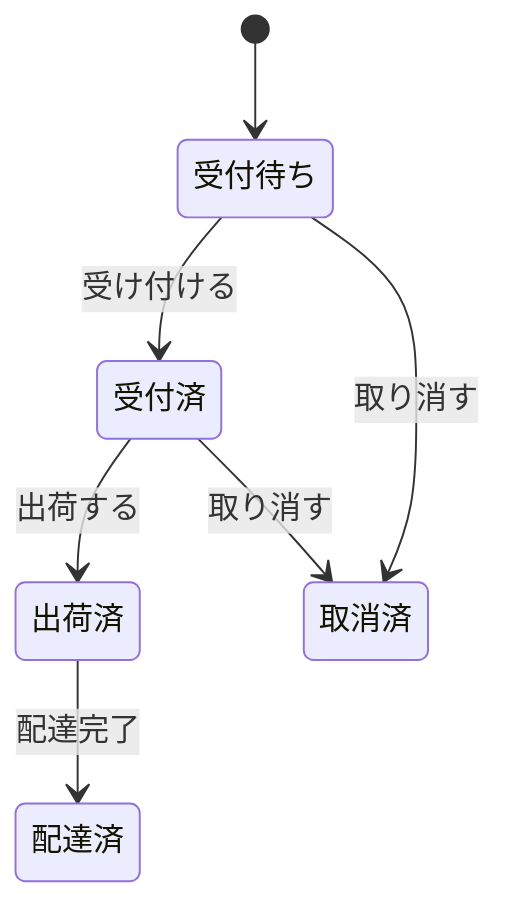
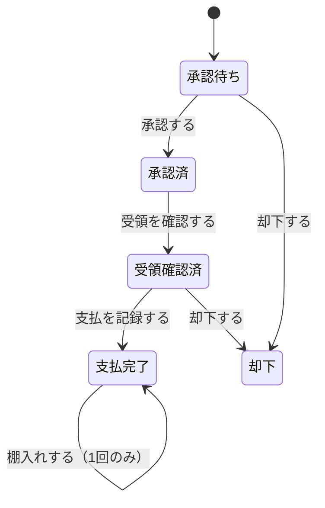
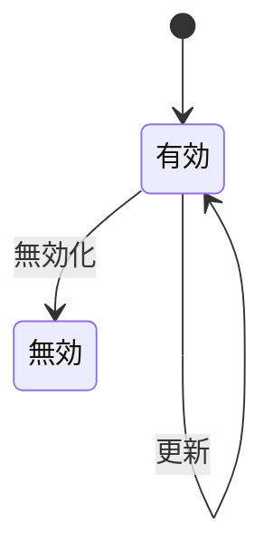
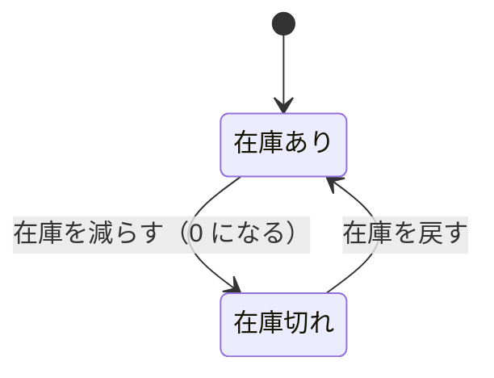

# 不変条件・ビジネスルール

本書に散在する不変条件とルールの総覧。**変更要求を受けたときは、まずこの表で
影響範囲を特定する**こと。

強制レベルの記号は [設計 §4.3](../README.md) を参照。

## 1. 不変条件の総覧

### 1.1 値オブジェクト

| 識別子 | 不変条件 | 強制 |
| --- | --- | --- |
| `INV-MONEY-01` | 金額は負にならない | **[強制]** |
| `INV-MONEY-02` | 金額は通貨最小単位（小数2桁）に丸められている | **[強制]** |
| `INV-MONEY-03` | 金額は単一通貨 (USD) である | **[強制]** |
| `INV-MONEY-04` | 二つの金額の差は金額ではなく差額であり、負を取りうる | **[強制]** |
| `INV-QTY-01` | 数量は負にならない | **[強制]** |
| `INV-QTY-02` | 数量の減算は結果が負になる場合に拒否される | **[強制]** |
| `INV-QTY-03` | 明細の数量は 1 以上である | **[強制]** |
| `INV-CLASS-01` | 分類の各軸は、その位置が要求する種別の実在項目でなければならない | **[強制]** |

### 1.2 AGG-REFDATA — 参照データ

| 識別子 | 不変条件 | 強制 |
| --- | --- | --- |
| `INV-REFDATA-01` | 項目は種別と名称を必ず持つ | **[強制]** |
| `INV-REFDATA-02` | 種別は生成時に確定し、以後変更できない | **[強制]** |
| `INV-REFDATA-03` | 項目への変更操作は名称変更のみ | **[強制]** |

### 1.3 AGG-BOOK — 書籍

| 識別子 | 不変条件 | 強制 |
| --- | --- | --- |
| `INV-BOOK-01` | 在庫数は 0 以上 | **[強制]** |
| `INV-BOOK-02` | 売価は 0 以上、通貨最小単位に丸められている | **[強制]** |
| `INV-BOOK-03` | 出庫は在庫数を超えられない | **[強制]** |
| `INV-BOOK-04` | 分類の4軸は検証済みである | **[強制]** |
| `INV-BOOK-05` | 供給元オファーと仕入原価は、両方あるか両方ないか | **[強制]** |
| `INV-BOOK-06` | オファー由来の書籍は在庫 1 冊で生まれる | **[強制]** |
| `INV-BOOK-07` | 在庫の増減は在庫操作を通じて行われる | **[表明]** |
| `INV-BOOK-08` | 仕入原価は棚入れ後に変化しない | **[強制]** |

### 1.4 AGG-CUSTOMER / AGG-ADDRESS — 顧客・住所

| 識別子 | 不変条件 | 強制 |
| --- | --- | --- |
| `INV-CUST-01` | 顧客は主体識別子なしには存在できない | **[強制]** |
| `INV-CUST-02` | 主体識別子は生成後変更できない | **[強制]** |
| `INV-CUST-03` | 主体識別子以外のすべての属性は未設定を許す | **[強制]** |
| `INV-ADDR-01` | 住所は必ず顧客に属する | **[強制]** |
| `INV-ADDR-02` | 生成時の住所は有効である | **[強制]** |
| `INV-ADDR-03` | 住所の削除は無効化のみ。物理削除は行われない | **[強制]** |
| `INV-ADDR-04` | 有効／無効の切り替えは集約の振る舞いを通じてのみ行われる | **[強制]** |
| `INV-ADDR-05` | 住所行2 以外のすべての住所項目は必須 | **[強制]** |
| `INV-ADDR-06` | 注文が参照している住所は、無効化後も参照できる | **[強制]** |

### 1.5 AGG-CART — 買い物かご

| 識別子 | 不変条件 | 強制 |
| --- | --- | --- |
| `INV-CART-01` | かごはかご相関識別子で特定される | **[強制]** |
| `INV-CART-02` | 同一書籍の購入明細は 1 行しか存在しない | **[強制]** |
| `INV-CART-03` | 同一書籍の欲しい物明細は 1 行、数量は常に 1 | **[強制]** |
| `INV-CART-04` | 明細の数量は 1 以上 | **[強制]** |
| `INV-CART-05` | 同一書籍が購入明細と欲しい物明細に併存しうる | **[強制]** |
| `INV-CART-06` | 個別に指定された明細が存在しない操作は失敗する | **[強制]** |
| `INV-CART-06b` | 移動操作の対象は欲しい物明細でなければならない | **[不成立]** |
| `INV-CART-07` | 明細の集合はかごの振る舞いを通じてのみ変更される | **[表明]** |
| `INV-CART-08` | 注文対象の明細は必ず 1 件以上 | **[強制]** |

### 1.6 AGG-ORDER — 注文

| 識別子 | 不変条件 | 強制 |
| --- | --- | --- |
| `INV-ORDER-01` | 注文は顧客と配送先を必ず持つ | **[強制]** |
| `INV-ORDER-02` | 生成された注文の状態は受付待ち | **[強制]** |
| `INV-ORDER-03` | 状態は 受付待ち→受付済→出荷済→配達済 の順にのみ進む | **[強制]** |
| `INV-ORDER-04` | 取消は受付待ちまたは受付済からのみ可能 | **[強制]** |
| `INV-ORDER-05` | 状態は集約の振る舞いを通じてのみ変化する | **[強制]** |
| `INV-ORDER-06` | 明細の数量は 1 以上 | **[強制]** |
| `INV-ORDER-07` | 明細の価格・原価・数量は追加後変化しない | **[強制]** |
| `INV-ORDER-08` | 取消時、各明細の数量が対応する書籍の在庫に戻される | **[強制]** |
| `INV-ORDER-09` | 在庫の返却は取消が実際に成立した場合にのみ起こる | **[強制]** |
| `INV-ORDER-10` | 注文は最低 1 明細を持つ | **[外部]** |
| `INV-ORDER-11` | 納品予定日は注文時点の UTC から 7 日後 | **[表明]** |
| `INV-ORDER-12` | 明細の価格・原価は書籍の現在値に追随しない | **[強制]** |

### 1.7 AGG-OFFER — 買取オファー

| 識別子 | 不変条件 | 強制 |
| --- | --- | --- |
| `INV-OFFER-01` | オファーは顧客・書誌・分類・買取価格を必ず持つ | **[強制]** |
| `INV-OFFER-02` | 生成されたオファーの状態は承認待ち | **[強制]** |
| `INV-OFFER-03` | 状態は 承認待ち→承認済→受領確認済→支払完了 の順にのみ進む | **[強制]** |
| `INV-OFFER-04` | 却下は承認待ちまたは受領確認済からのみ可能 | **[強制]** |
| `INV-OFFER-05` | 支払は受領確認済からのみ可能であり、支払日が同時に記録される | **[強制]** |
| `INV-OFFER-06` | 棚入れは支払完了からのみ、かつ 1 回だけ可能 | **[強制]** |
| `INV-OFFER-07` | 状態・支払日・棚入れ済は集約の振る舞いを通じてのみ変化する | **[強制]** |
| `INV-OFFER-08` | 買取価格は 0 以上、通貨最小単位に丸められている | **[強制]** |
| `INV-OFFER-09` | 分類の4軸は検証済みであり、生成後変更されない | **[強制]** |
| `INV-OFFER-10` | 却下されたオファーは支払われず、棚入れもされない | **[強制]** |
| `INV-OFFER-11` | 買取価格は支払後変化しない | **[不成立]** |

### 1.8 強制レベルの集計

全 60 件の内訳。

| 強制レベル | 件数 | 該当 |
| --- | --- | --- |
| **[強制]** | 54 | — |
| **[表明]** | 3 | `INV-BOOK-07`, `INV-CART-07`, `INV-ORDER-11` |
| **[外部]** | 1 | `INV-ORDER-10` |
| **[不成立]** | 2 | `INV-OFFER-11`, `INV-CART-06b` |

**[表明]**・**[外部]**・**[不成立]** の6件はすべて [設計課題](../issues.md) に対応する課題がある。

## 2. ビジネスルール

### 2.1 金額に関するルール

| 識別子 | ルール |
| --- | --- |
| `RULE-MONEY-01` | 金額は生成時に通貨最小単位へ四捨五入（絶対値を大きくする方向）される |
| `RULE-CART-01` | かご明細の小計 ＝ 書籍の**現在の**売価 × 数量 |
| `RULE-CART-02` | かごの小計 ＝ 対象となる購入明細の小計の合計。**欲しい物明細は含まない** |
| `RULE-ORDER-01` | 注文金額は 小計 → 税 → 合計 の順に導出され、各段階で丸められる |
| `RULE-ORDER-02` | 注文明細の小計 ＝ **凍結された価格** × 数量 |
| `RULE-ORDER-03` | 税 ＝ 小計 × 税率 (0.1) |
| `RULE-ORDER-04` | 合計 ＝ 小計 ＋ 税 |
| `RULE-ORDER-05` | 注文明細の粗利 ＝ (価格 − 原価) × 数量。原価が未知なら**粗利も未知**（0 ではない） |
| `RULE-BOOK-01` | 書籍の粗利見込 ＝ 売価 − 仕入原価。仕入原価が未知なら**未定義** |

### 2.2 在庫に関するルール

| 識別子 | ルール |
| --- | --- |
| `RULE-STOCK-01` | 注文確定時、注文された各明細の数量が対応する書籍の在庫から引かれる |
| `RULE-STOCK-02` | 注文取消時、各明細の数量が対応する書籍の在庫に戻される |
| `RULE-STOCK-03` | 在庫を超える出庫は拒否される。0 に飽和させない |
| `RULE-STOCK-04` | 在庫僅少（仕入判断）＝ 在庫数 ≦ 5。**在庫 0 を含む** |
| `RULE-STOCK-05` | 在庫切れの書籍は注文できないが、かごには入れられる |
| `RULE-STOCK-06` | 在庫切れで注文から見送られた明細はかごに残る |

### 2.3 取引の成立に関するルール

| 識別子 | ルール |
| --- | --- |
| `RULE-TRADE-01` | 店は買っていない本を売らない（棚入れは支払完了を要求する） |
| `RULE-TRADE-02` | 1件の買取オファーは 1 冊の書籍になる。二重の棚入れは拒否される |
| `RULE-TRADE-03` | 売価は買取価格から導出されない。店の独立した決定である |
| `RULE-TRADE-04` | 仕入原価は棚入れ時に確定し、以後の変更に追随しない |
| `RULE-TRADE-05` | 注文明細の価格・原価は注文確定時に確定し、以後の変更に追随しない |
| `RULE-TRADE-06` | 注文は最低 1 明細を要する |

### 2.4 期間と日付に関するルール

| 識別子 | ルール |
| --- | --- |
| `RULE-PERIOD-01` | すべての時点は UTC を基準とする |
| `RULE-PERIOD-02` | 「今月」は当月 1 日の 0 時 0 分 0 秒から始まる。**問い合わせ時刻の時分秒は用いない** |
| `RULE-PERIOD-03` | 納品予定日 ＝ 注文時点の UTC ＋ 7 日 |
| `RULE-PERIOD-04` | 納期超過 ＝ 納品予定日を過ぎ、かつ配達済でも取消済でもない |
| `RULE-PERIOD-05` | 買取側の支出は**支払日**で期間に割り当てられる。申込日ではない |

**`RULE-PERIOD-02` の要点**: 15日の14時に「今月」を問うたとき、期間の開始が
「1日の14時」であってはならない。1日の午前中に記録された取引が期間から
漏れてしまうためである。

### 2.5 売上計上に関するルール

| 識別子 | ルール |
| --- | --- |
| `RULE-SALES-01` | 取消済**以外**のすべての注文が売上に計上される |
| `RULE-SALES-02` | 売上は**税抜**である（税は他者のために徴収するものであるため） |
| `RULE-SALES-03` | 粗利は、原価が既知の売上（＝オファー由来の書籍）に限って算出される |
| `RULE-SALES-04` | 原価が未知の書籍は粗利の計算から除外される。**純利益として数えない** |

**`RULE-SALES-01` の根拠**: 注文は確定した時点で合意である。
出荷前でも受付前でも、それは成立した取引である。取り消されたものだけが
「取引ではなかった」ものになる。

### 2.6 アクセスに関するルール

| 識別子 | ルール |
| --- | --- |
| `RULE-ACCESS-01` | 顧客向けの照会は必ず主体識別子で絞り込まれる |
| `RULE-ACCESS-02` | 絞り込みなしの単件照会はスタッフ専用である |
| `RULE-ACCESS-03` | 住所には絞り込みなしの照会が存在しない |

### 2.7 操作方針に関するルール

| 識別子 | ルール |
| --- | --- |
| `RULE-SERVICE-01` | 注文と買取申込は、顧客がすでに存在することを前提とする |
| `RULE-SERVICE-02` | 住所登録とプロフィール登録は、顧客が存在しなければ生成する |
| `RULE-SERVICE-03` | 個別に指定された対象を変更する操作は、対象が不在なら失敗する |
| `RULE-SERVICE-04` | 照会および対象を個別に指定しない操作は、対象が不在でも成功する |
| `RULE-SERVICE-05` | 注文の取消はべき等である（対象不在時は成功、状態違反時は失敗） |

### 2.8 ポリシー

| 識別子 | ポリシー | 差し替え可能な点 |
| --- | --- | --- |
| `POL-IMAGE-SAFETY` | 表紙画像は**保存直前の状態**（寸法調整後）で安全性を判定する。危険なら書籍ごと保存しない | 判定基準そのもの（ドメイン外） |
| `POL-NOTFOUND` | 対象不在時の厳格／寛容の使い分け（§2.7） | 個々の操作をどちらに割り当てるか |

## 3. 状態遷移の総覧

### 3.1 注文

| 状態 | 売上計上 | 納期超過の対象 | 在庫 |
| --- | --- | --- | --- |
| 受付待ち | ○ | ○ | 引当済 |
| 受付済 | ○ | ○ | 引当済 |
| 出荷済 | ○ | ○ | 店にない |
| 配達済 | ○ | ✗ | 顧客の手元 |
| 取消済 | ✗ | ✗ | 返却済 |

### 3.2 買取オファー

| 状態 | 支払日 | 棚入れ可能 |
| --- | --- | --- |
| 承認待ち | 未設定 | ✗ |
| 承認済 | 未設定 | ✗ |
| 受領確認済 | 未設定 | ✗ |
| 支払完了 | 設定済 | ✓（未棚入れなら 1 回） |
| 却下 | 未設定 | ✗ |

### 3.3 住所

### 3.4 書籍（在庫の観点）

## 4. ルールが存在しない領域

以下について、ドメインは**何も規定していない**。「規定がない」ことも仕様である。

| 領域 | 状態 |
| --- | --- |
| 買取価格の算定 | 基準なし。外部で決まる |
| 売価の算定 | 基準なし。店の裁量 |
| 在庫僅少しきい値の根拠 | 定数 5 の由来は不明 |
| 税率の適用対象・地域差 | 定数 10% のみ |
| 納品予定日の 7 日の根拠 | 定数 |
| 送料・割引・決済 | 概念自体が存在しない |
| 参照データ名称の一意性 | 検査なし |
| 文字列項目の書式・長さ | 検査なし |
| 並行更新の解決 | 楽観的並行制御のトークンは存在するが、衝突時の業務判断は未定義 |
| 統計の集計式 | 属性の形だけが定義され、算出は永続化層に委ねられている |
