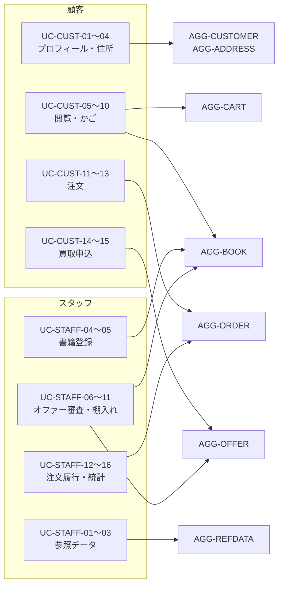

# ユースケース

アクター起点で、ドメインが提供する操作を記述する。
画面遷移や入力書式は扱わない。**何が起き、何が保証されるか**のみを記す。

## 1. 顧客のユースケース

| 識別子 | ユースケース | 主に触れる集約 |
| --- | --- | --- |
| `UC-CUST-01` | プロフィールを登録・更新する | AGG-CUSTOMER |
| `UC-CUST-02` | 配送先住所を登録する | AGG-ADDRESS, AGG-CUSTOMER |
| `UC-CUST-03` | 配送先住所を更新する | AGG-ADDRESS |
| `UC-CUST-04` | 配送先住所を削除する | AGG-ADDRESS |
| `UC-CUST-05` | 書籍を検索・閲覧する | AGG-BOOK |
| `UC-CUST-06` | 書籍を買い物かごに入れる | AGG-CART |
| `UC-CUST-07` | 書籍を欲しい物リストに入れる | AGG-CART |
| `UC-CUST-08` | 欲しい物リストの1件をかごへ移す | AGG-CART |
| `UC-CUST-09` | 欲しい物リストをすべてかごへ移す | AGG-CART |
| `UC-CUST-10` | かごの明細を削除する | AGG-CART |
| `UC-CUST-11` | 注文を確定する | AGG-ORDER, AGG-CART, AGG-BOOK, AGG-CUSTOMER |
| `UC-CUST-12` | 自分の注文を照会する | AGG-ORDER |
| `UC-CUST-13` | 自分の注文を取り消す | AGG-ORDER, AGG-BOOK |
| `UC-CUST-14` | 買取を申し込む | AGG-OFFER, AGG-CUSTOMER, AGG-REFDATA |
| `UC-CUST-15` | 自分の買取オファーを照会する | AGG-OFFER |

---

### UC-CUST-02 — 配送先住所を登録する

| 項目 | 内容 |
| --- | --- |
| **入力** | 主体識別子、住所行1、住所行2（任意）、市区町村、州、国、郵便番号 |
| **事前条件** | なし |
| **手順** | 主体識別子で顧客を検索し、なければ**主体識別子のみで顧客を生成する** → 住所を生成する → 単位作業を完了する |
| **事後条件** | 有効な住所が1件存在する。顧客が存在しなかった場合、顧客も同時に生成されている |
| **保証** | 顧客と住所は**同一の単位作業**で確定する。住所の生成が失敗すれば顧客も残らない |

### UC-CUST-04 — 配送先住所を削除する

| 項目 | 内容 |
| --- | --- |
| **入力** | 主体識別子、住所識別子 |
| **事前条件** | 当該住所が呼び出し元の顧客のものであること |
| **手順** | 所有者で絞り込んで住所を無効化する → 見つからなければ**失敗** → 単位作業を完了する |
| **事後条件** | 住所が無効化されている。**物理的には削除されない** |
| **保証** | すでにその住所を使った注文は、引き続き配送先を参照できる（[INV-ADDR-06](aggregate-customer-address.md)） |

### UC-CUST-06 — 書籍を買い物かごに入れる

| 項目 | 内容 |
| --- | --- |
| **入力** | かご相関識別子、書籍識別子、数量 |
| **事前条件** | 数量が 1 以上 |
| **手順** | かごを取得し、**なければ生成する** → 同一書籍の購入明細があれば数量を加算、なければ新しい行を作る → 単位作業を完了する |
| **事後条件** | 当該書籍の購入明細が**ちょうど1行**存在する |
| **例外** | 数量が 0 のとき失敗する |
| **注意** | **在庫は確認されない。** 在庫を超える数量も投入できる。在庫の判定は注文確定時に行われる |

### UC-CUST-07 — 書籍を欲しい物リストに入れる

| 項目 | 内容 |
| --- | --- |
| **入力** | かご相関識別子、書籍識別子 |
| **手順** | かごを取得し、なければ生成する → 同一書籍の欲しい物明細がすでにあれば**何もしない**、なければ数量 1 の行を作る |
| **事後条件** | 当該書籍の欲しい物明細が**ちょうど1行**、数量 1 で存在する |
| **注意** | 同じ書籍の購入明細があっても影響しない。両者は併存する |

### UC-CUST-08 / UC-CUST-09 — 欲しい物リストからかごへ移す

| 項目 | 個別移動 (UC-CUST-08) | 一括移動 (UC-CUST-09) |
| --- | --- | --- |
| **入力** | かご相関識別子、明細識別子 | かご相関識別子 |
| **かご不在時** | **失敗** | 何もしない |
| **明細不在時** | **失敗** | — |
| **手順** | 同一書籍の購入明細があれば数量を合流させて元の明細を除去、なければ購入意思を真に変える | 欲しい物明細を1件ずつ個別移動する |
| **事後条件** | 同一書籍の購入明細は 1 行に保たれる | 欲しい物リストが空になる |

方針の違いは [POL-NOTFOUND](services-and-policies.md) による。
個別に指定した明細の不在は誤りだが、「すべて移す」対象が空であることは正常である。

### UC-CUST-11 — 注文を確定する

| 項目 | 内容 |
| --- | --- |
| **入力** | 主体識別子、かご相関識別子、住所識別子 |
| **事前条件** | かごが存在すること、顧客が存在すること、購入意思のある在庫ありの明細が 1 件以上あること |
| **手順** | [ドメインサービスとポリシー](services-and-policies.md) §6.1 を参照 |
| **出力** | 注文識別子、**在庫切れで見送られた明細の一覧** |
| **事後条件** | 受付待ちの注文が1件存在する。注文された各書籍の在庫が減っている。注文された明細がかごから除去されている |
| **例外** | かご不在、顧客不在、注文対象が 0 件のいずれかで失敗し、**何も変更されない** |
| **保証** | 注文・在庫・かごは**同一の単位作業**で確定する（[ドメイン全体像](overview.md) §8） |

**明細に凍結されるもの**

| 項目 | 由来 |
| --- | --- |
| 価格 | その時点の書籍の売価 |
| 原価 | その時点の書籍の仕入原価（オファー由来でなければ未設定） |
| 数量 | かご明細の数量 |

**在庫切れの明細**は注文に含まれず、**かごに残る**。呼び出し側は返却された一覧を用いて
顧客に伝えることができる。

### UC-CUST-13 — 自分の注文を取り消す

| 項目 | 内容 |
| --- | --- |
| **入力** | 主体識別子、注文識別子 |
| **事前条件** | 注文が受付待ちまたは受付済であること |
| **手順** | 所有者で絞り込んで注文を取得 → **見つからなければ何もせず成功** → 取り消す（各明細の数量を書籍の在庫に戻す）→ 単位作業を完了する |
| **事後条件** | 注文が取消済。各書籍の在庫が注文前の水準に戻っている |
| **例外** | 注文が出荷済・配達済・取消済のとき**失敗**し、在庫は戻らない |

**取得が寛容で、遷移が厳格である**点に注意。
「自分のものでない注文／存在しない注文」は何もせず成功するが、
**見つかった注文が誤った状態にある**場合は失敗する。
出荷済の在庫が取消操作によって復活しないことは、在庫整合性上決定的である。

### UC-CUST-14 — 買取を申し込む

| 項目 | 内容 |
| --- | --- |
| **入力** | 主体識別子、書名、著者、ISBN、4軸の分類識別子、買取価格 |
| **手順** | 顧客を取得 → 参照データを全件取得し**4軸の分類を検証** → オファーを生成 → 単位作業を完了する |
| **事後条件** | 承認待ちのオファーが1件存在する |
| **例外** | 分類の識別子が実在しない、または種別が一致しない場合に失敗する |
| **注意** | 顧客の存在が検査されていない（[ISSUE-04](../issues.md)） |

## 2. 店舗スタッフのユースケース

| 識別子 | ユースケース | 主に触れる集約 |
| --- | --- | --- |
| `UC-STAFF-01` | 参照データ項目を登録する | AGG-REFDATA |
| `UC-STAFF-02` | 参照データ項目を改名する | AGG-REFDATA |
| `UC-STAFF-03` | 参照データを一覧・照会する | AGG-REFDATA |
| `UC-STAFF-04` | 書籍を手入力で登録する | AGG-BOOK, AGG-REFDATA |
| `UC-STAFF-05` | 書籍を更新する | AGG-BOOK, AGG-REFDATA |
| `UC-STAFF-06` | 買取オファーを承認する | AGG-OFFER |
| `UC-STAFF-07` | 買取オファーを却下する | AGG-OFFER |
| `UC-STAFF-08` | 買取オファーの受領を確認する | AGG-OFFER |
| `UC-STAFF-09` | 買取オファーの支払を記録する | AGG-OFFER |
| `UC-STAFF-10` | 支払済オファーを棚入れする | AGG-BOOK, AGG-OFFER |
| `UC-STAFF-11` | 買取オファーを一覧・照会する | AGG-OFFER |
| `UC-STAFF-12` | 注文を受け付ける | AGG-ORDER |
| `UC-STAFF-13` | 注文を出荷する | AGG-ORDER |
| `UC-STAFF-14` | 注文の配達完了を記録する | AGG-ORDER |
| `UC-STAFF-15` | 注文を一覧・照会する | AGG-ORDER |
| `UC-STAFF-16` | ダッシュボードの統計を閲覧する | 読み取りモデル |

---

### UC-STAFF-02 — 参照データ項目を改名する

| 項目 | 内容 |
| --- | --- |
| **入力** | 項目識別子、新しい名称 |
| **手順** | 項目を取得 → **なければ失敗** → 名称を差し替える → 単位作業を完了する |
| **事後条件** | 名称が変わっている。**種別は変わらない** |
| **保証** | 入力に種別が含まれないため、すでに書籍やオファーが分類に用いている項目の**意味が変わることはない**（[INV-REFDATA-02](aggregate-reference-data.md)） |

### UC-STAFF-04 / UC-STAFF-05 — 書籍を登録・更新する

| 項目 | 登録 (UC-STAFF-04) | 更新 (UC-STAFF-05) |
| --- | --- | --- |
| **入力** | 書名、著者、ISBN、4軸の分類識別子、出版年、概要、売価、在庫数、表紙画像 | 上記＋書籍識別子 |
| **手順** | 参照データを全件取得し**4軸の分類を検証** → 書籍を生成 → 画像処理 → 単位作業を完了 | 書籍を取得 → 分類を検証 → 各属性を差し替え → 更新日時を記録 → 画像処理 → 単位作業を完了 |
| **事後条件** | 書籍が存在する。供給元オファーと仕入原価は**未設定** | 書籍が更新されている。供給元オファーと仕入原価は**変更されない** |
| **例外** | 分類の検証失敗、画像の安全性判定失敗 | 同左 |

**画像の扱い**（[POL-IMAGE-SAFETY](services-and-policies.md) §5）

1. 画像が与えられていれば寸法を調整する
2. **調整後の画像**の安全性を判定する
3. 危険と判定されれば、**書籍も画像も保存されず**、失敗を表す結果が返る
4. 安全なら保存し、古い画像を削除して、書籍に新しい外部資源参照を設定する

### UC-STAFF-06〜09 — 買取オファーの審査と支払

| ユースケース | 遷移元 | 遷移先 | 副作用 |
| --- | --- | --- | --- |
| 承認する | 承認待ち | 承認済 | — |
| 却下する | 承認待ち／受領確認済 | 却下 | — |
| 受領を確認する | 承認済 | 受領確認済 | — |
| 支払を記録する | 受領確認済 | 支払完了 | **支払日を UTC の現在時刻で記録** |

いずれも、遷移元の状態が一致しなければ**失敗する**。
手順はすべて共通で、対象を取得 → 集約の遷移操作を呼ぶ → 更新日時を記録 → 単位作業を完了、である。

### UC-STAFF-10 — 支払済オファーを棚入れする

| 項目 | 内容 |
| --- | --- |
| **入力** | オファー識別子、売価、出版年（任意）、概要（任意）、表紙画像（任意） |
| **事前条件** | オファーが**支払完了**かつ**未棚入れ**であること |
| **手順** | オファーを取得 → **なければ失敗** → オファーから書籍を生成（オファーが棚入れ済になる）→ 画像処理 → 単位作業を完了する |
| **事後条件** | 在庫 1 冊の書籍が存在する。オファーが棚入れ済になっている |
| **例外** | オファー不在、支払未完了、既に棚入れ済、画像の安全性判定失敗 |
| **保証** | 書籍とオファーの棚入れ済は**同一の単位作業**で確定する。失敗時は**書籍が残らない** |

**引き継がれる項目**

| 引き継がれる | 引き継がれない |
| --- | --- |
| 書名・著者・ISBN・分類 | 概要（棚入れ時に改めて与える） |
| 買取価格 → 仕入原価 | 表紙画像（棚入れ時に改めて与える） |
| — | 売価（**店が決める。買取価格から導出されない**） |

在庫数は**常に 1** である。

### UC-STAFF-12〜14 — 注文の履行

| ユースケース | 遷移元 | 遷移先 |
| --- | --- | --- |
| 受け付ける | 受付待ち | 受付済 |
| 出荷する | 受付済 | 出荷済 |
| 配達完了を記録する | 出荷済 | 配達済 |

いずれも遷移元が一致しなければ失敗する。**在庫には影響しない**
（在庫は注文確定時にすでに引き当てられている）。

### UC-STAFF-16 — ダッシュボードの統計を閲覧する

[読み取りモデル](read-models.md) を参照。

## 3. ユースケースと集約の対応

## 4. ドメインに存在しないユースケース

以下は業務上必要になりうるが、**ドメイン層に操作が存在しない**。

| 不在の操作 | 影響 |
| --- | --- |
| 書籍の廃棄・削除 | 在庫 0 の書籍がカタログに残り続ける |
| 顧客の削除・退会 | 手段なし |
| 参照データ項目の廃止 | 使わなくなった選択肢を隠せない |
| 買取オファーの取り下げ（顧客側） | 顧客は申込を撤回できない |
| オファーの備考の更新 | 属性は存在するが更新手段がない |
| 注文の返品・返金 | 取消のみ。配達済からの巻き戻しはできない |
| 決済・入金の記録 | 金額は算出されるが支払の事実を記録しない |
| かごの破棄 | 手段なし |
