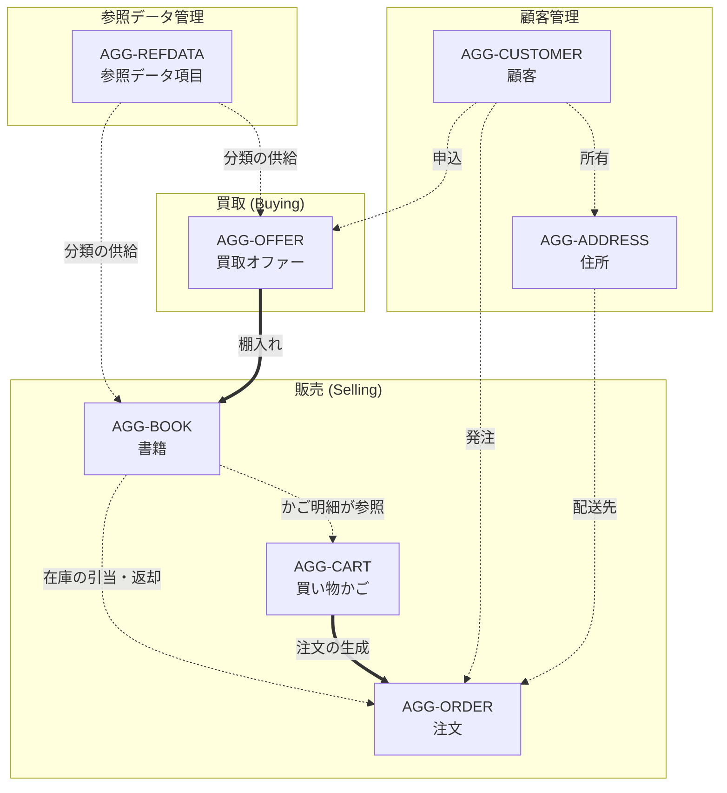
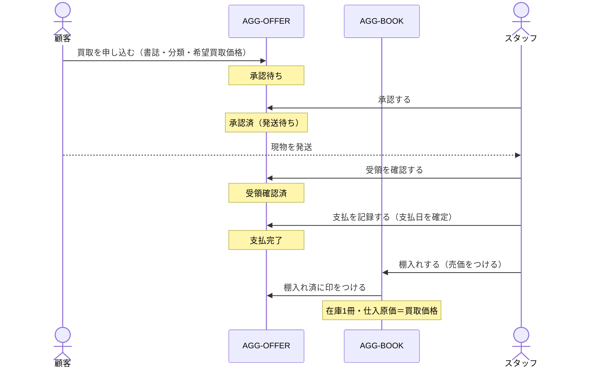
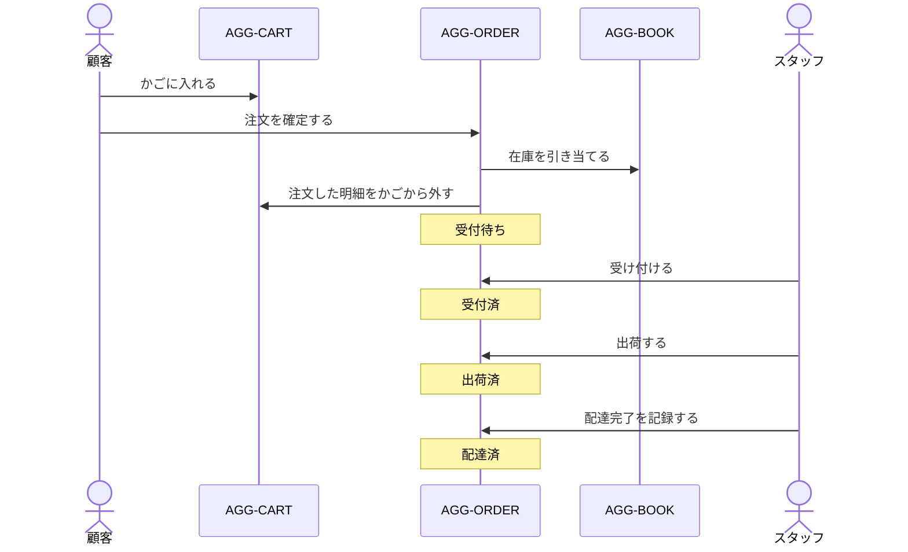

# ドメイン全体像

## 1. 事業モデル

この店の事業は一つの単純な循環でできている。

```
顧客 ──買取オファー──> 店 ──棚入れ──> 在庫 ──注文──> 顧客
        （代金を支払う）              （売価をつける）
```

**安く買って高く売る**。したがってドメインが表現しなければならない最重要の事実は、
「**この1冊にいくら払い、いくらで売ったか**」である。この事実を保持するために、
仕入原価が買取オファーから書籍へ、書籍から注文明細へと**値として写し取られる**。

## 2. サブドメイン

| 区分 | サブドメイン | 内容 | 集約 |
| --- | --- | --- | --- |
| 中核 | **販売 (Selling)** | 在庫の提示、かごへの投入、注文の成立と履行 | AGG-BOOK, AGG-CART, AGG-ORDER |
| 中核 | **買取 (Buying)** | 買取申込の受付、審査、支払、棚入れ | AGG-OFFER |
| 支援 | **顧客管理** | 顧客の同一性、配送先 | AGG-CUSTOMER, AGG-ADDRESS |
| 汎用 | **参照データ管理** | 分類の選択肢の維持 | AGG-REFDATA |

販売と買取は独立した流れであり、**接点は棚入れ（`Book.CreateFromOffer`）ただ一つ**である。
この接点を通らずに買取側から販売側へ状態が伝わることはない。

## 3. 集約マップ



- **太線 (==)**: 一方の集約の状態遷移が他方の集約を生成・変更する、業務上の主要な導線
- **点線 (-.-)**: 識別子または読み取りによる参照

## 4. 集約一覧

| 識別子 | 集約 | ルート | 内部エンティティ | 識別の鍵 | 文書 |
| --- | --- | --- | --- | --- | --- |
| `AGG-REFDATA` | 参照データ項目 | ReferenceDataItem | — | 識別子 | [AGG-REFDATA](aggregate-reference-data.md) |
| `AGG-BOOK` | 書籍 | Book | — | 識別子 | [AGG-BOOK](aggregate-book.md) |
| `AGG-CUSTOMER` | 顧客 | Customer | — | 主体識別子 (Sub) | [AGG-CUSTOMER / AGG-ADDRESS](aggregate-customer-address.md) |
| `AGG-ADDRESS` | 住所 | Address | — | 識別子 ＋ 所有顧客 | [AGG-CUSTOMER / AGG-ADDRESS](aggregate-customer-address.md) |
| `AGG-CART` | 買い物かご | ShoppingCart | ShoppingCartItem | かご相関識別子 | [AGG-CART](aggregate-shopping-cart.md) |
| `AGG-ORDER` | 注文 | Order | OrderItem | 識別子 | [AGG-ORDER](aggregate-order.md) |
| `AGG-OFFER` | 買取オファー | Offer | — | 識別子 | [AGG-OFFER](aggregate-offer.md) |

## 5. アクター

| アクター | 役割 | 主なユースケース |
| --- | --- | --- |
| **顧客 (Customer)** | 書籍を買う／自分の蔵書を売る | 検索、かご操作、注文、注文取消、買取申込、自分の履歴照会 |
| **店舗スタッフ (Staff)** | 在庫と取引を運営する | 参照データ保守、書籍登録、オファー審査・支払・棚入れ、注文の受付・出荷・配達、ダッシュボード閲覧 |
| **外部認証基盤** | 顧客の同一性を発行する | 主体識別子 (Sub) の発行 |

顧客とスタッフの分離は**照会の作法**として現れる。顧客向けの照会は必ず主体識別子で絞り込まれ
（`GetOrderAsync(sub, id)` / `GetOfferAsync(sub, id)`）、スタッフ向けの照会は絞り込まない
（`GetOrderAsync(id)` / `GetOfferAsync(id)`）。詳細は [RULE-ACCESS-01](../../spec/rules.md)。

## 6. ドメイン外の協力者

ドメイン層は以下を**インタフェースとしてのみ**知っており、実装は外側にある。

| インタフェース | 責務 | ドメイン上の位置づけ |
| --- | --- | --- |
| `IUnitOfWork` | 一連の変更をまとめて確定する | 整合性境界の宣言（[共通構成要素](building-blocks.md) §5） |
| `IFileService` | 表紙画像の保存・削除 | 外部資源参照の管理 |
| `IImageResizeService` | 画像の寸法調整 | 表示都合の変換 |
| `IImageValidationService` | 画像の安全性判定 | 差し替え可能なポリシー [POL-IMAGE-SAFETY](services-and-policies.md) |
| 各 `I*Repository` | 集約の取得と登録 | 永続化の抽象（[ドメインサービスとポリシー](services-and-policies.md) §4） |

## 7. 二つの流れの詳細

### 7.1 買取の流れ（顧客 → 店）



### 7.2 販売の流れ（店 → 顧客）



## 8. 整合性境界

この店では **1冊しかない本を二人に売ってしまうこと**が最も避けたい事故である。
そのため、注文の確定は**複数集約を同一の単位作業で確定する**設計になっている。

| 操作 | 同一単位作業で変更される集約 |
| --- | --- |
| 注文の確定 | AGG-ORDER（新規）＋ AGG-BOOK（在庫減、複数）＋ AGG-CART（明細削除） |
| 注文の取消 | AGG-ORDER（状態）＋ AGG-BOOK（在庫戻し、複数） |
| 棚入れ | AGG-BOOK（新規）＋ AGG-OFFER（棚入れ済） |
| 住所の登録 | AGG-ADDRESS（新規）＋ AGG-CUSTOMER（新規の場合） |

DDD の一般原則は「1トランザクション1集約」だが、ここでは**在庫の即時整合性を優先する**判断が
明示的に採られている。その代償として、集約が他の集約を直接変更する箇所が存在する
（[ISSUE-03](../issues.md)）。
