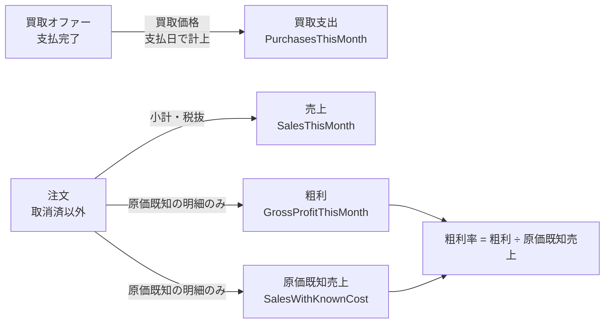

# 読み取りモデルと統計

## 1. 位置づけ

ドメインには、**状態を変える側（書き込みモデル）**と、
**状態を問う側（読み取りモデル）**の二つの面がある。

| 面 | 特徴 |
| --- | --- |
| 書き込みモデル | 集約・値オブジェクト。金額と数量は値オブジェクトで表され、不変条件を担う |
| 読み取りモデル | 統計・一覧。金額は**素の数**であり、値オブジェクトを用いない |

**統計値が金額でない理由**: 統計は永続化層が算出した**投影**であり、
値オブジェクトが担う不変条件（非負・丸め・単一通貨）の対象ではない。
それらは書き込みモデルが守るべき性質であって、集計結果の性質ではない。

## 2. RM-BOOK-STATS — 書籍統計

| 指標 | 論理型 | 定義 |
| --- | --- | --- |
| 在庫切れ数 (OutOfStock) | 数 | 在庫数が 0 の書籍の件数 |
| 在庫僅少（販売可）数 (LowStockStillAvailable) | 数 | 在庫数が 1 以上しきい値 (5) 以下の書籍の件数。**在庫切れを含まない** |
| 総在庫数 (StockTotal) | 数 | 全書籍の在庫数の合計 |

統計が取得できない場合、**すべて 0 の統計**が返る（呼び出し側が不在を扱わなくてよい）。

### 2.1 「在庫僅少」が二つある理由

| 概念 | 所属 | 問い | 0 冊を含むか |
| --- | --- | --- | --- |
| 在庫僅少 (IsLowInStock) | 書籍集約 | 「この本は**補充の判断**が要るか」 | **含む** |
| 在庫僅少（販売可） (LowStockStillAvailable) | 読み取りモデル | 「どの本が**在庫切れに近づいて**いるか」 | **含まない** |

**同じ言葉が二つの意味を持たないよう、意識的に別名が与えられている。**

仕入担当にとって、完全に売り切れた本は、残り少ない本と同じかそれ以上に補充判断を要する。
一方、分析にとって「売り切れそうな本」に**すでに売り切れた本**は含まれない。
それは別の指標（在庫切れ数）で数えられている。

書籍の絞り込み条件も同じ考えに従い、在庫僅少（0 を含む）と在庫切れ（0 のみ）を
**別の条件として**提供している（[AGG-BOOK](aggregate-book.md) §8.1）。

## 3. RM-ORDER-STATS — 注文統計

| 指標 | 論理型 | 定義 |
| --- | --- | --- |
| 受付待ち注文数 (PendingOrders) | 数 | 状態が受付待ちの注文の件数 |
| 納期超過注文数 (PastDueOrders) | 数 | **注文集約の納期超過絞り込み**による件数 |
| 今月の注文数 (OrdersThisMonth) | 数 | 当月に発生した注文の件数 |
| 累計注文数 (OrdersTotal) | 数 | 全注文の件数 |
| 今月の売上 (SalesThisMonth) | 数（金額相当） | 当月の売上計上対象注文の小計の合計。**税抜** |
| 累計売上 (SalesTotal) | 数（金額相当） | 全期間の同上 |
| 今月の粗利 (GrossProfitThisMonth) | 数（差額相当） | 当月の、**原価が既知の**明細の粗利の合計 |
| 累計粗利 (GrossProfitTotal) | 数（差額相当） | 全期間の同上 |
| 今月の原価既知売上 (SalesWithKnownCostThisMonth) | 数（金額相当） | 当月の、原価が既知の明細の小計の合計 |
| 累計原価既知売上 (SalesWithKnownCostTotal) | 数（金額相当） | 全期間の同上 |

### 3.1 原価既知売上が別に集計される理由

粗利は、**原価が既知の売上に対してのみ**算出できる。
手入力された書籍は仕入原価をドメインが知らないため、粗利の計算から除外される。

したがって「粗利 ÷ 売上」を粗利率として計算すると**過小評価**になる。
正しい分母は原価既知売上である。この分母を別に集計しているのはそのためである。

| 誤り | 正しい |
| --- | --- |
| 粗利 ÷ 売上 | 粗利 ÷ **原価既知売上** |

### 3.2 売上が税抜である理由

税は店の収入ではなく、**他者のために徴収するもの**である。
したがって売上は小計（税抜）の合計であり、合計（税込）ではない。

### 3.3 集約が定義するルールと読み取り側の一致

注文集約は、**同一のルールを二つの形で公開している**。

| ルール | 集約上の形 | 読み取り側の形 |
| --- | --- | --- |
| 売上計上対象 | 売上計上対象 (CountsAsSale) | 売上絞り込み (SalesFilter) |
| 納期超過 | 納期超過 (IsPastDue) | 納期超過絞り込み (PastDueAsOf) |

**両者が同じ答えを返すことはテストで固定されている**（[テストによる仕様](verified-by-test.md)）。
ダッシュボードの数字が、注文自身の定義から離れて別の意味になることを防ぐための構造である。

## 4. RM-OFFER-STATS — 買取オファー統計

| 指標 | 論理型 | 定義 |
| --- | --- | --- |
| 承認待ちオファー数 (PendingOffers) | 数 | 状態が承認待ちのオファーの件数 |
| 今月のオファー数 (OffersThisMonth) | 数 | 当月に発生したオファーの件数 |
| 累計オファー数 (OffersTotal) | 数 | 全オファーの件数 |
| 承認待ちオファー金額 (PendingOffersValue) | 数（金額相当） | 承認待ちオファーの買取価格の合計。**受け入れた場合にかかる費用** |
| 今月の買取支出 (PurchasesThisMonth) | 数（金額相当） | **支払日**が当月であるオファーの買取価格の合計 |
| 累計買取支出 (PurchasesTotal) | 数（金額相当） | 全期間の同上 |

### 4.1 支払日で数える理由

「店が期間内にいくら使ったか」は、**金が出た時点**で決まる。
ある月に申し込まれ、翌月に支払われたオファーは、**翌月の支出**である。
申込日で数えると、まだ払っていない金を払ったことにしてしまう。

### 4.2 承認待ちオファー金額

「何件待っているか」は測れても、「**それを受け入れると何ドルかかるか**」が
測れなければ、意思決定の材料にならない。この指標はその問いに答える。

## 5. 収益の全体像

**買取支出と売上は別々の時点で計上される。** 棚入れした月ではなく支払った月に支出が立ち、
売れた月に売上が立つ。したがって「今月の買取支出 − 今月の売上」は損益ではない。

## 6. 一覧照会

| 識別子 | 読み取りモデル | 絞り込み条件 | ページ化 |
| --- | --- | --- | --- |
| `RM-BOOK-LIST` | 書籍一覧（条件指定） | 書名、著者、出版社、ジャンル、書籍種別、状態、在庫僅少、在庫切れ | ○ |
| `RM-BOOK-SEARCH` | 書籍一覧（検索） | 検索文字列、並べ替えキー | ○ |
| `RM-BESTSELLERS` | 売れ筋書籍 | 件数 | ✗ |
| `RM-ORDER-LIST` | 注文一覧（スタッフ） | 状態、注文日 From/To、納期超過 | ○ |
| `RM-ORDER-BY-CUSTOMER` | 注文一覧（顧客別） | 主体識別子 | ✗ |
| `RM-OFFER-LIST` | オファー一覧（スタッフ） | 書名、著者、ジャンル、状態（コンディション）、状態（ステータス） | ○ |
| `RM-OFFER-BY-CUSTOMER` | オファー一覧（顧客別） | 主体識別子 | ✗ |
| `RM-REFDATA-LIST` | 参照データ一覧 | 種別 | ○ |
| `RM-ADDRESS-BY-CUSTOMER` | 住所一覧（顧客別） | 主体識別子 | ✗ |

### 6.1 ページ化の仕様

| 属性 | 意味 |
| --- | --- |
| 要素 | 切り出された行 |
| 頁番号 | **1 始まり** |
| 頁サイズ | **要求された範囲の大きさ**。返ってきた行数ではない |
| 総件数 | 範囲を無視した、条件に合致する行数 |

「次頁があるか」「何頁あるか」「どの頁番号のボタンを描くか」は**業務概念ではない**ため
含まれない。それらは表示側が総件数と頁サイズから導く。

## 7. ドメイン未定義の事項

読み取りモデルの多くは**属性の形だけが定義され、算出方法は永続化層に委ねられている**。

| 事項 | ドメインの規定 |
| --- | --- |
| 「今月」の起点 | **規定あり**（当月 1 日 0 時、[RULE-PERIOD-02](invariants.md)） |
| 売上計上の対象 | **規定あり**（注文集約の売上絞り込み） |
| 納期超過の判定 | **規定あり**（注文集約の納期超過絞り込み） |
| 「今月の注文数」の基準日 | **未定義**。注文日という属性がなく、基底の作成日時に依拠する（[ISSUE-11](../issues.md)） |
| 「今月のオファー数」の基準日 | **未定義**。同上 |
| 売れ筋の定義 | **未定義**。何をもって「売れている」とするかドメインに規定がない |
| 検索文字列の照合対象・方式 | **未定義** |
| 並べ替えキーの語彙 | **未定義**。文字列で受け渡される |
| 在庫切れ数・総在庫数の算出 | **未定義**（属性の意味のみ規定） |
| 各金額指標の集計式 | **未定義**（意味のみ規定） |

**規定のあるものとないものの違いは重要である。** 売上計上と納期超過は、
集約が問い合わせ形式のルールを公開し、テストで一致が固定されているため、
読み取り側が独自の意味を持つことはない。それ以外の指標にはその保証がない。
