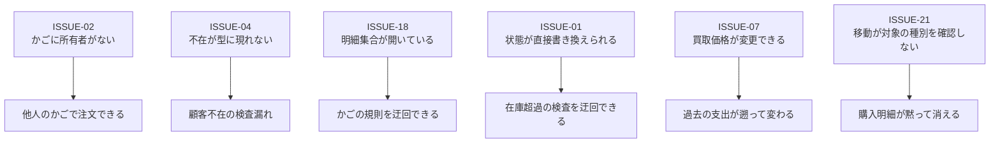

# 設計上の課題

本章は**現時点のモデルの歪み**を隔離して記述する。01〜14 は現状の記述であり、
本章のみが「あるべき姿」を論じる。

各課題には**重大度**を付す。

| 重大度 | 意味 |
| --- | --- |
| **高** | 不変条件が実際に破られうる、または業務上の誤りを生む |
| **中** | モデルの表現力が不足しており、将来の変更を難しくする |
| **低** | 整理の問題。動作に影響しない |

## 課題一覧

| 識別子 | 課題 | 重大度 | 関係する不変条件 |
| --- | --- | --- | --- |
| [ISSUE-01](#issue-01) | 集約の状態が公開された代入で直接書き換えられる | **高** | `INV-BOOK-07`, `INV-CART-07`, `INV-ORDER-11` |
| [ISSUE-02](#issue-02) | 買い物かごが顧客に紐づいていない | **高** | — |
| [ISSUE-03](#issue-03) | 集約が他の集約を直接変更する | 中 | `INV-ORDER-08` |
| [ISSUE-04](#issue-04) | 不在を返す照会が不在を表現しない型で宣言されている | **高** | — |
| [ISSUE-05](#issue-05) | 明細の追加と在庫の引き当てが分離している | 中 | `INV-ORDER-10` |
| [ISSUE-06](#issue-06) | 集約単体では明細のない注文を作れる | 中 | `INV-ORDER-10` |
| [ISSUE-07](#issue-07) | 支払済オファーの買取価格が変更できる | **高** | `INV-OFFER-11` |
| [ISSUE-08](#issue-08) | 棚入れが常に 1 冊固定である | 中 | `INV-BOOK-06` |
| [ISSUE-09](#issue-09) | 統計の集計定義がドメインにない | 中 | — |
| [ISSUE-10](#issue-10) | 税率が単一の定数である | 中 | — |
| [ISSUE-11](#issue-11) | 注文日・申込日という業務概念がない | 中 | — |
| [ISSUE-12](#issue-12) | 参照データに一意性・廃止の概念がない | 中 | `INV-REFDATA-01` |
| [ISSUE-13](#issue-13) | 更新日時の記録が経路によって漏れる | 低 | — |
| [ISSUE-14](#issue-14) | ドメインイベントがない | 中 | — |
| [ISSUE-15](#issue-15) | 住所が独立した集約であることの是非 | 低 | `INV-ADDR-01` |
| [ISSUE-16](#issue-16) | 基盤設定がドメイン層に混在している | 低 | — |
| [ISSUE-17](#issue-17) | リポジトリの公開範囲が不統一である | 低 | — |
| [ISSUE-18](#issue-18) | かごの明細集合が外部から直接変更できる | **高** | `INV-CART-07` |
| [ISSUE-19](#issue-19) | 氏名の導出が未設定を考慮しない | 低 | — |
| [ISSUE-20](#issue-20) | かごの判定が書籍の読み込みに依存する | 低 | — |
| [ISSUE-21](#issue-21) | 欲しい物明細の移動が対象の種別を確認しない | **高** | `INV-CART-06` |

---

## ISSUE-01

### 集約の状態が公開された代入で直接書き換えられる

**重大度: 高**

#### 現象

集約が振る舞いで守っているはずの状態が、外部からの直接代入で書き換えられる。

| 集約 | 直接代入できる属性 | 迂回される振る舞い |
| --- | --- | --- |
| 書籍 | 在庫数 | 在庫を減らす／戻す（在庫超過の検査） |
| 書籍 | 売価 | — |
| 注文 | 納品予定日 | 生成時の 7 日後という規則 |
| 注文 | 顧客・配送先 | 生成時の確定 |
| かご明細 | 数量、購入意思、書籍 | かごの明細統合規則 |
| 買取オファー | 買取価格 | — |
| 基底 | 識別子、作成者、作成日時、更新日時 | — |

#### 影響

`INV-BOOK-07`（在庫の増減は在庫操作を通じる）が **[表明]** に留まる直接の原因である。
在庫超過の検査は在庫を減らす操作にしかないため、直接代入は検査を完全に迂回する。

書籍の更新ユースケースは実際に在庫数を直接代入している。
スタッフによる在庫の手動調整という正当な用途だが、
**その用途に固有の振る舞いが存在しない**ため、検査のない代入で代用されている。

かご明細の購入意思と数量が書き換え可能であることは、
`INV-CART-02`（同一書籍の購入明細は 1 行）を集約の外から破れることを意味する。

#### 改善の方向

1. 状態を外部から書き換えられないようにし、用途ごとの振る舞いを与える
   - 在庫の手動調整 → 「在庫を訂正する」振る舞い
   - 売価の改定 → 「売価を改定する」振る舞い
2. 永続化の都合で代入が必要な箇所は、内部限定の経路に閉じる
   （金額・数量の内部数値属性がすでに採っている方式）

---

## ISSUE-02

### 買い物かごが顧客に紐づいていない

**重大度: 高**

#### 現象

かごを特定するのは**かご相関識別子だけ**であり、かごは所有者を知らない。
注文確定の入力は、かご相関識別子と顧客の主体識別子を**独立した引数**として受け取る。

```
注文を確定する(主体識別子, かご相関識別子, 住所識別子)
```

**両者が同一人物のものであるかを検証する箇所がドメインに存在しない。**

#### 影響

他人のかご相関識別子を知っていれば、その中身を自分の注文として確定できる。
在庫は減り、かごの明細は消え、注文は自分のものになる。

同様に、住所識別子も注文確定時に**所有者が検証されていない**。
他人の住所識別子を配送先に指定できる。

これはドメイン層の外（認証・セッション管理）で防がれている可能性があるが、
**ドメインは何も保証していない**。

#### 改善の方向

いずれかを選ぶ。

| 案 | 内容 | 代償 |
| --- | --- | --- |
| A | かごに所有者（主体識別子）を持たせ、注文確定時に一致を検証する | 未ログイン訪問者のかごを表現できなくなる |
| B | かごに任意の所有者を持たせ、設定済みの場合のみ一致を検証する | 未設定のかごが残る |
| C | 現状維持とし、**検証はドメイン外の責務であると明記する** | 保証がドメインの外に出る |

配送先住所については、注文確定時に**所有者で絞り込んだ住所取得**を用いれば
現在の照会だけで検証できる。

---

## ISSUE-03

### 集約が他の集約を直接変更する

**重大度: 中**

#### 現象

注文集約の取消操作は、明細を通じて**書籍集約の在庫を直接変更する**。
注文サービスも同様に、注文確定時に書籍の在庫を減らす。

DDD の一般原則では、集約は他の集約を識別子で参照し、実体を保持しない。
ここでは注文明細が書籍の実体を保持し、その状態を変えている。

#### 判断

**これは意図的な設計判断である。**

中古書店では通常 1 冊しか在庫がなく、
**同じ 1 冊を二人に売る事故の代償が、複数集約を同時に確定する代償を上回る**。
そのため、注文・在庫・かごは同一の単位作業で確定される。

問題は判断そのものではなく、その帰結が**モデルに現れていない**ことである。

| 帰結 | 現状 |
| --- | --- |
| 注文は書籍を読み込んだ状態でしか取り消せない | 明示されていない |
| 注文明細は書籍の実体に依存する | 型としてそう見えるだけ |
| 在庫の整合性は単位作業に依存する | 単位作業の存在は明示されているが、どの集約が含まれるかは手順を読まないとわからない |

#### 改善の方向

1. 現状の判断を維持し、**「在庫の即時整合性を優先する」という方針を集約の契約として明記する**
2. あるいは、在庫の引き当てを独立した概念（引当）として切り出し、
   注文と在庫の結合を弱める

---

## ISSUE-04

### 不在を返す照会が不在を表現しない型で宣言されている

**重大度: 高**

#### 現象

「見つからなければ不在を返す」と説明されている照会が、
**不在を表現できない型で宣言されている**。

| 照会 | 説明上の振る舞い | 宣言 |
| --- | --- | --- |
| 所有者で絞り込んだ注文取得 | 所有者が異なれば不在を返す | 不在を許さない型 |
| 所有者で絞り込んだオファー取得 | 同上 | 同上 |
| かご取得 | かごがなければ不在を返す | 同上 |
| 顧客取得 | 顧客がなければ不在を返す | 同上 |
| 住所取得 | 同上 | 同上 |

呼び出し側は実際には不在を検査している（注文取消、注文確定、住所更新など）。
つまり**宣言と実際の契約が食い違っている**。

#### 具体的な欠陥

買取オファーの申込は、顧客を取得したあと**不在を検査せずに顧客の識別子を読む**。
注文確定は同じ場面で不在を検査して失敗させている。
同じ「顧客がいない」状況に対して、**二つの操作が異なる振る舞いをする**。

`RULE-SERVICE-01`（注文と買取申込は顧客の存在を前提とする）は、
買取申込については保証されていない。

同様に、書籍の更新は書籍取得の結果を検査せず属性を代入する。

#### 改善の方向

1. 不在を返す照会を、**不在を表現できる型**で宣言する
2. 呼び出し側に検査を強制し、`POL-NOTFOUND` の方針を型の上で見えるようにする
3. 買取申込と書籍更新に、他の操作と同じ厳格な検査を加える

---

## ISSUE-05

### 明細の追加と在庫の引き当てが分離している

**重大度: 中**

#### 現象

注文集約の「明細を追加する」操作は、**在庫を減らさない**。
在庫の引き当ては注文サービスが別途行う。

```
注文.明細を追加する(書籍, 数量)     ← 在庫は変わらない
書籍.在庫を減らす(数量)              ← サービスが呼ぶ
```

一方、取消操作は**在庫の返却を含む**。追加と取消が非対称である。

#### 影響

集約だけを使って、**在庫を減らさずに明細を持つ注文**を作れる。
`INV-ORDER-10`（注文は最低 1 明細を持つ）が **[外部]** に留まる背景でもある。

在庫の整合性は「サービスが正しい順序で呼ぶこと」に依存しており、
集約が保証していない。

#### 改善の方向

| 案 | 内容 |
| --- | --- |
| A | 明細の追加が在庫の引き当てを含むようにし、取消と対称にする |
| B | 注文の生成自体を、かごの明細を受け取る単一の操作にまとめ、部分的に構築された注文が存在しないようにする |

案 B は `INV-ORDER-10` を **[強制]** にできる（[ISSUE-06](#issue-06) と同時に解決する）。

---

## ISSUE-06

### 集約単体では明細のない注文を作れる

**重大度: 中**

#### 現象

注文は顧客識別子と住所識別子だけで生成でき、そのまま明細を持たずに存在できる。
明細が 1 件以上あることは、かごの「注文対象抽出」が保証している。

`INV-ORDER-10` が **[外部]** である理由。

#### 影響

明細のない注文は、小計 0・税 0・合計 0 の売上として統計に計上される。
業務的には存在してはならない注文である。

#### 改善の方向

注文の生成を、**明細を伴う単一の操作**にする。
「顧客・住所・1 件以上の明細」を受け取って注文を作り、
明細なしの中間状態を存在させない。

---

## ISSUE-07

### 支払済オファーの買取価格が変更できる

**重大度: 高**

#### 現象

買取オファーの買取価格は外部から書き換えられる。
状態が支払完了であっても、棚入れ済であっても変更できる。

`INV-OFFER-11`（買取価格は支払後変化しない）が **[不成立]** である。

#### 影響

| 影響 | 内容 |
| --- | --- |
| 過去の支出が変わる | 買取側の金額指標（今月の買取支出、累計買取支出）は買取価格を集計する。すでに支払った金額を書き換えると、**過去の月の支出が遡って変わる** |
| 承認待ちオファー金額が変わる | 同様に集計対象である |
| 書籍の仕入原価とは乖離する | 仕入原価は棚入れ時に**写し取られている**ため書き換えの影響を受けない。結果として、オファーの買取価格と書籍の仕入原価が食い違いうる |

写し取りによって注文の粗利は守られているが、**買取側の指標は守られていない**。

#### 改善の方向

買取価格を外部から書き換えられないようにする。
承認前の価格交渉が必要なら、**承認待ちの状態でのみ有効な「価格を改める」振る舞い**を設ける。

---

## ISSUE-08

### 棚入れが常に 1 冊固定である

**重大度: 中**

#### 現象

オファーから書籍を作るとき、在庫数は**常に 1** である。
「1 件の買取オファーは 1 冊の現物を指す」という前提が定数として埋め込まれている。

#### 影響

同一タイトルを複数冊まとめて買い取る場合、オファーを冊数分作るしかない。
また、同じタイトルがすでに在庫にある場合、
**既存の書籍の在庫が増えるのではなく、別の書籍が作られる**。

結果として、同じ本が複数の書籍として並ぶ。
これは中古書店では正しい場合もある（コンディションが異なるため）が、
**ドメインはその区別を表現していない**。

#### 改善の方向

1. オファーに冊数の概念を導入する
2. 既存の同一書籍への合流を扱うか、扱わないかを明示的に決める
   （コンディションが分類の一部である以上、「同一の書籍」の定義を先に決める必要がある）

---

## ISSUE-09

### 統計の集計定義がドメインにない

**重大度: 中**

#### 現象

統計は**属性の形だけが定義され、算出方法は永続化層に委ねられている**。

| 規定あり | 規定なし |
| --- | --- |
| 「今月」の起点（当月 1 日 0 時） | 「今月の注文数」の基準日 |
| 売上計上の対象（注文集約の絞り込み） | 在庫切れ数・総在庫数の算出 |
| 納期超過の判定（注文集約の絞り込み） | 売れ筋の定義 |
| | 各金額指標の集計式 |

#### 影響

規定のあるものは、集約が問い合わせ形式のルールを公開し、
テストで判定形式との一致が固定されているため、乖離しない。

規定のないものにはその保証がなく、
**ダッシュボードの数字が業務上の意味から静かにずれても検出できない**。

#### 改善の方向

集約が公開する問い合わせ形式のルールを、他の指標にも広げる。
特に金額指標（売上・粗利・買取支出）は、
どの明細をどの期間に割り当てるかがドメインの判断であり、
永続化層に委ねるべきではない。

---

## ISSUE-10

### 税率が単一の定数である

**重大度: 中**

#### 現象

税率は注文集約の定数 10% である。
時期による変動、地域による差異、非課税品目のいずれも表現できない。

#### 影響

税率が変わると、**過去の注文の税額も変わる**。
注文は価格と原価を凍結しているのに、税だけが凍結されていない。

#### 改善の方向

1. 税額を注文確定時に**凍結する**（価格・原価と同じ扱い）
2. 税率を、時点と対象から決まる概念として切り出す

最小限の改善は 1 である。凍結すれば、税率の変更が過去に遡らない。

---

## ISSUE-11

### 注文日・申込日という業務概念がない

**重大度: 中**

#### 現象

注文にも買取オファーにも、**業務上の発生日を表す属性がない**。
「今月の注文数」も、注文一覧の期間絞り込みも、
基底エンティティの**作成日時**に依拠している。

作成日時は技術的な記録であり、業務上の日付ではない。

#### 影響

| 影響 | 内容 |
| --- | --- |
| 意味の混同 | データ移行やバッチ登録で作成日時が実際の注文日と乖離すると、統計が狂う |
| 訂正できない | 業務上の日付を修正する手段がない |
| 対称性の欠如 | 買取側は**支払日**を独立した属性として持っている。売上側に同等の概念がない |

買取側が支払日を独立に持っているのは正しい設計であり、
**注文側がそれに倣っていない**ことが問題である。

#### 改善の方向

注文に「注文日」、オファーに「申込日」を業務属性として持たせ、
統計と絞り込みをそちらに切り替える。

---

## ISSUE-12

### 参照データに一意性・廃止の概念がない

**重大度: 中**

#### 現象

| 事項 | 現状 |
| --- | --- |
| 名称の一意性 | 検査なし。同一種別に同名の項目を複数作れる |
| 名称の書式・長さ | 検査なし。空文字も拒否されない |
| 項目の廃止 | 手段なし |
| 表示順 | 概念なし |

#### 影響

同名のジャンルが二つあると、書籍がどちらに分類されているか判別できない。
使わなくなった選択肢を隠せないため、選択肢は増える一方である。

一方、**項目を削除できないこと自体は正しい**。
削除できれば、その項目を参照している書籍の分類が壊れる
（`INV-CLASS-01` が過去に遡って破られる）。
必要なのは削除ではなく**廃止**——新規選択の対象から外しつつ、既存の参照は保つ——である。

#### 改善の方向

1. 種別内での名称の一意性を保証する
2. 空の名称を拒否する
3. 「廃止」の概念を導入する。廃止された項目は分類の新規作成には使えないが、既存の参照は有効なまま

---

## ISSUE-13

### 更新日時の記録が経路によって漏れる

**重大度: 低**

#### 現象

更新日時は**呼び出し側が明示的に設定する**。設定する経路としない経路が混在している。

| 設定する | 設定しない |
| --- | --- |
| 書籍の更新 | 住所の更新 |
| 注文の状態遷移 | 参照データ項目の改名 |
| オファーの状態遷移 | かごの全操作 |
| プロフィールの登録・更新 | |

#### 影響

更新日時が「最後に変更された時点」を表さない。
監査や同期の基準として使えない。

#### 改善の方向

更新日時を**集約またはその外側の仕組みが自動的に記録する**ようにし、
呼び出し側の責務から外す。

---

## ISSUE-14

### ドメインイベントがない

**重大度: 中**

#### 現象

集約間の連携は、すべて**サービスの手順**か**副作用**として表現されている。

| 業務上の出来事 | 現在の表現 |
| --- | --- |
| オファーが支払われた | 状態遷移。誰も通知されない |
| オファーが棚入れされた | 書籍生成の副作用としてフラグが立つ |
| 注文が確定した | サービスの手順 |
| 注文が取り消された | 取消操作の副作用として在庫が戻る |
| 書籍が在庫切れになった | 表現されない |

#### 影響

「支払が完了したら顧客に通知する」「在庫切れになったら仕入担当に知らせる」
といった要求を加えるとき、**サービスの手順に処理を差し込むしかない**。
サービスが肥大し、集約が何を起こしたのかが手順を読まないとわからない。

特に**棚入れ**は、買取側と販売側をつなぐ唯一の接点でありながら、
書籍の生成操作がオファーの内部状態を変えるという形で表現されている。
これは二つのサブドメインの結合を強めている。

#### 改善の方向

集約が業務上の出来事を発行し、単位作業の完了時に配送する仕組みを導入する。
棚入れは「オファーが支払われた」という出来事に反応する形に変えられる。

---

## ISSUE-15

### 住所が独立した集約であることの是非

**重大度: 低**

#### 現象

住所は独自のリポジトリを持つ独立した集約だが、
生成時に顧客の実体を要求し、顧客への参照を保持する。
所有者を跨いだ照会は存在せず、**常に顧客とともに扱われる**。

これは「顧客集約の内部エンティティである」という設計と、
「独立した集約である」という設計の中間にある。

#### 判断

住所を顧客集約の内部に置くと、顧客を読むたびに全住所を読むことになる。
独立させる判断には合理性がある。

問題は、独立集約であるなら**顧客の実体ではなく識別子で参照すべき**である点。
現状は実体を保持しており、集約の境界が曖昧になっている。

#### 改善の方向

住所が顧客を識別子で参照するようにし、境界を明確にする。

---

## ISSUE-16

### 基盤設定がドメイン層に混在している

**重大度: 低**

#### 現象

データベースの接続情報（ホスト、ポート、資格情報、インスタンス識別子、エンジン種別）が
ドメイン層に配置されている。これは業務モデルではなく**基盤の設定**である。

#### 影響

ドメイン層が「業務のことだけを述べる場所」であるという性質が損なわれる。

#### 改善の方向

基盤設定を永続化層または構成層へ移す。

---

## ISSUE-17

### リポジトリの公開範囲が不統一である

**重大度: 低**

#### 現象

リポジトリの操作は原則としてドメイン層と永続化層の内部にのみ公開されている。
ところが**統計取得だけ**は、書籍・オファーのリポジトリでドメイン層の外にも公開されている。
注文リポジトリの統計取得は内部限定であり、**同じ種類の操作の公開範囲が集約ごとに違う**。

#### 影響

ドメイン層の外がリポジトリを直接呼べる経路が部分的に開いており、
サービスを経由するという原則に穴がある。

#### 改善の方向

公開範囲を統一する。統計はサービス経由でのみ取得できるようにする。

---

## ISSUE-18

### かごの明細集合が外部から直接変更できる

**重大度: 高**

#### 現象

買い物かごの明細集合は、**変更可能なコレクションとして公開されている**。
外部から明細を追加・削除できる。

#### 影響

かごが守っている規則をすべて迂回できる。

| 迂回される規則 | 結果 |
| --- | --- |
| `INV-CART-02` 同一書籍の購入明細は 1 行 | 同じ書籍の購入明細を複数作れる。小計が二重に計上される |
| `INV-CART-03` 欲しい物明細は数量 1 | 数量 2 以上の欲しい物明細を作れる |
| `INV-CART-06` 存在しない明細の操作は失敗 | 検査なしに除去できる |

`INV-CART-07` が **[表明]** である直接の原因である。
[ISSUE-01](#issue-01) の一部だが、コレクション全体が開いている点でより深刻である。

#### 改善の方向

明細集合を**読み取り専用として公開**し、変更はかごの振る舞いを通じてのみ行えるようにする。
内部では変更可能な集合を保持し、公開時に読み取り専用に変換する。

---

## ISSUE-19

### 氏名の導出が未設定を考慮しない

**重大度: 低**

#### 現象

顧客の氏名は、名と姓を空白で連結して導出される。
名も姓も任意項目であり、両方が未設定でも氏名は空文字ではなく**空白 1 文字**になる。

#### 影響

「氏名が未設定である」ことを呼び出し側が判定できない。
表示上、名前欄が空白として現れる。

#### 改善の方向

いずれかの部分が未設定の場合の振る舞いを明示する。
両方未設定なら未設定を返す、あるいは設定されている部分のみを連結する。

---

## ISSUE-20

### かごの判定が書籍の読み込みに依存する

**重大度: 低**

#### 現象

かごの小計算出と在庫切れ判定は、**明細が参照する書籍が読み込まれていること**を前提とする。
読み込まれていなければ判定が成立しない。

この前提は型にも振る舞いにも現れておらず、
**かごを取得する経路が正しく書籍を伴って読み込むこと**に依存している。

#### 影響

書籍を伴わずにかごを取得する経路が加わると、
小計と在庫判定が静かに失敗する。

#### 改善の方向

1. かごの取得が書籍を必ず伴うことを、リポジトリの契約として明記する
2. あるいは、小計と在庫判定をかごの外（サービスまたは読み取りモデル）へ移す

---

## ISSUE-21

### 欲しい物明細の移動が対象の種別を確認しない

**重大度: 高**

#### 現象

「欲しい物明細をかごへ移す」操作は、指定された識別子を**かごの全明細から**探す。
探す対象を欲しい物明細（購入意思が偽）に限定していない。

そのため、**購入明細の識別子を渡すことができる**。
その場合の処理は次のように進む。

| 手順 | 内容 |
| --- | --- |
| 1 | 移動対象として、**購入明細そのもの**が見つかる |
| 2 | 同一書籍の購入明細を探す。`INV-CART-02` により購入明細は 1 行しかないため、**手順 1 と同じ明細**が見つかる |
| 3 | 「既存の行がある」経路に入り、自分自身に自分の数量を加算する（数量が倍になる） |
| 4 | 移動対象——すなわち同じ明細——をかごから除去する |

**結果として、その購入明細は黙って削除される。**

#### 検証

購入明細 1 行（数量 2）だけを持つかごに対し、その明細の識別子で移動操作を呼ぶと、
かごは購入明細も欲しい物明細も持たない**完全に空の状態**になる。
例外は発生せず、失敗も報告されない。

#### 影響

この操作の識別子は、顧客の入力としてサービスへ渡される。
顧客が（あるいは誤った画面が）購入明細の識別子を渡すと、
**移動が起きたように見えて、実際にはかごの中身が消える**。

`INV-CART-06`（個別に指定された明細が存在しない操作は失敗する）は
「存在しない場合」を守っているが、**「存在するが種別が違う場合」を守っていない**。

現在のテストは欲しい物明細の識別子しか渡していないため、この経路は検証されていない。

#### 付随する問題

明細の探索は「該当が 1 件であること」を前提とする方式で書かれており、
複数該当した場合には**ドメイン例外ではない例外**が発生する。
永続化済みの明細の識別子は一意であるため通常は起こらないが、
未採番（識別子が 0）の明細が複数ある状態では該当しうる。

#### 改善の方向

1. 移動対象の探索を、**購入意思が偽の明細に限定する**
2. 種別が一致しない識別子は、存在しない場合と同様にドメイン例外で拒否する
3. 購入明細の識別子を渡す経路を検証するテストを加える

---

## まとめ

### 優先度の高い課題



### 課題の性質による分類

| 性質 | 該当する課題 |
| --- | --- |
| **カプセル化の不足** | ISSUE-01, ISSUE-07, ISSUE-18 |
| **境界の曖昧さ** | ISSUE-02, ISSUE-03, ISSUE-15 |
| **契約の表現不足** | ISSUE-04, ISSUE-05, ISSUE-06, ISSUE-20 |
| **入力の検査漏れ** | ISSUE-21 |
| **業務概念の欠落** | ISSUE-08, ISSUE-10, ISSUE-11, ISSUE-12, ISSUE-14 |
| **読み取り側の規定不足** | ISSUE-09 |
| **整理の問題** | ISSUE-13, ISSUE-16, ISSUE-17, ISSUE-19 |

### モデルの強い部分

課題の裏返しとして、**すでに十分に守られている部分**を記しておく。

| 領域 | 状態 |
| --- | --- |
| 金額と数量の意味 | 値オブジェクトにより非負・丸め・明細の最小数量が生成時に保証される |
| 分類の型安全性 | 4 軸の取り違えが生成時に拒否される。種別が不変であるため過去に遡って破られない |
| 状態遷移 | 注文・オファーとも、全遷移が遷移元を検査する。テストが全状態を網羅している |
| 金額の凍結 | 注文明細の価格・原価、書籍の仕入原価がいずれも写し取りであり、後の変更に追随しない |
| 対象不在時の方針 | 厳格／寛容の使い分けが体系的に適用され、根拠が説明できる |
| 整合性境界 | 単位作業が名前のある概念として存在し、どの変更が同時に確定するかが読める |
| 読み取り側との一致 | 売上計上と納期超過は集約が問い合わせ形式でも定義し、テストで一致が固定されている |
