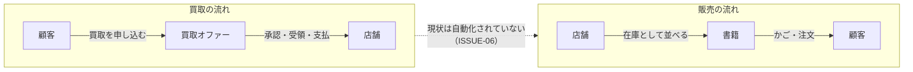
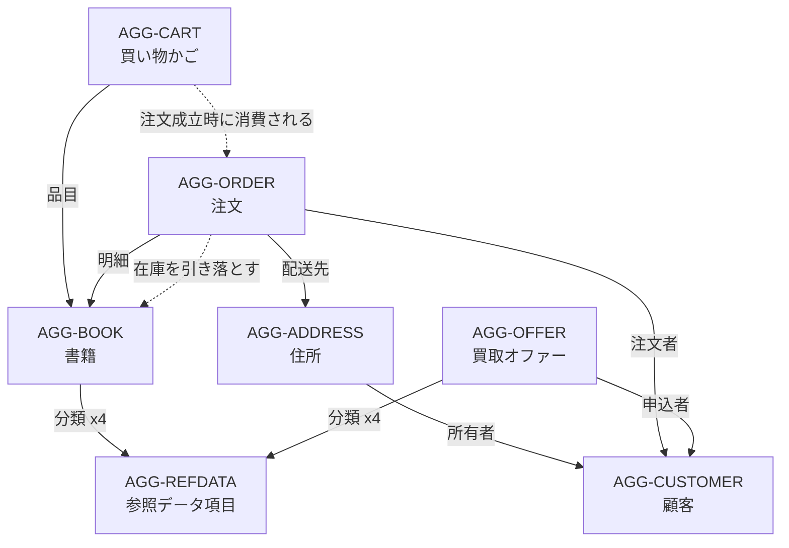
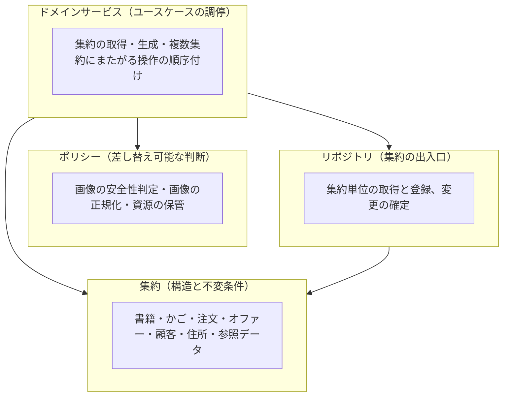

# 02. ドメイン全体像

## 1. このドメインが解いている問題

Bob's Used Bookstore は、**中古書籍が顧客から店舗へ、そして店舗から顧客へと循環する**事業である。したがってドメインには 2 つの逆向きの流れが存在する。

**重要な発見**：買取の流れと販売の流れは、ドメインモデル上つながっていない。買取オファーが承認・受領・支払されても、それが自動的に書籍（在庫）になる仕組みはない。店舗担当者が手作業で書籍を登録することで両者が結ばれる。

## 2. サブドメインの分割

| サブドメイン | 種別 | 責務 | 中核となる集約 |
| --- | --- | --- | --- |
| **販売** | コア | 書籍を顧客に届け、代金の計算根拠を確定する | `AGG-CART`, `AGG-ORDER` |
| **在庫** | コア | 販売可能な書籍と、その残数を管理する | `AGG-BOOK` |
| **買取** | コア | 顧客からの買取申込を受け付け、可否を判断し、決済まで進める | `AGG-OFFER` |
| **顧客** | 支援 | 顧客の同一性と配送先を保持する | `AGG-CUSTOMER`, `AGG-ADDRESS` |
| **分類** | 汎用 | 書籍・オファーが共通で使う分類語彙を管理する | `AGG-REFDATA` |

コア／支援／汎用の区分は、事業上の差別化への寄与度による。**在庫と買取が中古書店の競争力の源泉**であり、顧客管理や分類は他業種と同じ形でよい。

## 3. アクター

ドメインモデルは 2 種類の操作主体を想定するが、片方しか実体を持たない。

| アクター | ドメイン上の実体 | できること |
| --- | --- | --- |
| **顧客** | `AGG-CUSTOMER` として存在する | 書籍を閲覧・かごに入れる・注文する・注文をキャンセルする・住所を管理する・買取を申し込む |
| **店舗担当者** | **実体を持たない** | 書籍を登録・更新する・参照データを管理する・オファーの状態を進める・注文の状態を進める・統計を見る |

> 店舗担当者がモデル上の実体を持たないため、「誰が承認したか」「誰が在庫を登録したか」はドメインでは追跡できない。各要素は作成者を記録する枠を持つが、既定値のまま用いられる（→ [ISSUE-10](14-design-issues.md)）。

## 4. 集約マップ

矢印は**参照の向き**を表す。点線は集約をまたぐ**振る舞い上の依存**を表す。

### 4.1 集約の一覧

| 集約 | 集約ルート | 内部の構成要素 | 識別の方法 |
| --- | --- | --- | --- |
| `AGG-REFDATA` | 参照データ項目 | なし（単一要素） | 識別子 |
| `AGG-BOOK` | 書籍 | なし（単一要素） | 識別子 |
| `AGG-CUSTOMER` | 顧客 | なし（単一要素） | 識別子、および**主体識別子** |
| `AGG-ADDRESS` | 住所 | なし（単一要素） | 識別子（ただし常に所有者と対で照会される） |
| `AGG-CART` | 買い物かご | かご項目（複数） | **相関識別子** |
| `AGG-ORDER` | 注文 | 注文明細（複数） | 識別子 |
| `AGG-OFFER` | 買取オファー | なし（単一要素） | 識別子 |

### 4.2 集約境界の判断根拠

集約の境界は、**「同時に一貫していなければならない範囲」**として引かれている。

| 境界 | なぜ内側か / なぜ外側か |
| --- | --- |
| かご項目がかごの**内側** | 項目単独では意味を持たず、小計や在庫フィルタはかご全体の視点でしか計算できないため |
| 注文明細が注文の**内側** | 明細の増減が注文金額を直接変えるため。明細だけを外から触らせない |
| 書籍がかごの**外側** | 書籍はかごとは独立に更新される。かごが書籍の一貫性に責任を負うことはできない |
| 住所が顧客の**外側** | 住所は独立に照会・更新・削除される。ただし常に所有者の主体識別子とともに照会され、実質的に顧客に従属する（→ [ISSUE-04](14-design-issues.md)） |
| オファーが書籍の**外側** | オファーは在庫ではない。承認前の申込にすぎず、在庫の一貫性とは無関係 |

### 4.3 集約をまたぐ参照の扱い

DDD の原則では、集約間は**識別子による参照**にとどめる。現状のモデルは以下の状態にある。

| 参照元 → 参照先 | 形式 | 評価 |
| --- | --- | --- |
| 書籍 → 参照データ項目 | 識別子＋実体 | 分類の表示に実体が必要。実用上の妥協 |
| かご項目 → 書籍 | 識別子＋実体 | **小計計算と在庫判定が書籍の実体に依存している**。境界を越えた読み取り |
| 注文明細 → 書籍 | 識別子＋実体 | **注文金額が書籍の現在価格に依存している**（→ [ISSUE-02](14-design-issues.md)） |
| 注文 → 顧客 / 住所 | 識別子＋実体 | 生成時は識別子のみで足りている |
| 住所 → 顧客 | 識別子＋実体 | 生成時に顧客の実体を要求する |
| オファー → 顧客 | 識別子＋実体 | 生成時は識別子のみ |

## 5. 集約のライフサイクル一覧

| 集約 | 生成の契機 | 終端 | 状態を持つか |
| --- | --- | --- | --- |
| 参照データ項目 | 店舗担当者が分類を追加したとき | なし（削除経路なし） | いいえ |
| 書籍 | 店舗担当者が在庫を登録したとき | なし（削除経路なし） | いいえ（在庫数で表現） |
| 顧客 | 初回の住所登録時、または認証情報の同期時 | なし | いいえ |
| 住所 | 顧客が配送先を追加したとき | 削除 | 有効フラグのみ |
| 買い物かご | 相関識別子に対する初回の追加操作時 | なし（空になるだけ） | いいえ |
| 注文 | 顧客が注文を確定したとき | 配送完了 または キャンセル | **はい** |
| 買取オファー | 顧客が買取を申し込んだとき | 支払完了 または 却下 | **はい** |

## 6. ドメイン層の構成方針

このドメイン層は、以下の 4 種類の要素からなる。

**設計上の特徴**：ドメインサービスがユースケースの調停役を兼ねている。純粋な DDD ではアプリケーションサービスとドメインサービスを分けるが、本モデルでは 1 層に統合されている。この判断の是非は [09-domain-services-and-policies.md](09-domain-services-and-policies.md) で論じる。

## 7. モデルの重心

このドメインで**もっとも複雑な振る舞いが集中している**のは以下の 2 点である。変更時はここに最大の注意を払う。

1. **注文の成立**（[UC-SALES-08](10-use-cases.md)）— 買い物かご・書籍・注文の 3 集約を同時に変更する唯一の操作。在庫の引き落とし、かごの消費、明細の生成が一体で起きる。
2. **在庫数の意味**（[AGG-BOOK](04-aggregate-book.md)）— 在庫あり・在庫僅少・引き落とし可能量という 3 つの判断がすべて 1 つの数量から導かれる。
