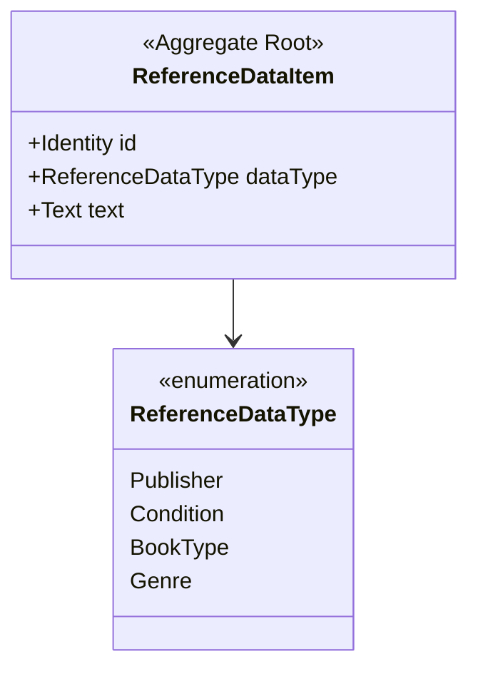
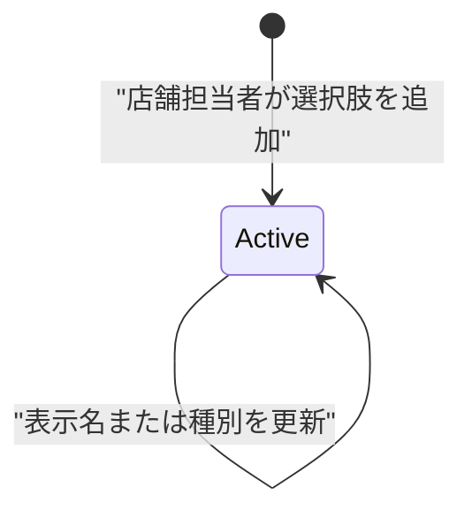
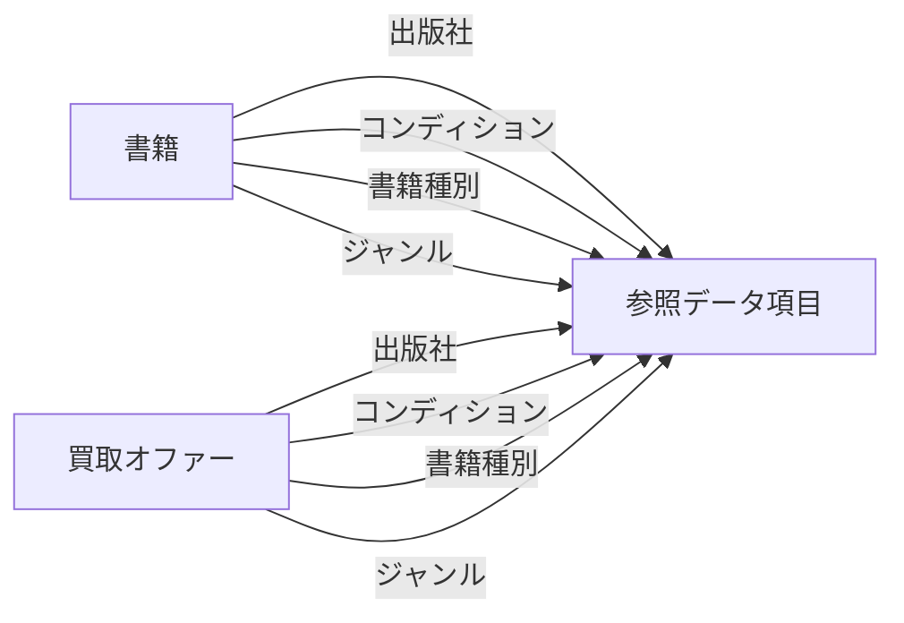

# 03. 参照データ集約 (`AGG-REFDATA`)

## 1. 責務

書籍と買取オファーが共通で用いる**分類の選択肢**を、単一の概念で一元管理する。

## 2. 構造

### 2.1 参照データ項目（集約ルート）

| # | 属性 | 論理型 | 必須 | 説明 |
| --- | --- | --- | --- | --- |
| 1 | 識別子 | 識別子 | ● | |
| 2 | 種別 | 列挙（参照データ種別） | ● | この項目がどの分類軸に属するか |
| 3 | 表示名 | テキスト | ● | 選択肢として提示される文字列 |

### 2.2 参照データ種別

| 値 | 意味 | 用途 |
| --- | --- | --- |
| 出版社 | 書籍を出版した組織 | 書籍・オファーの分類 |
| コンディション | 中古品としての傷み具合 | 書籍・オファーの分類 |
| 書籍種別 | 装丁や媒体の区分 | 書籍・オファーの分類 |
| ジャンル | 内容による分類 | 書籍・オファーの分類 |

## 3. 設計判断：4 つの軸を 1 つの概念で表す

**採用されている形**：出版社・コンディション・書籍種別・ジャンルを、それぞれ別の概念にせず、「種別」属性で区別される単一の概念にまとめている。

| 観点 | 評価 |
| --- | --- |
| 利点 | 分類軸を増やしても構造が変わらない。管理画面が 1 つで済む |
| 欠点 | **型による保証がない**。ジャンルを指定すべき箇所に出版社を渡してもモデルは拒まない（→ [INV-BOOK-05](11-invariants-and-rules.md)） |
| 欠点 | 軸ごとに固有の属性を持たせられない。例：出版社に所在地を追加できない |

これは**汎用サブドメインに対する意図的な単純化**である。分類軸ごとに固有の業務ルールが生まれた時点で、この形は限界を迎える。

## 4. 不変条件

| ID | 条件 | 強制レベル | 備考 |
| --- | --- | --- | --- |
| `INV-REFDATA-01` | 種別と表示名は生成時に必ず与えられる | **[強制]** | 生成経路が 1 つしかない |
| `INV-REFDATA-02` | 同一種別の中で表示名は一意である | **[外部]** | ドメインは重複を拒まない |
| `INV-REFDATA-03` | 書籍やオファーから参照されている項目は、種別を変更されない | **[外部]** | 更新操作は種別の変更を許す |

> `INV-REFDATA-03` が破られると、たとえば「ジャンルとして参照されている項目が出版社に変わる」ことが起こりうる。→ [ISSUE-05](14-design-issues.md)

## 5. 振る舞い

参照データ項目は**振る舞いを持たない**。生成と属性の書き換えのみが可能な、貧血なエンティティである。分類の選択肢という性質上、これは妥当である。

| 操作 | 主体 | 効果 |
| --- | --- | --- |
| 生成 | 店舗担当者 | 種別と表示名を与えて新しい選択肢を作る |
| 更新 | 店舗担当者 | 種別と表示名を書き換える |

**削除操作は存在しない**。一度作られた選択肢は永続する。書籍やオファーから参照されている項目を消せないという整合性上の要請に対して、「消せなくする」ことで応えている。

## 6. ライフサイクル

終端状態を持たない。

## 7. 他集約との関係

書籍と買取オファーは、いずれも 4 本の参照を持つ。**この 8 本の参照が、参照データを削除不能にしている実質的な理由**である。

## 8. 照会

| 照会 | 目的 |
| --- | --- |
| 全件取得 | 書籍・オファーの登録画面で、4 軸すべての選択肢を一度に得る |
| 種別で絞り込んだ一覧（ページ分割） | 店舗担当者が特定の軸の選択肢を管理する |
| 識別子で 1 件取得 | 更新対象の特定 |

「全件取得」が存在することは、**分類の選択肢が全件をメモリに載せられる規模である**という前提を表している。
