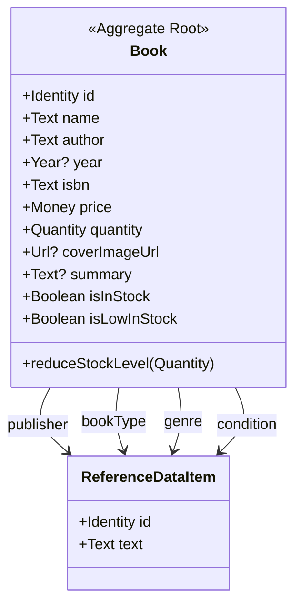
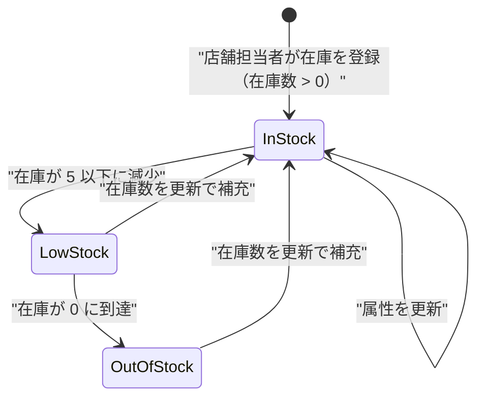
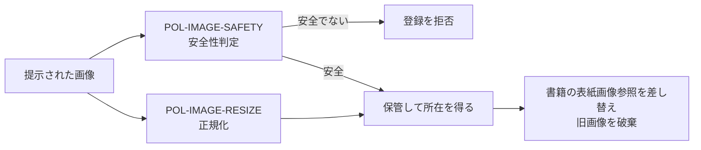

# 04. 書籍集約 (`AGG-BOOK`)

## 1. 責務

販売可能な中古書籍 1 点の**商品としての情報**と**在庫としての残数**を保持し、在庫状況の判断と在庫の引き落としに責任を持つ。

本ドメインで**唯一、意味のある振る舞いを持つ集約**である。他の集約が構造中心であるのに対し、書籍は在庫という業務概念を能動的に守る。

## 2. 構造



### 2.1 属性

| # | 属性 | 論理型 | 必須 | 説明 |
| --- | --- | --- | --- | --- |
| 1 | 識別子 | 識別子 | ● | |
| 2 | 書名 | テキスト | ● | |
| 3 | 著者 | テキスト | ● | 単一の著者しか表現できない |
| 4 | ISBN | テキスト | ● | **一意性はドメインで保証されない** |
| 5 | 発行年 | 年 | ○ | 不明な古書を許容するため任意 |
| 6 | 出版社 | 参照（参照データ） | ● | |
| 7 | 書籍種別 | 参照（参照データ） | ● | |
| 8 | ジャンル | 参照（参照データ） | ● | |
| 9 | コンディション | 参照（参照データ） | ● | 中古品としての傷み具合 |
| 10 | 価格 | 金額 | ● | 販売価格 |
| 11 | 在庫数 | 数量 | ● | |
| 12 | 概要 | テキスト | ○ | |
| 13 | 表紙画像 | 外部資源参照 | ○ | 集約は所在のみを持ち、実体を持たない |
| 14 | 在庫あり | 真偽 | ◇ | 在庫数 > 0 |
| 15 | 在庫僅少 | 真偽 | ◇ | 在庫数 ≦ 在庫僅少しきい値 |

### 2.2 ドメイン定数

| 名称 | 値 | 意味 |
| --- | --- | --- |
| 在庫僅少しきい値 | 5 | この値以下で「補充を検討すべき」と判断する |

しきい値がドメイン内の定数として置かれていることは、**これが業務ルールであり設定値ではない**という設計判断を表す。すべての書籍に同一のしきい値が適用され、ジャンル別・回転率別の調整はできない。

## 3. 同一性の考え方

書籍の同一性は**識別子のみ**で決まる。ISBN は同一性の根拠ではない。

これは中古書店のドメインとして正しい。同じ ISBN の本でも、**コンディションが違えば別の商品**であり、別の価格を持つ。したがって：

- 同一 ISBN・同一コンディションの本が複数登録されうる（ドメインは拒まない）
- 在庫数は「その登録エントリの残数」であり、「その ISBN の総在庫」ではない

> この帰結として、`ISBN` による在庫の名寄せはドメインの責務外である。

## 4. 不変条件

| ID | 条件 | 強制レベル | 根拠 |
| --- | --- | --- | --- |
| `INV-BOOK-01` | 在庫数は 0 未満にならない | **[強制]** | 引き落とし操作が 0 で下限を切る |
| `INV-BOOK-02` | 在庫あり ⇔ 在庫数 ≧ 1 | **[強制]** | 派生属性であり保持しない |
| `INV-BOOK-03` | 在庫僅少 ⇔ 在庫数 ≦ 5 | **[強制]** | 派生属性であり保持しない |
| `INV-BOOK-04` | 書名・著者・ISBN・4 つの分類・価格・在庫数は必ず存在する | **[強制]** | 生成時に必須として要求される |
| `INV-BOOK-05` | 出版社には出版社種別の参照データ項目が指定される（他 3 軸も同様） | **[外部]** | 種別の整合はモデルで検査されない |
| `INV-BOOK-06` | 価格は 0 以上である | **[外部]** | 負の価格を拒む仕組みがない |
| `INV-BOOK-07` | 在庫数は生成・更新時に 0 以上である | **[外部]** | 生成・更新は任意の値を受け入れる |

### 4.1 `INV-BOOK-02` と `INV-BOOK-03` の重なり

在庫数が 0 のとき、**在庫あり = 偽 かつ 在庫僅少 = 真**となる。

| 在庫数 | 在庫あり | 在庫僅少 |
| --- | --- | --- |
| 0 | 偽 | **真** |
| 1〜5 | 真 | 真 |
| 6 以上 | 真 | 偽 |

「在庫僅少」は日常語としては「少しはある」を含意するが、モデルでは在庫切れを包含する。統計（[RM-BOOK-STATS](12-read-models-and-statistics.md)）では在庫切れと在庫僅少を別々に数えており、**同じ言葉が 2 つの異なる意味で使われている**。→ [ISSUE-01](14-design-issues.md)

## 5. 振る舞い

### 5.1 在庫引き落とし

```
在庫引き落とし(引き落とす数量):
    在庫数 ← max(在庫数 − 引き落とす数量, 0)
```

| 観点 | 内容 |
| --- | --- |
| 目的 | 注文成立に伴い、販売可能数を減らす |
| 事前条件 | なし |
| 事後条件 | 在庫数が 0 以上である（`INV-BOOK-01`） |
| **不足時の挙動** | **要求量が在庫を上回っても失敗しない**。在庫数は 0 になり、不足分は黙って切り捨てられる |

この「黙って切り捨てる」設計は重大な帰結を持つ：

> 在庫 3 冊の書籍に対して 10 冊の注文明細を作ることができ、注文は成立し、在庫は 0 になる。**5 冊分の販売不能が、ドメインからは検知できない**。

数量の妥当性を判断する責務が集約の外に置かれている（`INV-ORDER-05` を参照）。→ [ISSUE-03](14-design-issues.md)

### 5.2 存在しない振る舞い

以下は業務上必要と思われるが、ドメインに存在しない。

| 不在の振る舞い | 現状の代替 |
| --- | --- |
| 在庫の補充 | 在庫数を直接書き換える更新操作 |
| 在庫の引き当て（予約） | なし。在庫が動くのは注文成立の瞬間のみ |
| 引き落とし可能かの判定 | なし。呼び出し側が在庫数を直接見る |
| 価格の改定 | 価格を直接書き換える更新操作 |
| 販売停止 | なし。在庫数を 0 にすることで代替 |

## 6. ライフサイクル



**終端状態を持たない**。書籍を廃棄・削除する経路はドメインに存在しない。在庫切れは終端ではなく一時的な状態として扱われる。

上図の状態は在庫数から**導出される**ものであり、書籍が状態属性を持つわけではない点に注意。

## 7. 表紙画像の扱い

書籍は表紙画像の**所在への参照のみ**を持ち、画像そのものは集約の外にある。画像の受け入れには 2 段階の判断が介在する。



詳細は [09-domain-services-and-policies.md](09-domain-services-and-policies.md) を参照。ドメインとして重要なのは以下の点である。

| ルール | ID |
| --- | --- |
| 安全でないと判断された画像を伴う登録・更新は、**全体が失敗する** | `RULE-BOOK-01` |
| 画像が差し替えられたとき、旧画像は破棄される | `RULE-BOOK-02` |
| 画像が提示されなかった場合、既存の表紙画像は維持される | `RULE-BOOK-03` |

## 8. 照会

| 照会 | 目的 | 絞り込み条件 |
| --- | --- | --- |
| 識別子で 1 件取得 | 詳細表示・更新 | — |
| 条件付き一覧（ページ分割） | 店舗担当者の在庫管理 | 書名・著者・出版社・ジャンル・書籍種別・コンディション・在庫僅少のみ |
| 検索文字列による一覧（ページ分割） | 顧客のカタログ閲覧 | 検索文字列・並び順 |
| 売れ筋書籍 | 顧客への推薦 | 上位 N 件 |
| 在庫統計 | 店舗担当者のダッシュボード | — |

**注目点**：「在庫僅少のみ」という絞り込みが、顧客向けではなく店舗担当者向けの照会条件として存在する。これは在庫僅少という概念が**補充判断のためのもの**であることを裏付ける。

売れ筋書籍の照会は、書籍ではなく**注文の側**が責務を負う。売上は注文の履歴から導かれる情報であり、書籍自身は自分が何冊売れたかを知らないためである。この責務配置は正しい（→ [12-read-models-and-statistics.md](12-read-models-and-statistics.md)）。
