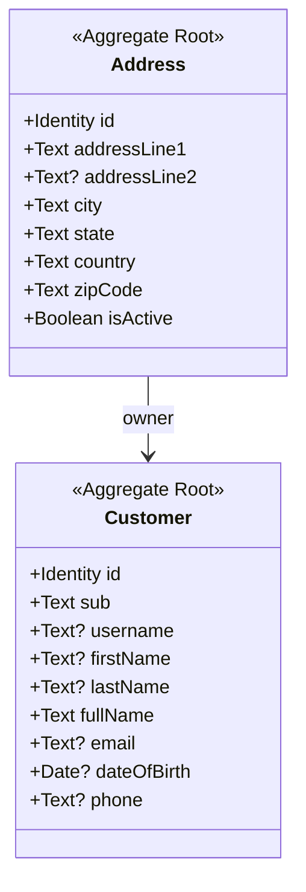
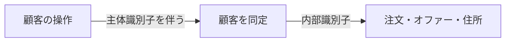
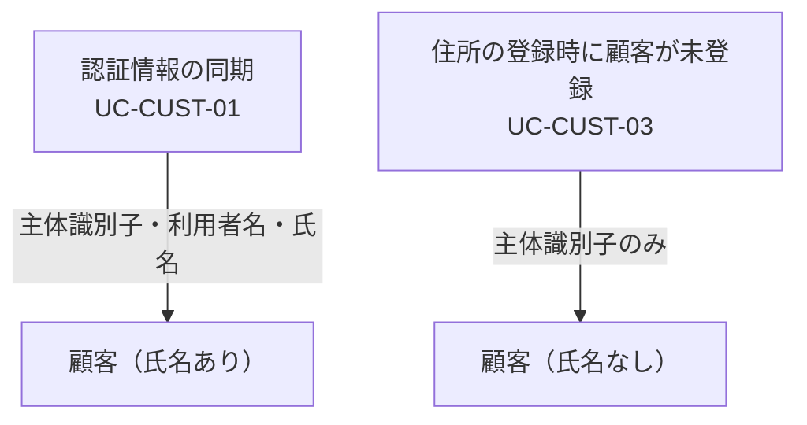
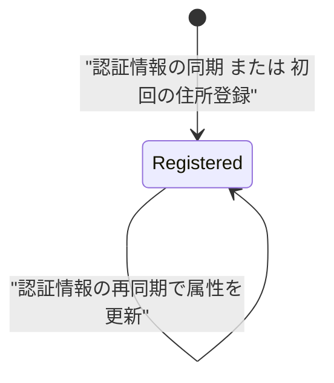
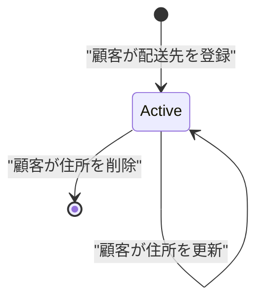
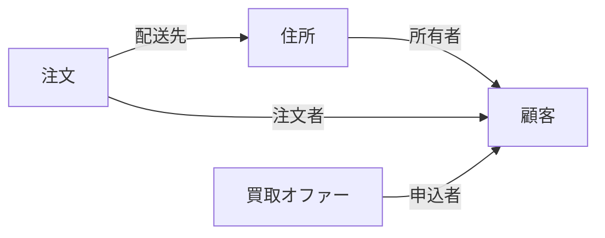

# 05. 顧客集約 (`AGG-CUSTOMER`) と住所集約 (`AGG-ADDRESS`)

この 2 つは別の集約だが、住所は顧客なしには存在できず、常に対で扱われるため 1 つの文書にまとめる。

## 1. 責務

| 集約 | 責務 |
| --- | --- |
| `AGG-CUSTOMER` | 外部の認証基盤で識別された人物を、ドメイン内の顧客として同定し、その属性を保持する |
| `AGG-ADDRESS` | 顧客が持つ配送先を保持する。顧客は複数の住所を持てる |

## 2. 構造

### 2.1 顧客の属性

| # | 属性 | 論理型 | 必須 | 説明 |
| --- | --- | --- | --- | --- |
| 1 | 識別子 | 識別子 | ● | ドメイン内部の同一性 |
| 2 | **主体識別子** | テキスト | ● | 外部の認証基盤から受け取る不変の識別子 |
| 3 | 利用者名 | テキスト | ○ | |
| 4 | 名 | テキスト | ○ | |
| 5 | 姓 | テキスト | ○ | |
| 6 | 氏名 | テキスト | ◇ | 名と姓を空白で連結した表示用の値 |
| 7 | 電子メール | テキスト | ○ | |
| 8 | 生年月日 | 日付 | ○ | |
| 9 | 電話番号 | テキスト | ○ | |

### 2.2 住所の属性

| # | 属性 | 論理型 | 必須 | 説明 |
| --- | --- | --- | --- | --- |
| 1 | 識別子 | 識別子 | ● | |
| 2 | 所有者 | 参照（顧客） | ● | 生成時に顧客の実体を要求する |
| 3 | 住所行 1 | テキスト | ● | |
| 4 | 住所行 2 | テキスト | ○ | |
| 5 | 市区町村 | テキスト | ● | |
| 6 | 州・都道府県 | テキスト | ● | |
| 7 | 国 | テキスト | ● | |
| 8 | 郵便番号 | テキスト | ● | |
| 9 | 有効フラグ | 真偽 | ● | 生成時に真。**偽に変える振る舞いが存在しない** |

## 3. 顧客の同一性 — 二重の識別

顧客は**2 つの識別子**を持つ。これはモデルの重要な特徴である。

| 識別子 | 由来 | 用途 |
| --- | --- | --- |
| 識別子 | ドメイン内で採番 | 注文・オファーからの参照 |
| 主体識別子 | 外部の認証基盤 | **すべての顧客起点の操作の入口** |

**帰結**：ドメインサービスの入力はほぼすべて主体識別子を含む。ドメインは「操作を行っている人物」を主体識別子で受け取り、内部識別子に変換してから集約を操作する。

この設計は、**認可がドメインの照会に埋め込まれている**ことも意味する。住所と注文の取得は「主体識別子と識別子の両方」で照会され、他人の住所や注文を識別子だけで取得することはできない。

| ルール | ID | 内容 |
| --- | --- | --- |
| 所有者による照会の限定 | `RULE-CUST-01` | 住所・注文の顧客向け照会は、主体識別子と対象識別子の両方が一致するものだけを返す |

> これはドメインが自ら認可責務を引き受けている数少ない例である。上位層の認可漏れがあってもデータは漏れない。

## 4. 顧客の生成 — 2 つの経路

顧客が作られる契機は 2 つあり、**それぞれ異なる完全性の顧客を作る**。

| 経路 | 契機 | 与えられる属性 |
| --- | --- | --- |
| 経路 A | 認証済み利用者の情報を同期する | 主体識別子・利用者名・名・姓 |
| 経路 B | 住所を登録しようとしたが顧客が存在しない | 主体識別子のみ |

経路 B で作られた顧客は、氏名・電子メール・電話が空のまま存在しうる。したがって：

| ID | 条件 | 強制レベル |
| --- | --- | --- |
| `INV-CUST-01` | 顧客は主体識別子を必ず持つ | **[表明]** |
| `INV-CUST-02` | 主体識別子は顧客間で一意である | **[外部]** |
| `INV-CUST-03` | 顧客は氏名を持つ | **[不成立]** |

`INV-CUST-01` が **[表明]** にとどまるのは、主体識別子を与えずに顧客を生成する経路が存在するためである（経路 A は空の顧客を作ってから主体識別子を設定する）。→ [ISSUE-08](14-design-issues.md)

## 5. 住所の不変条件

| ID | 条件 | 強制レベル | 備考 |
| --- | --- | --- | --- |
| `INV-ADDR-01` | 住所は必ず所有者を持つ | **[強制]** | 生成時に顧客の実体を要求する |
| `INV-ADDR-02` | 住所行 1・市区町村・州・国・郵便番号は必ず存在する | **[強制]** | 生成時に必須 |
| `INV-ADDR-03` | 住所は生成時に有効である | **[強制]** | 既定値が真 |
| `INV-ADDR-04` | 住所の所有者は変更されない | **[外部]** | 更新操作は所有者を対象にしないが、モデルは書き換えを拒まない |
| `INV-ADDR-05` | 注文に使われた住所は消えない | **[外部]** | 削除操作に参照チェックがない |

### 5.1 有効フラグの謎

住所は有効フラグを持つが、**ドメインに偽へ変える振る舞いがない**。にもかかわらず削除操作は存在する。

| 解釈 | 帰結 |
| --- | --- |
| 論理削除を意図した | 削除操作は本来フラグを倒すべきだが、そうなっていない |
| 物理削除を採用した | 有効フラグは死んだ属性である |

現状のモデルは**どちらとも解釈できる中途半端な状態**にある。過去の注文が参照している住所を物理削除すると、注文の配送先が失われる（`INV-ADDR-05`）。→ [ISSUE-04](14-design-issues.md)

## 6. ライフサイクル

### 6.1 顧客

終端状態を持たない。退会の概念がドメインに存在しない。

### 6.2 住所

## 7. 振る舞い

顧客・住所ともに**振る舞いを持たない**。属性の集合体である。

これは妥当か：

| 集約 | 評価 |
| --- | --- |
| 顧客 | **妥当**。支援サブドメインであり、業務ルールを持たない参加者である |
| 住所 | **やや不足**。「有効化／無効化」「既定の配送先にする」といった振る舞いが業務上ありうるが、モデルにはない |

## 8. 他集約との関係

**買い物かごは顧客を参照しない**。かごは相関識別子だけで識別され、顧客と結ばれるのは注文が成立する瞬間である。この非対称性は [06-aggregate-shopping-cart.md](06-aggregate-shopping-cart.md) で論じる。
