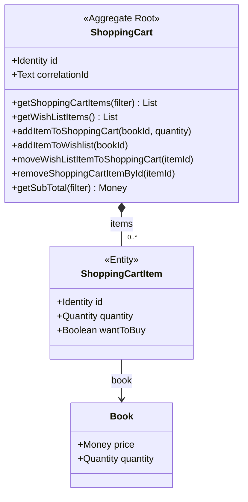
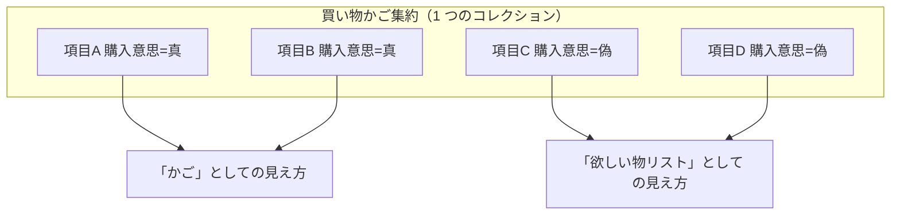
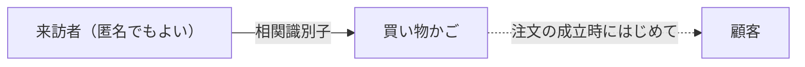
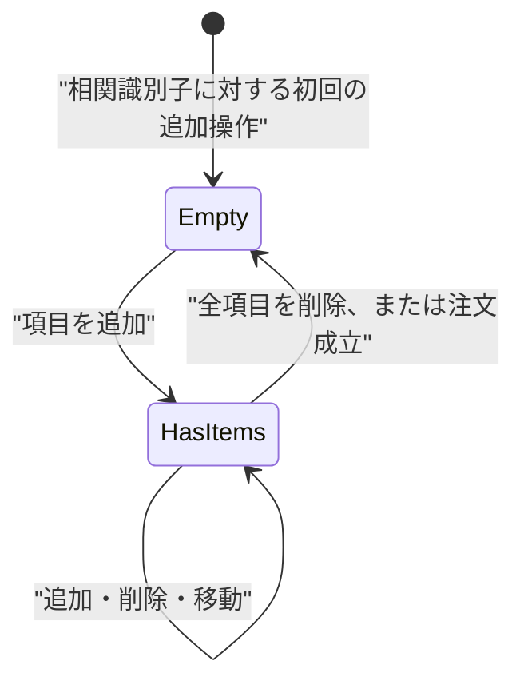

# 06. 買い物かご集約 (`AGG-CART`)

## 1. 責務

顧客が購入を検討している書籍と、購入意思の有無を保持する。**在庫を拘束せず、金額を確定させない**、確定前の意思の入れ物である。

## 2. 構造



### 2.1 買い物かご（集約ルート）

| # | 属性 | 論理型 | 必須 | 説明 |
| --- | --- | --- | --- | --- |
| 1 | 識別子 | 識別子 | ● | |
| 2 | **相関識別子** | テキスト | ● | かごを外部から指すための値 |
| 3 | かご項目 | 内部要素（0 個以上） | ● | 集約内に閉じたコレクション |

### 2.2 かご項目（内部エンティティ）

| # | 属性 | 論理型 | 必須 | 説明 |
| --- | --- | --- | --- | --- |
| 1 | 識別子 | 識別子 | ● | かご内で項目を指すために必要 |
| 2 | 書籍 | 参照（書籍） | ● | |
| 3 | 数量 | 数量 | ● | |
| 4 | **購入意思** | 真偽 | ● | 真＝かご、偽＝欲しい物リスト |

## 3. 中心となる設計判断：かごと欲しい物リストの統合

**「買い物かご」と「欲しい物リスト」は別の入れ物ではない。同じコレクションの 2 つの見え方である。**



| 観点 | 評価 |
| --- | --- |
| 利点 | 欲しい物リストからかごへの移動が、**フラグを倒すだけの操作**になる。項目の削除・再生成が不要 |
| 利点 | 「かごの中身」と「欲しい物リストの中身」の重複管理が起きない |
| 欠点 | 欲しい物リストに固有の関心（登録日、通知希望など）を持たせにくい |
| 欠点 | 欲しい物リストの項目も数量を持つが、**常に 1 で固定**され意味を持たない |

## 4. かご項目の 3 つの見え方

かご項目の抽出には 3 通りがあり、それぞれ異なる業務目的に対応する。

| 見え方 | 抽出条件 | 用途 |
| --- | --- | --- |
| **かご（在庫切れ含む）** | 購入意思 = 真 | 顧客にかごの中身を見せる。在庫切れも「入っている」ものとして表示する |
| **かご（在庫切れ除く）** | 購入意思 = 真 **かつ** 書籍の在庫数 > 0 | **注文に載せる対象を決める** |
| **欲しい物リスト** | 購入意思 = 偽 | 欲しい物リストの表示 |

この 2 段構えは重要なルールを表現している。

| ルール | ID | 内容 |
| --- | --- | --- |
| 在庫切れ項目の表示 | `RULE-CART-01` | 在庫切れの書籍もかごには残り、顧客に見える |
| 在庫切れ項目の除外 | `RULE-CART-02` | 注文を成立させる際、在庫切れの書籍は**黙って注文から除外される** |

`RULE-CART-02` は顧客体験上の重大な意味を持つ。**注文しようとした本が在庫切れだった場合、通知されることなく注文から除外され、かごに残り続ける。** 顧客は「注文した」と思っているのに、その本はかごの中にあるという状態になる（→ [ISSUE-11](14-design-issues.md)）。

## 5. 不変条件

| ID | 条件 | 強制レベル | 備考 |
| --- | --- | --- | --- |
| `INV-CART-01` | かごは相関識別子を必ず持つ | **[強制]** | 生成時に必須 |
| `INV-CART-02` | かご項目はかごを通じてのみ追加・削除される | **[強制]** | コレクションは外部から差し替えられない |
| `INV-CART-03` | 欲しい物リストの項目の数量は 1 である | **[強制]** | 追加操作が 1 を固定で与える |
| `INV-CART-04` | 同一の書籍はかご内に 1 行しか存在しない | **[不成立]** | 追加操作は重複を検査しない |
| `INV-CART-05` | かご項目の数量は 1 以上である | **[外部]** | 0 や負数を拒まない |
| `INV-CART-06` | かご項目の数量は書籍の在庫数を超えない | **[不成立]** | 検査されない |

### 5.1 `INV-CART-04` が成立しないことの帰結

同じ書籍をかごに 2 回追加すると、**数量が合算されず 2 行になる**。

```
「書籍X を 2 冊」追加 → 項目1: 書籍X, 数量2
「書籍X を 3 冊」追加 → 項目1: 書籍X, 数量2
                        項目2: 書籍X, 数量3
```

小計は行数に依存するため（後述）、この挙動は金額に直接影響する。→ [ISSUE-12](14-design-issues.md)

## 6. 振る舞い

### 6.1 かごへの追加

```
かごへの追加(書籍, 数量):
    項目を新規作成（購入意思 = 真, 数量 = 指定値）してコレクションに追加
```

既存項目との統合は行わない（`INV-CART-04`）。

### 6.2 欲しい物リストへの追加

```
欲しい物リストへの追加(書籍):
    項目を新規作成（購入意思 = 偽, 数量 = 1）してコレクションに追加
```

### 6.3 欲しい物リストからかごへの移動

```
移動(項目識別子):
    該当項目が存在しなければ 何もしない
    該当項目の購入意思 ← 真
```

**存在しない項目に対して寛容**（何もせず正常終了）。冪等な操作として設計されている。

### 6.4 かご項目の削除

```
削除(項目識別子):
    該当項目をコレクションから除去する
    ※ 該当項目が存在しない場合の挙動は未定義
```

**存在しない項目に対して非寛容**（失敗する）。6.3 と挙動が非対称である。→ [ISSUE-13](14-design-issues.md)

| 操作 | 対象が存在しないとき |
| --- | --- |
| 欲しい物リストからかごへの移動 | 何もしない |
| かご項目の削除 | 失敗する |

### 6.5 小計の算出

```
小計(見え方):
    該当する見え方の項目について、書籍の価格を合計する
```

**数量を掛けていない。** 数量 5 の項目も、価格 1 冊分しか計上されない。

| ID | 内容 |
| --- | --- |
| `RULE-CART-03` | かごの小計は、対象項目の**書籍価格の単純和**である。数量は乗じられない |

これはドメインの重大な欠陥である。同一のロジックが注文側にも存在する（`RULE-ORDER-02`）。→ [ISSUE-02](14-design-issues.md)

## 7. 相関識別子 — 顧客を持たないかご

かごは**顧客への参照を持たない**。相関識別子だけで識別される。



| 観点 | 内容 |
| --- | --- |
| 意図 | ログインしていない来訪者にもかごを持たせる |
| 帰結 | かごの寿命と顧客の寿命が無関係になる |
| 帰結 | 同一顧客が別の相関識別子で複数のかごを持ちうる |
| 帰結 | **かごの統合・引き継ぎがドメインに存在しない**。匿名で入れたかごをログイン後に引き継ぐ仕組みがない |
| 帰結 | かごの破棄・期限切れの概念がない。かごは永久に残る |

→ [ISSUE-14](14-design-issues.md)

## 8. ライフサイクル



**終端状態を持たない**。注文が成立してもかご自体は残り、空になるだけである。

## 9. 他集約との関係

| 関係 | 内容 |
| --- | --- |
| かご項目 → 書籍 | かごの小計と在庫フィルタは、**書籍の現在の価格と在庫数を直接読む**。書籍側の変更が即座にかごに反映される |
| かご → 注文 | 注文成立時に、かご項目が注文明細に転記され、かごから除去される |

かごが書籍の実体に依存していることは、DDD の集約境界の原則からは逸脱している。ただし「かごの中身は常に最新価格・最新在庫で見せたい」という業務要求とは整合する。**価格をかご項目に写し取らないという判断は、意図的である可能性が高い**。
