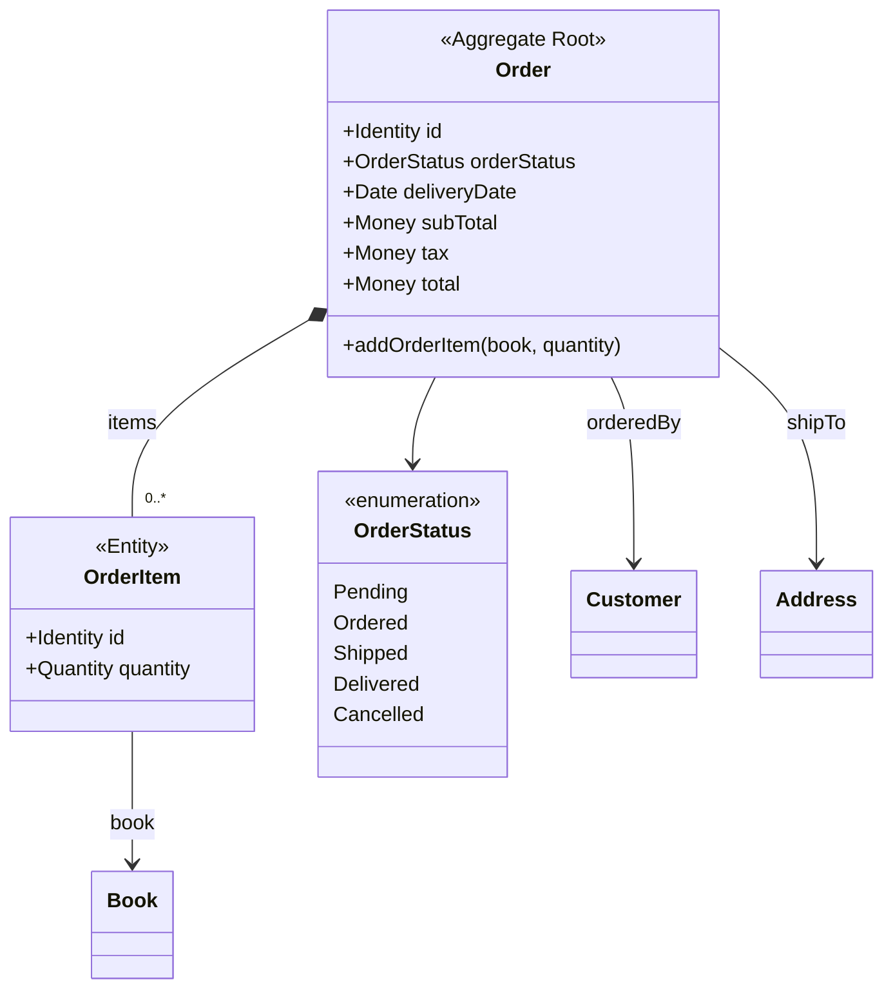
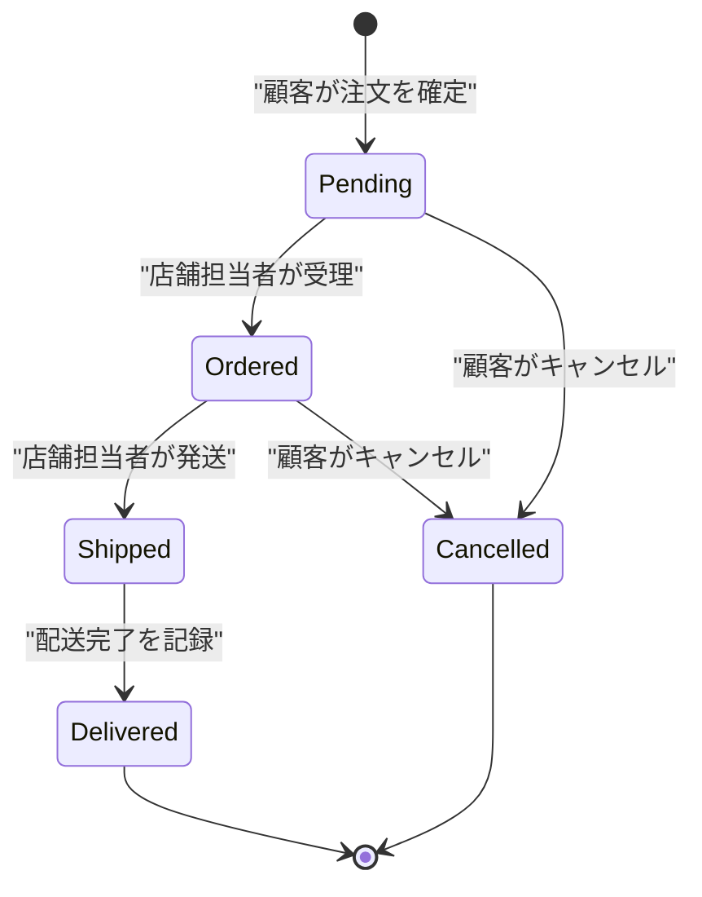
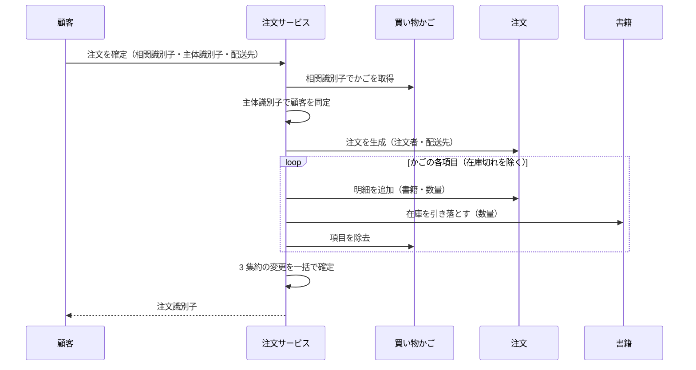

# 07. 注文集約 (`AGG-ORDER`)

## 1. 責務

顧客が確定させた購入の内容と、その履行状況を保持する。**注文の成立は在庫を確定的に減らす**という点で、本ドメインで最も重い操作の結果物である。

## 2. 構造



### 2.1 注文（集約ルート）

| # | 属性 | 論理型 | 必須 | 説明 |
| --- | --- | --- | --- | --- |
| 1 | 識別子 | 識別子 | ● | |
| 2 | 注文者 | 参照（顧客） | ● | |
| 3 | 配送先 | 参照（住所） | ● | |
| 4 | 注文明細 | 内部要素（0 個以上） | ● | 集約内に閉じたコレクション |
| 5 | 注文状態 | 列挙 | ● | 既定値は「受付待ち」 |
| 6 | 配送予定日 | 日時 | ● | 既定値は生成時点の 7 日後 |
| 7 | 小計 | 金額 | ◇ | 明細の書籍価格の和 |
| 8 | 税 | 金額 | ◇ | 小計の 10% |
| 9 | 合計 | 金額 | ◇ | 小計 ＋ 税 |

### 2.2 注文明細（内部エンティティ）

| # | 属性 | 論理型 | 必須 | 説明 |
| --- | --- | --- | --- | --- |
| 1 | 識別子 | 識別子 | ● | |
| 2 | 書籍 | 参照（書籍） | ● | |
| 3 | 数量 | 数量 | ● | **金額計算に使われない** |

## 3. 注文状態

| 状態 | 意味 | 終端 |
| --- | --- | --- |
| **受付待ち (Pending)** | 注文は作られたが、まだ処理に入っていない。生成時の既定値 | |
| **注文確定 (Ordered)** | 店舗が注文を受理した | |
| **発送済 (Shipped)** | 商品が発送された | |
| **配送完了 (Delivered)** | 商品が顧客に届いた | ● |
| **キャンセル (Cancelled)** | 注文が取り消された | ● |

### 3.1 意図された状態遷移



### 3.2 実際に許されている遷移

**モデルは上図の制約を一切強制していない。** 注文状態は任意の値に書き換えられる。

| ID | 条件 | 強制レベル |
| --- | --- | --- |
| `INV-ORDER-01` | 注文は「受付待ち」で生成される | **[強制]** |
| `INV-ORDER-02` | 状態は前進のみで、後退しない | **[不成立]** |
| `INV-ORDER-03` | 終端状態（配送完了・キャンセル）からは遷移しない | **[不成立]** |
| `INV-ORDER-04` | 発送済・配送完了の注文はキャンセルできない | **[不成立]** |

したがって以下が可能である：

- 配送完了した注文を「受付待ち」に戻す
- キャンセル済みの注文を「発送済」にする
- 発送済の注文を顧客がキャンセルする

→ [ISSUE-15](14-design-issues.md)

### 3.3 キャンセルの副作用の不在

| ID | 内容 |
| --- | --- |
| `RULE-ORDER-05` | 注文をキャンセルしても、**引き落とされた在庫は戻らない** |

在庫の引き落としは注文成立時に行われるが、キャンセル時に戻す振る舞いがドメインに存在しない。キャンセルされた注文の分だけ在庫が永久に失われる。→ [ISSUE-16](14-design-issues.md)

## 4. 金額の計算

```
小計 = Σ（明細の書籍の現在価格）
税   = 小計 × 0.10
合計 = 小計 + 税
```

### 4.1 数量が計上されない

| ID | 内容 |
| --- | --- |
| `RULE-ORDER-02` | 小計は明細の**書籍価格の単純和**である。明細の数量は乗じられない |

明細は数量を保持しているが、金額に反映されない。**10 冊注文しても 1 冊分の代金しか請求されない。** かご側の `RULE-CART-03` と同一の欠陥である。→ [ISSUE-02](14-design-issues.md)

### 4.2 価格が確定しない

| ID | 内容 |
| --- | --- |
| `RULE-ORDER-03` | 注文金額は、参照先の書籍の**現在の価格**から毎回算出される |

注文時点の価格が明細に写し取られていない。したがって：

> 注文成立後に書籍の価格を改定すると、**過去の注文の金額が変わる**。

これは注文という概念の根幹に関わる。注文は「その時点の合意」を記録するものであり、後から変動してはならない。→ [ISSUE-17](14-design-issues.md)

### 4.3 税率

| ID | 内容 |
| --- | --- |
| `RULE-ORDER-04` | 税は小計の 10% とする。地域・商品種別による差異はない |

税率がドメイン内に固定値として置かれている。書籍の在庫僅少しきい値と同様、**設定ではなく業務ルールとして扱う**という判断である。ただし配送先の州・国を保持しているにもかかわらず税率に反映しない点は、モデルの一貫性を欠く。

### 4.4 丸め

金額の丸め規則は**ドメインに定義されていない**。税の計算結果が端数を持つ場合の扱いは未定義である。

## 5. 配送予定日

| ID | 内容 |
| --- | --- |
| `RULE-ORDER-01` | 配送予定日は、注文生成時点の 7 日後とする |

- 顧客が指定することはできない
- 発送状況に応じて更新する振る舞いは存在しない
- 配送完了時に実績日を記録する属性がない

配送予定日は、統計における「期限超過注文」の判定根拠として使われる（[RM-ORDER-STATS](12-read-models-and-statistics.md)）。

## 6. 不変条件

| ID | 条件 | 強制レベル | 備考 |
| --- | --- | --- | --- |
| `INV-ORDER-01` | 注文は「受付待ち」で生成される | **[強制]** | 既定値 |
| `INV-ORDER-05` | 明細の数量は書籍の在庫数を超えない | **[不成立]** | 検査されない。超過分は在庫引き落としで黙って切り捨てられる |
| `INV-ORDER-06` | 注文は 1 件以上の明細を持つ | **[不成立]** | **空の注文が成立しうる**（かごが全て在庫切れの場合） |
| `INV-ORDER-07` | 配送先は注文者が所有する住所である | **[外部]** | 検査されない |
| `INV-ORDER-08` | 明細はかご項目からのみ生成される | **[外部]** | 集約の外の取り決め |
| `INV-ORDER-09` | 明細は注文を通じてのみ追加される | **[強制]** | コレクションは外部から差し替えられない |

### 6.1 `INV-ORDER-06` — 空の注文

かごの全項目が在庫切れだった場合、`RULE-CART-02` によりすべて除外され、**明細が 0 件の注文**が成立する。合計金額は 0 となり、顧客には「注文完了」と見える。→ [ISSUE-11](14-design-issues.md)

## 7. 振る舞い

### 7.1 明細の追加

```
明細の追加(書籍, 数量):
    明細を新規作成してコレクションに追加
```

- 既存明細との統合は行わない
- 数量や在庫の妥当性は検査しない
- 注文状態による制限がない（**配送完了後でも明細を追加できる**）

### 7.2 存在しない振る舞い

| 不在の振る舞い | 帰結 |
| --- | --- |
| 明細の削除・数量変更 | 注文内容の訂正ができない |
| 状態遷移メソッド（受理する・発送する等） | 状態が無防備に書き換えられる（3.2） |
| キャンセルに伴う在庫の戻し | 在庫が失われる（3.3） |
| 金額の確定 | 金額が後から変動する（4.2） |

**注文は状態と金額という 2 つの重要な関心を持ちながら、それらを守る振る舞いを 1 つも持たない。** これが本ドメイン最大の設計上の弱点である。

## 8. 注文の成立 — 3 集約にまたがる操作

注文の生成は、本ドメインで**唯一、3 つの集約を同時に変更する操作**である。



### 8.1 この操作が持つ性質

| 性質 | 内容 |
| --- | --- |
| **原子性** | 3 集約の変更は一括で確定される。途中で失敗すれば全体が取り消される |
| **DDD の原則との関係** | 「1 トランザクション 1 集約」の原則から逸脱している |
| **代替案** | 注文成立を事象として発行し、在庫の引き落としとかごの消費を結果整合で行う |
| **現状の判断** | 在庫の即時性を優先し、強い整合性を選んでいる |

在庫という概念の性質上、**「注文したのに在庫が減っていない瞬間」を許容しない**という判断は、中古書店（同一商品の在庫が 1 点しかないことが多い）のドメインでは合理的である。→ [ISSUE-18](14-design-issues.md) で改善案を論じる。

## 9. 照会

| 照会 | 主体 | 絞り込み条件 |
| --- | --- | --- |
| 識別子で 1 件取得 | 店舗担当者 | — |
| 識別子と主体識別子で 1 件取得 | 顧客 | 所有者に限定（`RULE-CUST-01`） |
| 条件付き一覧（ページ分割） | 店舗担当者 | 注文状態・注文日の範囲 |
| 主体識別子による一覧 | 顧客 | 自分の注文のみ |
| 売れ筋書籍 | 全員 | 上位 N 件 |
| 注文統計 | 店舗担当者 | — |

**売れ筋書籍の照会が注文の責務に置かれている点は正しい。** 何が売れたかは注文の履歴にしか存在しない情報であり、書籍集約は自身の販売実績を知らない。
