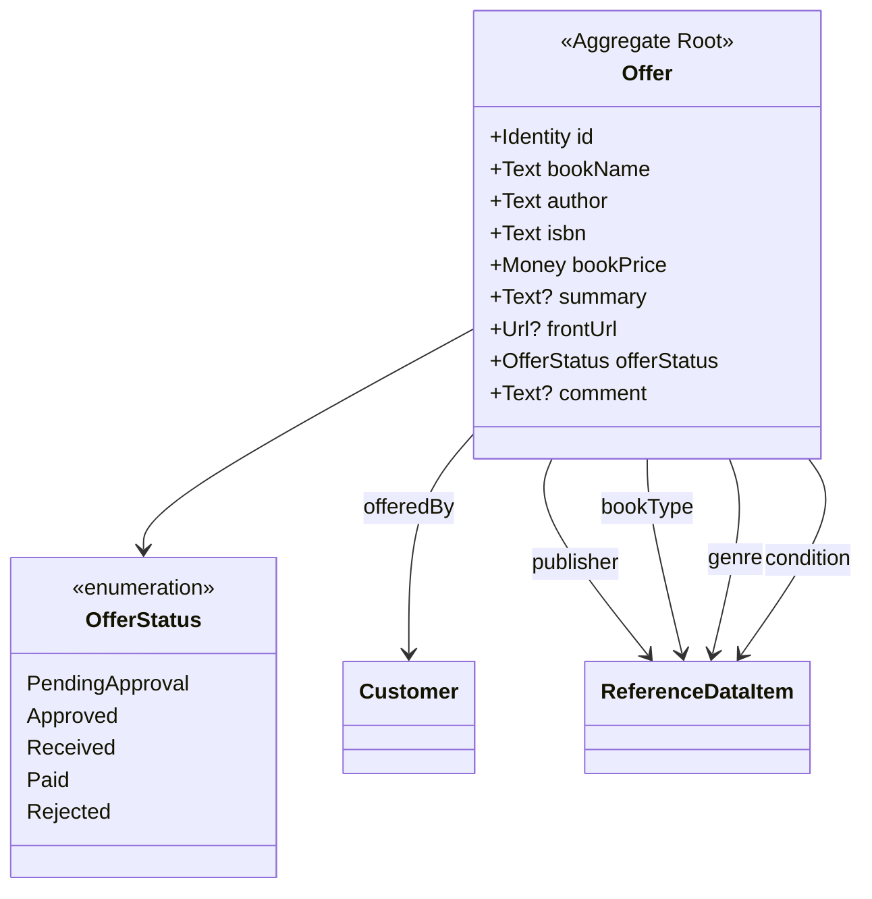
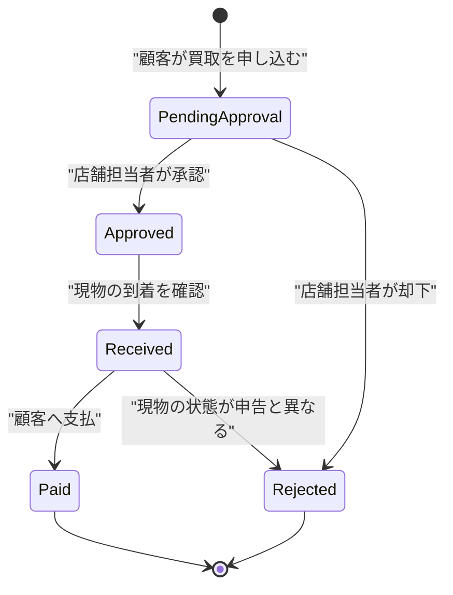
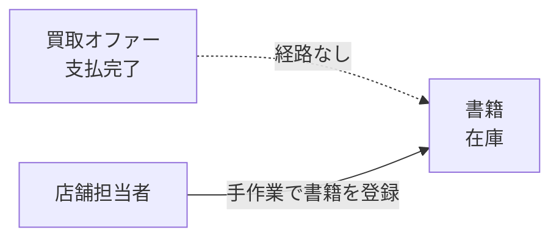
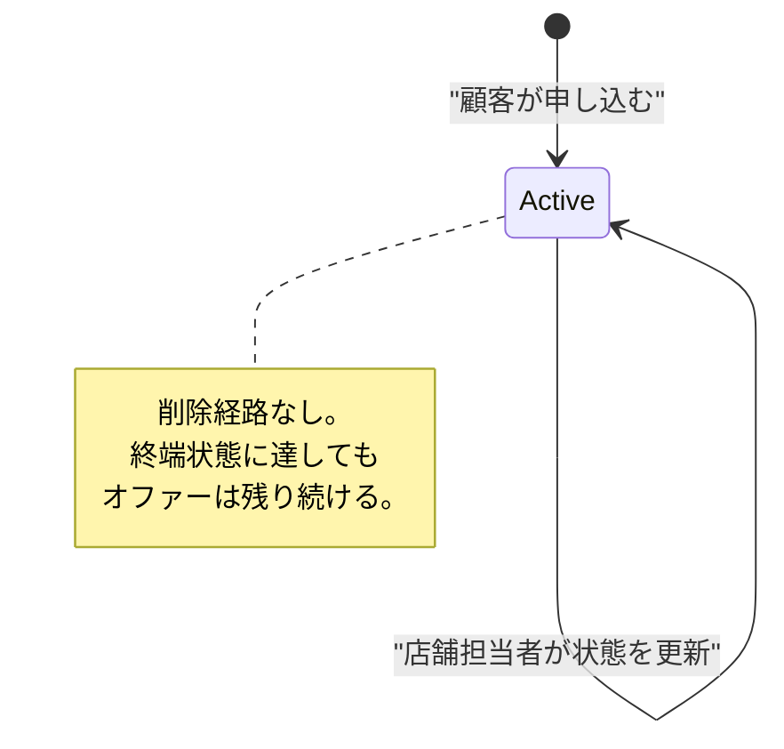

# 08. 買取オファー集約 (`AGG-OFFER`)

## 1. 責務

顧客が「この本を買い取ってほしい」と申し出た内容と、その審査・受領・支払の進捗を保持する。

**買取オファーは書籍ではない。** 属性は書籍と酷似しているが、在庫でも商品でもなく、店舗が保有してすらいない本についての申込である。

## 2. 構造

### 2.1 属性

| # | 属性 | 論理型 | 必須 | 説明 |
| --- | --- | --- | --- | --- |
| 1 | 識別子 | 識別子 | ● | |
| 2 | 申込者 | 参照（顧客） | ● | |
| 3 | 書名 | テキスト | ● | |
| 4 | 著者 | テキスト | ● | |
| 5 | ISBN | テキスト | ● | |
| 6 | 出版社 | 参照（参照データ） | ● | |
| 7 | 書籍種別 | 参照（参照データ） | ● | |
| 8 | ジャンル | 参照（参照データ） | ● | |
| 9 | コンディション | 参照（参照データ） | ● | 買取価格の主要な判断材料 |
| 10 | **買取価格** | 金額 | ● | 申込時に与えられる |
| 11 | 概要 | テキスト | ○ | |
| 12 | 表紙画像 | 外部資源参照 | ○ | **設定する経路がドメインに存在しない** |
| 13 | オファー状態 | 列挙 | ● | 既定値は「承認待ち」 |
| 14 | 講評 | テキスト | ○ | **設定する経路がドメインに存在しない** |

### 2.2 書籍との属性比較

| 属性 | 書籍 | オファー |
| --- | --- | --- |
| 書名・著者・ISBN | ● | ● |
| 4 つの分類 | ● | ● |
| 概要・表紙画像 | ○ | ○ |
| **発行年** | ○ | **なし** |
| **在庫数** | ● | **なし**（常に 1 点の申込） |
| **価格** | 販売価格 | 買取価格 |
| **状態** | なし | ● |
| **顧客** | なし | ● |

構造の重複は大きいが、**概念としては明確に別である**。書籍は店舗の資産、オファーは顧客との取引の進行中の記録である。共通の抽象を作らない判断は妥当と評価する。

## 3. 買取価格の意味

`買取価格` は誰が決めた額なのかが、ドメインからは判別できない。

| 解釈 | モデル上の裏付け |
| --- | --- |
| 顧客の希望額 | 申込時に必須で与えられる |
| 店舗の査定額 | 更新経路が状態のみで、価格を変える経路がない |

**申込時に一度だけ設定され、その後変更する振る舞いが存在しない**ことから、「顧客の希望額」と解釈するのが自然である。しかしそうすると、店舗が査定額を提示して交渉する余地がモデルにない。

| ID | 内容 |
| --- | --- |
| `RULE-OFFER-01` | 買取価格は申込時に確定し、以後変更されない |
| `RULE-OFFER-02` | 買取価格の算定基準はドメインに存在しない。コンディションと価格の関係は表現されない |

→ [ISSUE-19](14-design-issues.md)

## 4. オファー状態

| 状態 | 表示名 | 意味 | 終端 |
| --- | --- | --- | --- |
| **承認待ち** | Pending Approval | 店舗担当者がまだ諾否を判断していない。既定値 | |
| **承認済／発送待ち** | Approved/Awaiting Shipment from Customer | 買い取ると決めた。顧客からの現物発送を待つ | |
| **受領確認済** | Shipment Receipt Confirmed | 現物が店舗に届いたことを確認した | |
| **支払完了** | Payment Completed | 顧客への支払が済んだ | ● |
| **却下** | Rejected | 買い取らないと決めた | ● |

各状態は人間向けの表示名を持つ。表示名が状態そのものに付随していることは、**この状態が顧客にも直接見えるもの**であることを示す。

### 4.1 意図された状態遷移

`Received → Rejected` は、**現物が申告されたコンディションと違った場合**の経路として業務上ありうる。ただしモデルはこれを明示していない。

### 4.2 実際に許されている遷移

注文と同様、**モデルは遷移を一切制約していない**。状態は任意の値に書き換えられる。

| ID | 条件 | 強制レベル |
| --- | --- | --- |
| `INV-OFFER-01` | オファーは「承認待ち」で生成される | **[強制]** |
| `INV-OFFER-02` | 状態は定義された順序でのみ進む | **[不成立]** |
| `INV-OFFER-03` | 終端状態（支払完了・却下）からは遷移しない | **[不成立]** |
| `INV-OFFER-04` | 受領前に支払は行われない | **[不成立]** |

`INV-OFFER-04` が守られないことは、**現物を受け取らずに支払える**ことを意味する。金銭が動く業務としては看過できない。→ [ISSUE-15](14-design-issues.md)

## 5. 不変条件

| ID | 条件 | 強制レベル | 備考 |
| --- | --- | --- | --- |
| `INV-OFFER-01` | オファーは「承認待ち」で生成される | **[強制]** | 既定値 |
| `INV-OFFER-05` | 申込者・書名・著者・ISBN・4 つの分類・買取価格は必ず存在する | **[強制]** | 生成時に必須 |
| `INV-OFFER-06` | 買取価格は 0 以上である | **[外部]** | 検査されない |
| `INV-OFFER-07` | 各分類には対応する種別の参照データ項目が指定される | **[外部]** | 検査されない |
| `INV-OFFER-08` | 申込者は登録済みの顧客である | **[外部]** | 顧客が未登録の場合の挙動が未定義 |

### 5.1 `INV-OFFER-08` の危うさ

買取の申込は、主体識別子から顧客を同定してから行われる。しかし**顧客が未登録だった場合に顧客を作る経路がない**（住所登録にはある）。未登録の利用者が買取を申し込もうとすると失敗する。→ [ISSUE-08](14-design-issues.md)

## 6. 振る舞い

買取オファーは**振る舞いを持たない**。生成と、状態の書き換えのみが可能である。

| 不在の振る舞い | 帰結 |
| --- | --- |
| 承認する・却下する・受領する・支払う | 状態が無防備に書き換えられる |
| 講評を付す | 講評属性が死んでいる |
| 表紙画像を添付する | 表紙画像属性が死んでいる |
| 書籍として在庫に登録する | 買取と販売がつながらない |

### 6.1 死んでいる属性

`講評` と `表紙画像` は、モデルに存在するが**設定する経路がない**。

| 属性 | 想定される用途 | なぜ死んでいるか |
| --- | --- | --- |
| 講評 | 却下理由の説明、査定コメント | 状態更新の入力に含まれない |
| 表紙画像 | 顧客が本の実物を撮影して添付 | 申込の入力に含まれない |

書籍側には画像の受け入れ（安全性判定・正規化・保管）の仕組みが整っているのに、オファー側では使われていない。**顧客が投稿する画像こそ検査が必要**であることを考えると、この不在は不自然である。→ [ISSUE-20](14-design-issues.md)

## 7. 買取と販売の断絶

支払完了したオファーの本は、物理的には店舗の手元にある。しかし**それを在庫にする経路がドメインに存在しない**。店舗担当者が書籍登録の操作を別途行う必要があり、オファーと書籍のつながりは記録されない。

| 失われる情報 | 帰結 |
| --- | --- |
| この書籍を誰から買い取ったか | 仕入元の追跡ができない |
| 買取価格と販売価格の関係 | 粗利が算出できない |
| オファーが在庫化されたか | 支払完了のまま放置されたオファーを検知できない |

**これは本ドメインで最も大きな機能上の欠落である。** → [ISSUE-06](14-design-issues.md)

## 8. ライフサイクル

## 9. 照会

| 照会 | 主体 | 絞り込み条件 |
| --- | --- | --- |
| 識別子で 1 件取得 | 店舗担当者・顧客 | **所有者に限定されない** |
| 条件付き一覧（ページ分割） | 店舗担当者 | 書名・著者・ジャンル・コンディション・状態 |
| 主体識別子による一覧 | 顧客 | 自分のオファーのみ |
| オファー統計 | 店舗担当者 | — |

**注意**：識別子による 1 件取得が所有者に限定されていない。住所・注文には所有者限定の照会（`RULE-CUST-01`）が用意されているが、オファーにはない。他人のオファーを識別子だけで取得できる。→ [ISSUE-21](14-design-issues.md)
