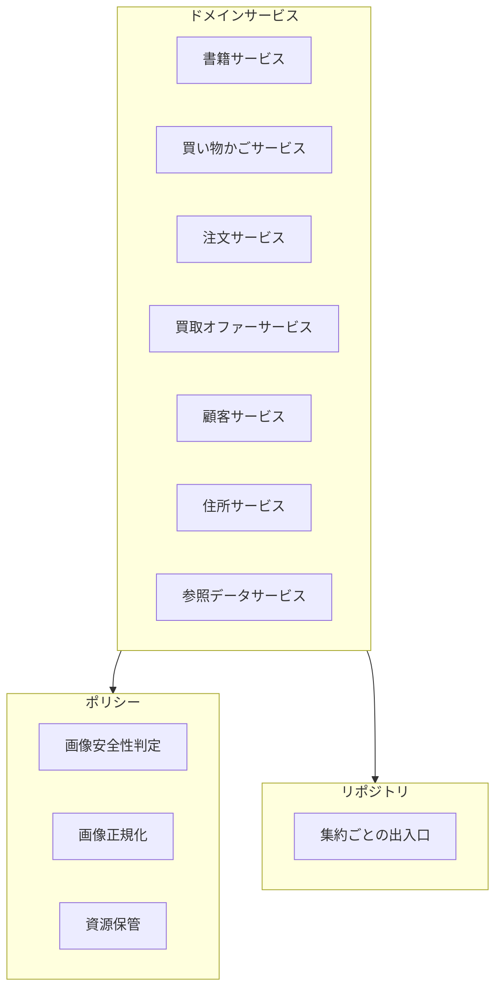
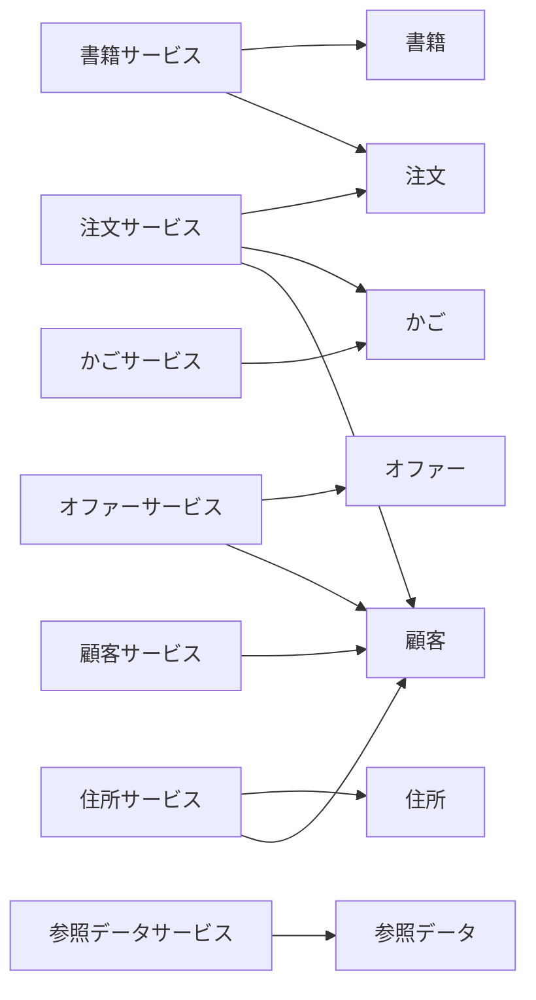
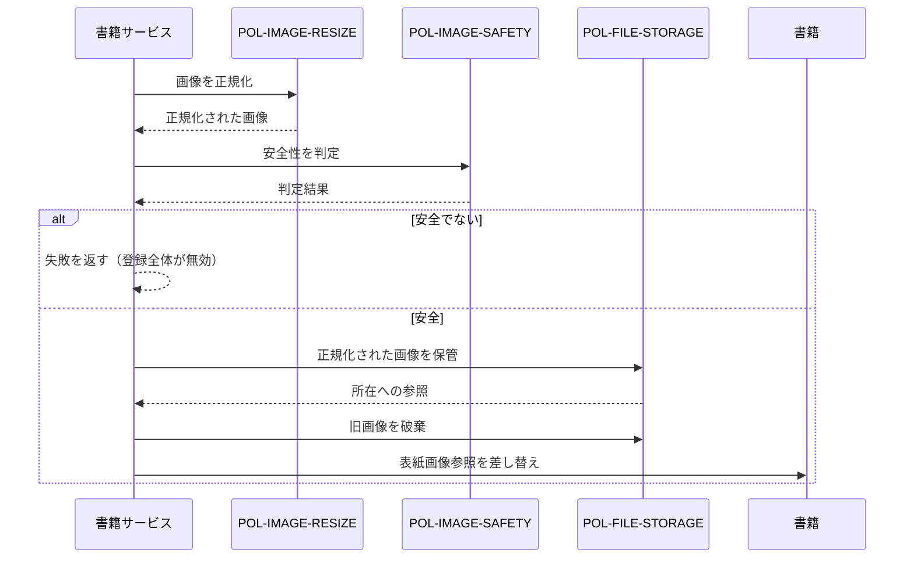
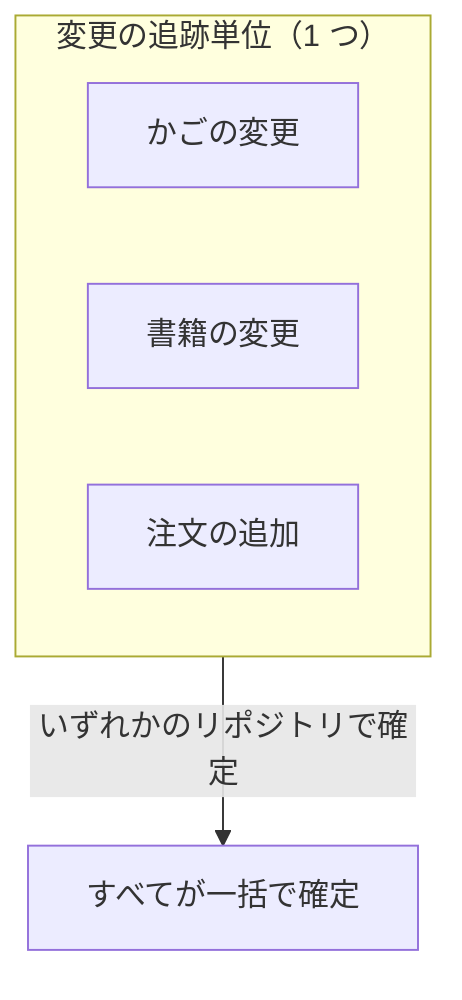

# 09. ドメインサービスとポリシー

集約に属さない振る舞いを担う要素を扱う。

## 1. 3 種類の非集約要素



| 要素 | 性質 | 責務 |
| --- | --- | --- |
| **ドメインサービス** | ユースケースの調停役 | 集約の取得・生成、複数集約にまたがる操作の順序付け、変更の確定 |
| **ポリシー** | 差し替え可能な判断 | ドメインが「何を求めるか」だけを定め、「どう判断するか」を外部に委ねる |
| **リポジトリ** | 集約の出入口 | 集約単位の取得と登録、変更の一括確定 |

## 2. ドメインサービス

### 2.1 一覧

| サービス | 主たる責務 | 依存する集約 |
| --- | --- | --- |
| **書籍サービス** | 書籍の登録・更新（画像の受け入れを含む）、カタログの照会 | 書籍、注文（売れ筋のため） |
| **買い物かごサービス** | かごの取得・生成、項目の追加・移動・削除 | かご |
| **注文サービス** | **注文の成立**、状態の更新、キャンセル、照会 | 注文、かご、顧客 |
| **買取オファーサービス** | オファーの申込、状態の更新、照会 | オファー、顧客 |
| **顧客サービス** | 顧客の同定と属性の同期 | 顧客 |
| **住所サービス** | 住所の登録・更新・削除。**必要に応じて顧客を生成する** | 住所、顧客 |
| **参照データサービス** | 分類選択肢の登録・更新・照会 | 参照データ |

### 2.2 設計上の性質

本モデルのドメインサービスには、以下の特徴がある。

#### (1) アプリケーションサービスとの統合

純粋な DDD では、ユースケースの調停は**アプリケーションサービス**の役割であり、ドメインサービスは「複数の集約にまたがる業務判断」だけを担う。本モデルでは両者が 1 層に統合されている。

| 観点 | 評価 |
| --- | --- |
| 利点 | 層が少なく、単純な操作で無意味な委譲が発生しない |
| 欠点 | 業務判断（例：在庫切れ項目の除外）と技術的調停（例：変更の確定）が同じ場所に混在する |
| 欠点 | ドメイン層が変更の確定タイミングを知っている |

#### (2) ほとんどのサービスが「取得して書き換えて確定する」

大半の操作は以下の形をとる。

```
操作(入力):
    集約を取得する
    集約の属性を書き換える
    変更を確定する
```

集約が振る舞いを持たないため、**業務ロジックがサービス側に漏れる**か、そもそも存在しない。例外は注文の成立（後述）と書籍の登録・更新（画像の受け入れ）のみである。

#### (3) 入力は「操作の意図」を表す値の組

各操作は、意図を表す値の組を入力にとる。

| 特徴 | 意味 |
| --- | --- |
| 主体識別子が含まれる | 誰の操作かをドメインが判断できる |
| 集約の識別子が含まれる | 対象を特定する |
| 部分的な更新の意図を表現しない | 更新はすべて全項目の置き換えである |

### 2.3 業務判断を含む唯一のサービス操作

以下の 2 つだけが、単純な取得・書き換えを超えた業務判断を含む。

| 操作 | 含まれる業務判断 |
| --- | --- |
| **注文の成立** | 在庫切れ項目の除外、在庫の引き落とし、かごの消費、3 集約の一括確定 |
| **書籍の登録・更新** | 画像の安全性判定、不合格時の登録全体の失敗、旧画像の破棄 |

これらは [10-use-cases.md](10-use-cases.md) で詳述する。

### 2.4 サービス間の依存



**書籍サービスが注文に依存している**のは、売れ筋書籍の照会が注文の履歴を必要とするためである。これは読み取りの都合による依存であり、[12-read-models-and-statistics.md](12-read-models-and-statistics.md) で論じる。

## 3. ポリシー

ドメインは「何を満たしてほしいか」だけを表明し、判断の中身を持たない。3 つのポリシーが定義されている。

### 3.1 `POL-IMAGE-SAFETY` — 画像安全性判定

| 項目 | 内容 |
| --- | --- |
| ドメインの要求 | 提示された画像が、店舗として掲載してよいものか判断してほしい |
| 入力 | 画像の内容 |
| 出力 | 安全か否かの二値 |
| 不合格時のドメインの反応 | **登録・更新の全体を失敗させ、理由を顧客に伝える** |
| 判断基準 | ドメイン未定義。外部の判断に完全に委ねる |

**「安全でない」という言葉の中身をドメインが持たない**ことは重要である。不適切画像の基準は事業判断・法規制・技術の進歩によって変わるため、ドメインを固定しない設計は妥当である。

### 3.2 `POL-IMAGE-RESIZE` — 画像正規化

| 項目 | 内容 |
| --- | --- |
| ドメインの要求 | 表紙画像を店舗の掲載基準に合う形に整えてほしい |
| 入力 | 画像の内容 |
| 出力 | 整えられた画像の内容 |
| 目標寸法・形式 | ドメイン未定義 |

### 3.3 `POL-FILE-STORAGE` — 資源保管

| 項目 | 内容 |
| --- | --- |
| ドメインの要求 | 画像を保管し、後で参照できる所在を返してほしい／不要になった画像を破棄してほしい |
| 入力 | 画像の内容と名前 |
| 出力 | 所在への参照 |
| 保管場所・命名規則 | ドメイン未定義 |

**ドメインは画像の実体を持たず、所在への参照だけを持つ。** これは正しい境界の引き方である。

### 3.4 ポリシーが適用される唯一の場面

3 つのポリシーはすべて、**書籍の登録・更新**でのみ用いられる。



> **注意**：安全性の判定は**正規化前の画像**に対して行われ、保管されるのは**正規化後の画像**である。正規化が画像の内容を変えないという前提に立っている。→ [ISSUE-22](14-design-issues.md)

## 4. リポジトリ — 集約の出入口

### 4.1 位置づけ

リポジトリは、ドメインが「集約をどこかから取得し、どこかへ登録する」ことを表明する抽象である。**保管の方法はドメインの関心ではない。**

| 集約 | 提供される操作 |
| --- | --- |
| 書籍 | 識別子で取得、条件で一覧、検索文字列で一覧、登録、更新、統計、**変更の確定** |
| 顧客 | 識別子で取得、主体識別子で取得、登録、**変更の確定** |
| 住所 | 主体識別子＋識別子で取得、主体識別子で一覧、登録、削除、**変更の確定** |
| 買い物かご | 相関識別子で取得、登録、**変更の確定** |
| 注文 | 識別子で取得、識別子＋主体識別子で取得、条件で一覧、主体識別子で一覧、登録、売れ筋書籍、統計、**変更の確定** |
| 買取オファー | 識別子で取得、条件で一覧、主体識別子で一覧、登録、統計、**変更の確定** |
| 参照データ | 識別子で取得、全件、条件で一覧、登録、**変更の確定** |

### 4.2 「変更の確定」が共有されているという前提

すべてのリポジトリが「変更の確定」操作を持ち、かつ **どのリポジトリで確定しても、他のリポジトリを経由して取得した集約の変更も一緒に確定される**。

これが注文の成立（3 集約の同時変更）を成り立たせている前提である。



| 観点 | 評価 |
| --- | --- |
| 利点 | 3 集約にまたがる操作が原子的になる |
| 欠点 | **ドメインの読み手には見えない暗黙の前提**である。リポジトリの見た目からは分からない |
| 欠点 | 「注文リポジトリで確定する」という記述が、実際には「すべてを確定する」ことを意味する |

DDD では、この責務は本来**作業単位（Unit of Work）**として明示的にモデル化される。リポジトリに融合させたことで、集約をまたぐ整合性の範囲が読み取れなくなっている。→ [ISSUE-23](14-design-issues.md)

### 4.3 リポジトリの粒度と集約境界の一致

リポジトリは集約ごとに 1 つ用意されており、**集約ルート以外を直接取得する操作を持たない**。かご項目・注文明細を単独で取得することはできない。これは DDD の原則に忠実である。

例外は住所で、顧客の内部要素ではなく独立した集約として扱われている（[05](05-aggregate-customer-address.md) 参照）。

## 5. 期間の判断規則

統計の集計期間を定める、ドメイン共通の規則が 2 つ存在する。

| ID | 規則 | 定義 |
| --- | --- | --- |
| `RULE-PERIOD-01` | **日の終わり** | ある日付の終端は、その日の 23 時 59 分 59 秒とする |
| `RULE-PERIOD-02` | **月の始まり** | ある時点が属する月の始まりは、同月 1 日の同時刻とする |

### 5.1 用途

| 規則 | 用途 |
| --- | --- |
| `RULE-PERIOD-01` | 注文日の範囲指定で、終端日を「その日いっぱい」と解釈する |
| `RULE-PERIOD-02` | 「今月の注文数」「今月のオファー数」の集計開始点を定める |

### 5.2 規則の癖

| 規則 | 癖 |
| --- | --- |
| `RULE-PERIOD-01` | 秒未満の時刻を持つ記録は、その日の集計から漏れる可能性がある |
| `RULE-PERIOD-02` | **時刻部分が切り捨てられない**。8 月 15 日 14 時に集計すると「今月」は 8 月 1 日 14 時からとなり、8 月 1 日午前中の記録が漏れる |

→ [ISSUE-24](14-design-issues.md)
