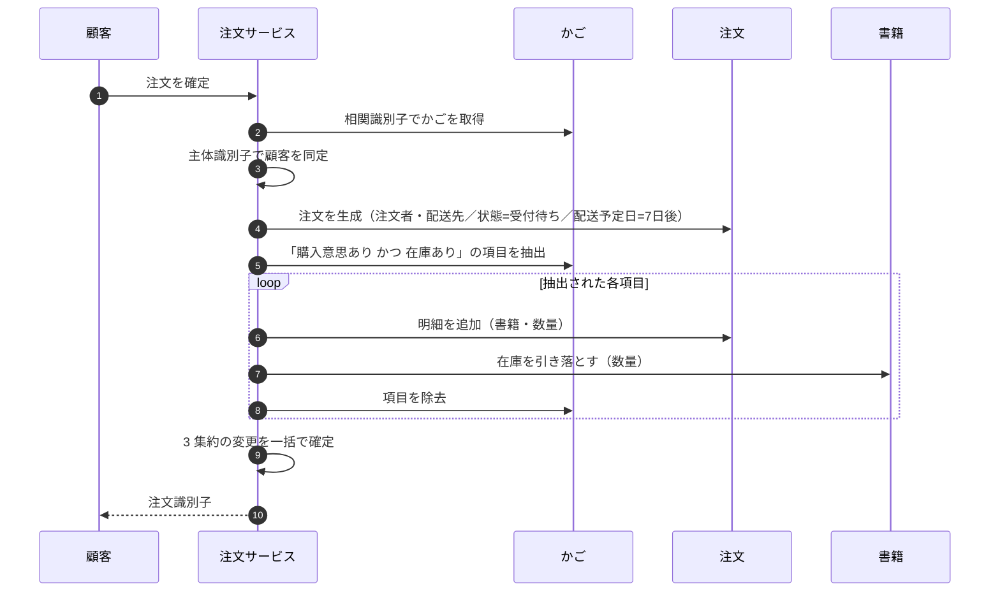
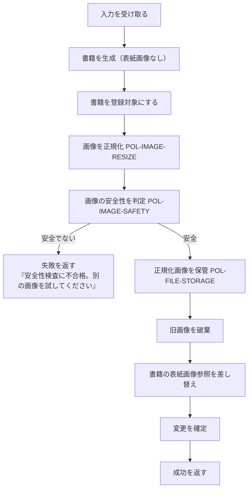
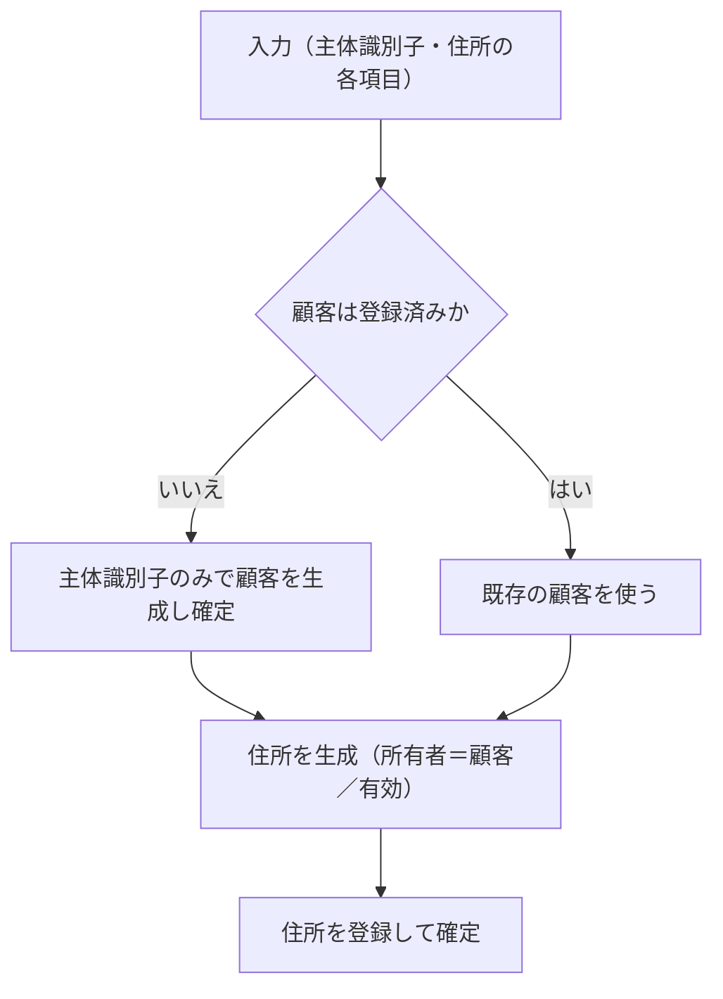
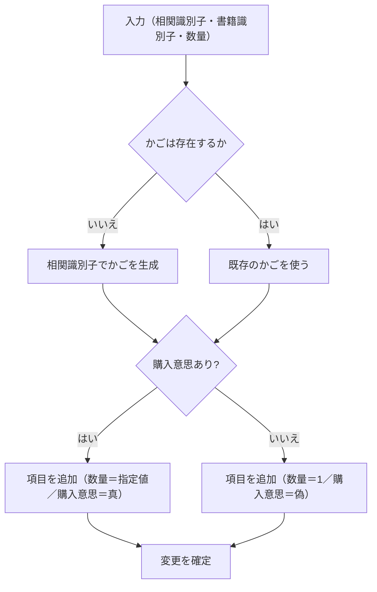

# 10. ユースケース

ドメインが提供する操作を、アクター起点で整理する。各ユースケースは**ドメインに定義されている範囲**のみを記述し、画面遷移や入力検証は含まない。

## 1. ユースケース一覧

### 1.1 顧客のユースケース

| ID | 名称 | 対象集約 | 業務判断の有無 |
| --- | --- | --- | --- |
| `UC-CUST-01` | 認証情報を同期する | 顧客 | 有（存在しなければ作る） |
| `UC-CUST-02` | 配送先を照会する | 住所 | 無 |
| `UC-CUST-03` | 配送先を登録する | 住所・顧客 | 有（顧客が未登録なら作る） |
| `UC-CUST-04` | 配送先を更新する | 住所 | 無 |
| `UC-CUST-05` | 配送先を削除する | 住所 | 無 |
| `UC-SALES-01` | 書籍を検索・閲覧する | 書籍 | 無 |
| `UC-SALES-02` | 売れ筋書籍を見る | 注文 | 無 |
| `UC-SALES-03` | かごに入れる | かご | 有（かごがなければ作る） |
| `UC-SALES-04` | 欲しい物リストに入れる | かご | 有（かごがなければ作る） |
| `UC-SALES-05` | かごの中身を見る | かご | 有（在庫切れの扱い） |
| `UC-SALES-06` | 欲しい物リストの 1 件をかごへ移す | かご | 無 |
| `UC-SALES-07` | 欲しい物リストを全件かごへ移す | かご | 無 |
| `UC-SALES-08` | **注文を確定する** | 注文・かご・書籍・顧客 | **有（本ドメインの中核）** |
| `UC-SALES-09` | 自分の注文を照会する | 注文 | 無 |
| `UC-SALES-10` | 注文をキャンセルする | 注文 | 無 |
| `UC-BUY-01` | 買取を申し込む | オファー・顧客 | 無 |
| `UC-BUY-02` | 自分のオファーを照会する | オファー | 無 |

### 1.2 店舗担当者のユースケース

| ID | 名称 | 対象集約 | 業務判断の有無 |
| --- | --- | --- | --- |
| `UC-ADMIN-01` | **書籍を登録する** | 書籍 | **有（画像の受け入れ）** |
| `UC-ADMIN-02` | **書籍を更新する** | 書籍 | **有（画像の受け入れ）** |
| `UC-ADMIN-03` | 在庫を条件で照会する | 書籍 | 無 |
| `UC-ADMIN-04` | 在庫統計を見る | 書籍 | 無 |
| `UC-ADMIN-05` | 注文を条件で照会する | 注文 | 無 |
| `UC-ADMIN-06` | 注文の状態を進める | 注文 | 無（制約なし） |
| `UC-ADMIN-07` | 注文統計を見る | 注文 | 無 |
| `UC-ADMIN-08` | オファーを条件で照会する | オファー | 無 |
| `UC-ADMIN-09` | オファーの状態を進める | オファー | 無（制約なし） |
| `UC-ADMIN-10` | オファー統計を見る | オファー | 無 |
| `UC-ADMIN-11` | 分類の選択肢を登録する | 参照データ | 無 |
| `UC-ADMIN-12` | 分類の選択肢を更新する | 参照データ | 無 |

## 2. 中核ユースケースの詳細

### 2.1 `UC-SALES-08` 注文を確定する

**本ドメインで最も重要な操作。** 3 つの集約を同時に変更し、在庫を確定的に減らす。

#### 入力

| 項目 | 意味 |
| --- | --- |
| 主体識別子 | 誰が注文するか |
| 相関識別子 | どのかごを注文にするか |
| 配送先識別子 | どこへ送るか |

#### 手順



#### 適用されるルール

| ルール | 内容 |
| --- | --- |
| `RULE-CART-02` | 在庫切れの項目は注文に載らず、**かごからも消えない** |
| `RULE-ORDER-01` | 配送予定日は生成時点の 7 日後 |
| `INV-ORDER-01` | 注文は「受付待ち」で生まれる |
| `INV-BOOK-01` | 在庫は 0 未満にならない（不足分は黙って切り捨て） |

#### 事後条件

| 集約 | 状態 |
| --- | --- |
| 注文 | 明細を持ち、状態が「受付待ち」で存在する |
| 書籍 | 明細の数量分だけ在庫が減っている（0 で下限） |
| かご | 注文に載った項目が除去されている。**在庫切れの項目は残る** |

#### 注意すべき挙動

| 状況 | 結果 |
| --- | --- |
| かごが空 | **明細 0 件・合計 0 円の注文が成立する** |
| かご全項目が在庫切れ | 同上。かごの中身はそのまま残る |
| 明細数量が在庫を超える | 注文は成立し、在庫は 0 になる。超過は記録されない |
| 配送先が他人の住所 | 検査されない |
| 同一書籍がかごに 2 行 | 明細も 2 行になり、在庫は 2 回引き落とされる |
| 顧客が未登録 | 顧客の同定に失敗する |

→ すべて [14-design-issues.md](14-design-issues.md) に課題として記録

### 2.2 `UC-ADMIN-01` / `UC-ADMIN-02` 書籍を登録・更新する

**画像の受け入れという業務判断を含む唯一の管理系ユースケース。**

#### 手順（登録）



#### 適用されるルール

| ルール | 内容 |
| --- | --- |
| `RULE-BOOK-01` | 画像が安全でなければ、**登録・更新の全体が失敗する** |
| `RULE-BOOK-02` | 画像が差し替えられたとき、旧画像は破棄される |
| `RULE-BOOK-03` | 画像が提示されなければ、既存の表紙画像は維持される |

#### 更新の性質

| 性質 | 内容 |
| --- | --- |
| 全項目の置き換え | 部分更新はできない。すべての属性が入力の値で上書きされる |
| **在庫数も置き換え** | 在庫の補充・減算ではなく、絶対値の設定である |
| 分類の種別整合 | 検査されない（`INV-BOOK-05`） |

> **在庫数が絶対値で上書きされる**ことは重要である。注文により在庫が減っている最中に管理画面から更新すると、注文分の引き落としが失われる。

### 2.3 `UC-CUST-03` 配送先を登録する

顧客の遅延生成を含む。



**顧客を先に確定させてから住所を作る**という 2 段階になっている。これは住所の生成が顧客の実体を要求するためである（`INV-ADDR-01`）。

> このユースケースだけが顧客を遅延生成する。買取の申込（`UC-BUY-01`）と注文の確定（`UC-SALES-08`）は顧客が既に存在することを前提にしている。

### 2.4 `UC-SALES-03` / `UC-SALES-04` かご・欲しい物リストに入れる



**かごへの追加と欲しい物リストへの追加は、購入意思フラグと数量の扱いだけが異なる同一の操作**である。

### 2.5 `UC-SALES-07` 欲しい物リストを全件かごへ移す

```
全件移動(相関識別子):
    かごを取得する
    かごが存在しなければ 何もしない
    欲しい物リストの各項目について:
        購入意思を真にする
    変更を確定する
```

**個別移動（`UC-SALES-06`）の単純な反復**として定義される。かごが存在しない場合に寛容である点が、他の操作（`UC-SALES-06`・`UC-SALES-10` 以外）と異なる。

## 3. 例外的な挙動の一覧

ドメインの操作が「対象が存在しない」場合にどう振る舞うかは、**操作ごとに一貫していない**。

| ユースケース | 対象が存在しないとき |
| --- | --- |
| `UC-SALES-06` 欲しい物リストの 1 件を移す（項目が不在） | **何もしない** |
| `UC-SALES-07` 全件を移す（かごが不在） | **何もしない** |
| `UC-SALES-10` 注文をキャンセル（注文が不在または他人のもの） | **何もしない** |
| `UC-SALES-05` かごの中身を見る（かごが不在） | 未定義 |
| `UC-SALES-08` 注文を確定（かごが不在／顧客が不在） | **失敗する** |
| 削除・更新系（`UC-CUST-04`, `UC-CUST-05`） | 未定義 |
| かご項目の削除 | **失敗する** |

→ [ISSUE-13](14-design-issues.md)

## 4. ユースケースとルールの対応

| ユースケース | 適用されるルール・不変条件 |
| --- | --- |
| `UC-SALES-08` | `RULE-CART-02`, `RULE-ORDER-01`, `RULE-ORDER-02`, `INV-ORDER-01`, `INV-BOOK-01` |
| `UC-ADMIN-01/02` | `RULE-BOOK-01`, `RULE-BOOK-02`, `RULE-BOOK-03`, `INV-BOOK-04` |
| `UC-SALES-03` | `INV-CART-01`, `INV-CART-02` |
| `UC-SALES-04` | `INV-CART-03` |
| `UC-CUST-03` | `INV-ADDR-01`, `INV-ADDR-02`, `INV-ADDR-03` |
| `UC-CUST-02/04/05` | `RULE-CUST-01`（所有者による限定） |
| `UC-SALES-09/10` | `RULE-CUST-01` |
| `UC-BUY-01` | `INV-OFFER-01`, `INV-OFFER-05`, `RULE-OFFER-01` |
| `UC-ADMIN-06/09` | **なし**（状態遷移の制約が存在しない） |
| `UC-ADMIN-11/12` | `INV-REFDATA-01` |
