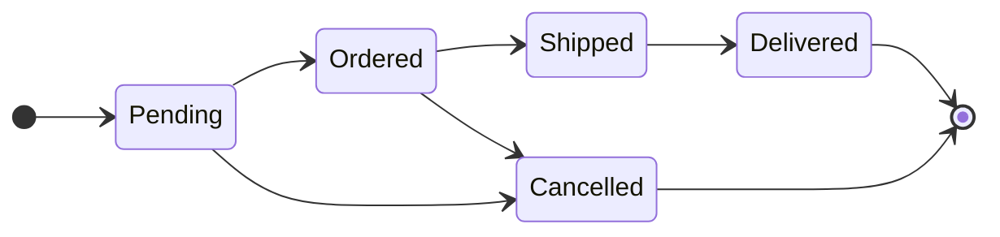
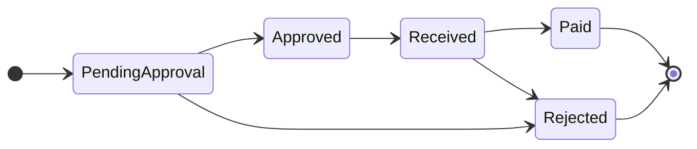
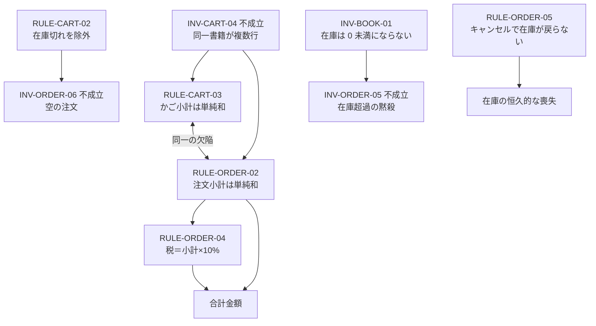

# 11. 不変条件・ビジネスルール一覧

本ドメインのすべてのルールを一箇所に集めた索引。**変更を加える前に、触れるルールをここで確認すること。**

## 1. 読み方

| 記号 | 意味 |
| --- | --- |
| **[強制]** | 集約の振る舞いによって破れない |
| **[表明]** | そう意図されているが、破る操作が存在する |
| **[外部]** | 集約の外で守られることを前提としている |
| **[不成立]** | モデルが守っておらず、実際に破られる |

**[不成立]** は「守るつもりがない」ではなく「守るべきなのに守れていない」ものを指す。すべて [14-design-issues.md](14-design-issues.md) に対応する課題がある。

## 2. 不変条件の全件

### 2.1 書籍

| ID | 条件 | レベル |
| --- | --- | --- |
| `INV-BOOK-01` | 在庫数は 0 未満にならない | **[強制]** |
| `INV-BOOK-02` | 在庫あり ⇔ 在庫数 ≧ 1 | **[強制]** |
| `INV-BOOK-03` | 在庫僅少 ⇔ 在庫数 ≦ 5 | **[強制]** |
| `INV-BOOK-04` | 書名・著者・ISBN・4 分類・価格・在庫数は必須 | **[強制]** |
| `INV-BOOK-05` | 各分類には対応する種別の参照データ項目が指定される | **[外部]** |
| `INV-BOOK-06` | 価格は 0 以上である | **[外部]** |
| `INV-BOOK-07` | 生成・更新時の在庫数は 0 以上である | **[外部]** |

### 2.2 参照データ

| ID | 条件 | レベル |
| --- | --- | --- |
| `INV-REFDATA-01` | 種別と表示名は必須 | **[強制]** |
| `INV-REFDATA-02` | 同一種別内で表示名は一意 | **[外部]** |
| `INV-REFDATA-03` | 参照されている項目の種別は変更されない | **[外部]** |

### 2.3 顧客・住所

| ID | 条件 | レベル |
| --- | --- | --- |
| `INV-CUST-01` | 顧客は主体識別子を持つ | **[表明]** |
| `INV-CUST-02` | 主体識別子は顧客間で一意 | **[外部]** |
| `INV-CUST-03` | 顧客は氏名を持つ | **[不成立]** |
| `INV-ADDR-01` | 住所は必ず所有者を持つ | **[強制]** |
| `INV-ADDR-02` | 住所行 1・市区町村・州・国・郵便番号は必須 | **[強制]** |
| `INV-ADDR-03` | 住所は生成時に有効 | **[強制]** |
| `INV-ADDR-04` | 住所の所有者は変更されない | **[外部]** |
| `INV-ADDR-05` | 注文に使われた住所は消えない | **[外部]** |

### 2.4 買い物かご

| ID | 条件 | レベル |
| --- | --- | --- |
| `INV-CART-01` | かごは相関識別子を持つ | **[強制]** |
| `INV-CART-02` | 項目はかごを通じてのみ増減する | **[強制]** |
| `INV-CART-03` | 欲しい物リストの項目の数量は 1 | **[強制]** |
| `INV-CART-04` | 同一書籍はかご内に 1 行のみ | **[不成立]** |
| `INV-CART-05` | 項目の数量は 1 以上 | **[外部]** |
| `INV-CART-06` | 項目の数量は在庫数を超えない | **[不成立]** |

### 2.5 注文

| ID | 条件 | レベル |
| --- | --- | --- |
| `INV-ORDER-01` | 注文は「受付待ち」で生成される | **[強制]** |
| `INV-ORDER-02` | 状態は前進のみで後退しない | **[不成立]** |
| `INV-ORDER-03` | 終端状態からは遷移しない | **[不成立]** |
| `INV-ORDER-04` | 発送済・配送完了の注文はキャンセルできない | **[不成立]** |
| `INV-ORDER-05` | 明細の数量は在庫数を超えない | **[不成立]** |
| `INV-ORDER-06` | 注文は 1 件以上の明細を持つ | **[不成立]** |
| `INV-ORDER-07` | 配送先は注文者が所有する住所である | **[外部]** |
| `INV-ORDER-08` | 明細はかご項目からのみ生成される | **[外部]** |
| `INV-ORDER-09` | 明細は注文を通じてのみ追加される | **[強制]** |

### 2.6 買取オファー

| ID | 条件 | レベル |
| --- | --- | --- |
| `INV-OFFER-01` | オファーは「承認待ち」で生成される | **[強制]** |
| `INV-OFFER-02` | 状態は定義された順序でのみ進む | **[不成立]** |
| `INV-OFFER-03` | 終端状態からは遷移しない | **[不成立]** |
| `INV-OFFER-04` | 受領前に支払は行われない | **[不成立]** |
| `INV-OFFER-05` | 申込者・書名・著者・ISBN・4 分類・買取価格は必須 | **[強制]** |
| `INV-OFFER-06` | 買取価格は 0 以上 | **[外部]** |
| `INV-OFFER-07` | 各分類には対応する種別の項目が指定される | **[外部]** |
| `INV-OFFER-08` | 申込者は登録済みの顧客である | **[外部]** |

### 2.7 強制レベルの集計

| レベル | 件数 | 割合 |
| --- | --- | --- |
| **[強制]** | 15 | 37% |
| **[外部]** | 14 | 34% |
| **[表明]** | 1 | 2% |
| **[不成立]** | 11 | 27% |
| 合計 | 41 | 100% |

集約別の内訳：

| 集約 | 強制 | 外部 | 表明 | 不成立 | 合計 |
| --- | --- | --- | --- | --- | --- |
| 書籍 | 4 | 3 | 0 | 0 | 7 |
| 参照データ | 1 | 2 | 0 | 0 | 3 |
| 顧客 | 0 | 1 | 1 | 1 | 3 |
| 住所 | 3 | 2 | 0 | 0 | 5 |
| 買い物かご | 3 | 1 | 0 | 2 | 6 |
| **注文** | 2 | 2 | 0 | **5** | 9 |
| **買取オファー** | 2 | 3 | 0 | **3** | 8 |

> 不変条件のうち集約自身が守っているものは 4 割に満たない。**このドメインは構造の記述には成功しているが、不変条件の保護には成功していない。** とりわけ状態を持つ 2 つの集約（注文・買取オファー）に不成立が集中しており、モデルの弱点が明確である。

## 3. ビジネスルールの全件

| ID | ルール | 適用場面 |
| --- | --- | --- |
| `RULE-BOOK-01` | 画像が安全でなければ登録・更新の全体が失敗する | 書籍の登録・更新 |
| `RULE-BOOK-02` | 画像の差し替え時、旧画像は破棄される | 書籍の登録・更新 |
| `RULE-BOOK-03` | 画像が提示されなければ既存の表紙画像は維持される | 書籍の更新 |
| `RULE-CART-01` | 在庫切れの書籍もかごには残り、顧客に見える | かごの表示 |
| `RULE-CART-02` | 注文成立時、在庫切れの書籍は黙って除外される | 注文の確定 |
| `RULE-CART-03` | かごの小計は書籍価格の単純和（数量を乗じない） | かごの表示 |
| `RULE-ORDER-01` | 配送予定日は注文生成時点の 7 日後 | 注文の確定 |
| `RULE-ORDER-02` | 注文の小計は書籍価格の単純和（数量を乗じない） | 注文の金額 |
| `RULE-ORDER-03` | 注文金額は書籍の現在価格から毎回算出される | 注文の金額 |
| `RULE-ORDER-04` | 税は小計の 10%。地域・商品種別による差異はない | 注文の金額 |
| `RULE-ORDER-05` | キャンセルしても在庫は戻らない | 注文のキャンセル |
| `RULE-OFFER-01` | 買取価格は申込時に確定し以後変更されない | 買取の申込 |
| `RULE-OFFER-02` | 買取価格の算定基準はドメインに存在しない | 買取の申込 |
| `RULE-CUST-01` | 住所・注文の顧客向け照会は所有者に限定される | 顧客の照会 |
| `RULE-PERIOD-01` | 日の終端はその日の 23:59:59 とする | 統計の期間 |
| `RULE-PERIOD-02` | 月の始まりは同月 1 日の同時刻とする | 統計の期間 |

## 4. ドメイン定数

| 定数 | 値 | 所属 | 変更の影響 |
| --- | --- | --- | --- |
| 在庫僅少しきい値 | 5 | 書籍 | 在庫僅少判定・在庫統計 |
| 税率 | 10% | 注文 | すべての注文金額 |
| 配送猶予日数 | 7 日 | 注文 | 配送予定日・期限超過判定 |

これら 3 つは**ドメインに埋め込まれた業務判断**であり、設定値として外部化されていない。事業ルールの変更＝ドメインの変更である。

## 5. 状態遷移の総覧

### 5.1 注文

**上図は意図であり、制約ではない。** モデルは任意の遷移を許す。

| 遷移 | 意図 | 実際 |
| --- | --- | --- |
| 受付待ち → 注文確定 | ○ | 可 |
| 注文確定 → 発送済 | ○ | 可 |
| 発送済 → 配送完了 | ○ | 可 |
| 受付待ち/注文確定 → キャンセル | ○ | 可 |
| 発送済 → キャンセル | × | **可** |
| 配送完了 → 受付待ち | × | **可** |
| キャンセル → 発送済 | × | **可** |

### 5.2 買取オファー

同じく制約されていない。

| 遷移 | 意図 | 実際 |
| --- | --- | --- |
| 承認待ち → 承認済/却下 | ○ | 可 |
| 承認済 → 受領確認済 | ○ | 可 |
| 受領確認済 → 支払完了 | ○ | 可 |
| 受領確認済 → 却下 | ○ | 可 |
| **承認待ち → 支払完了** | × | **可（現物未受領で支払）** |
| 却下 → 承認済 | × | **可** |
| 支払完了 → 承認待ち | × | **可** |

### 5.3 状態遷移に関する共通の課題

両者に共通して以下の要素が欠けている。

| 欠けている要素 | 帰結 |
| --- | --- |
| 遷移の妥当性検査 | 業務上ありえない状態変化が起こる |
| 遷移に伴う副作用 | キャンセル時の在庫戻し、支払完了時の在庫化がない |
| 遷移の履歴 | いつ誰が状態を変えたか追跡できない |
| 状態ごとの操作制限 | 配送完了後の注文に明細を追加できる |

→ [ISSUE-15](14-design-issues.md)

## 6. ルール間の依存関係

変更時に連動して確認すべきルールの組。

**金額に関する 4 つのルール（`RULE-CART-03`, `RULE-ORDER-02`, `RULE-ORDER-03`, `RULE-ORDER-04`）は密結合している。** 数量を計上する修正を入れる場合、かごと注文の両方を同時に直さなければ、かごの表示金額と注文の請求金額が食い違う。
