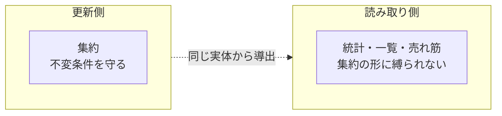

# 12. 読み取りモデルと統計

ドメインには、集約の更新とは別に**照会専用の関心**が存在する。それらを整理する。

## 1. 読み取りモデルの位置づけ



読み取りモデルは**集約の構造に従わない**。統計値は複数の集約インスタンスを横断して集計した結果であり、どの集約にも属さない。

本ドメインでは、これらが集約のリポジトリに同居している。純粋な分離（CQRS）は行われていない。

## 2. 統計（ダッシュボード指標）

店舗担当者が事業の状態を把握するための 3 種類の指標。

### 2.1 `RM-BOOK-STATS` 在庫統計

| 指標 | 定義 | ドメインでの定義の有無 |
| --- | --- | --- |
| 在庫切れ件数 | 在庫数が 0 の書籍の数 | `INV-BOOK-02` の否定として導出可能 |
| 在庫僅少件数 | 在庫数が 5 以下の書籍の数 | `INV-BOOK-03` として定義済み |
| 在庫総数 | 全書籍の在庫数の合計 | 定義なし（自明） |

**在庫切れと在庫僅少は重なる。** 在庫 0 の書籍は両方に数えられる（`INV-BOOK-03` の帰結）。

```
在庫 0 の書籍が 3 件、在庫 1〜5 の書籍が 7 件のとき：
    在庫切れ件数 = 3
    在庫僅少件数 = 10  ← 在庫切れの 3 件を含む
```

指標を並べて表示する場面では、**合計が全体を超える**という直感に反する見え方になる。→ [ISSUE-01](14-design-issues.md)

### 2.2 `RM-ORDER-STATS` 注文統計

| 指標 | 定義 | ドメインでの定義の有無 |
| --- | --- | --- |
| 受付待ち注文数 | 状態が「受付待ち」の注文の数 | 状態として定義済み |
| **期限超過注文数** | ? | **ドメインに定義がない** |
| 今月の注文数 | `RULE-PERIOD-02` で定まる期間内の注文の数 | 期間規則のみ定義済み |
| 総注文数 | すべての注文の数 | 定義なし（自明） |

#### 期限超過注文の定義不在

「期限超過（Past Due）」という言葉は統計にのみ現れ、**ドメインはその意味を定義していない**。

| 想定される定義 | 必要な情報 |
| --- | --- |
| 配送予定日を過ぎて未配送の注文 | 配送予定日（あり）＋状態（あり） |
| 配送予定日を過ぎた注文（状態を問わない） | 配送予定日（あり） |
| 注文日から一定期間処理されていない注文 | 作成日時（あり） |

いずれの解釈も成立しうる。**この重要な業務概念が集約の外で定義されている**ことは、ドメイン層の欠落である。

| ID | 内容 |
| --- | --- |
| `ISSUE-25` | 「期限超過注文」がユビキタス言語に存在せず、判定規則がドメインに定義されていない |

### 2.3 `RM-OFFER-STATS` 買取統計

| 指標 | 定義 | ドメインでの定義の有無 |
| --- | --- | --- |
| 承認待ちオファー数 | 状態が「承認待ち」のオファーの数 | 状態として定義済み |
| 今月のオファー数 | `RULE-PERIOD-02` で定まる期間内のオファーの数 | 期間規則のみ定義済み |
| 総オファー数 | すべてのオファーの数 | 定義なし（自明） |

**買取価格の総額が指標にない。** 承認待ちのオファーが何件あるかは分かるが、それが金額としていくらの負債になるかは分からない。事業指標としては不十分である。

### 2.4 統計の共通の性質

| 性質 | 内容 |
| --- | --- |
| **未取得時の既定値** | 統計が得られない場合、すべて 0 の値が返る。「不明」と「ゼロ」を区別しない |
| **期間の粒度** | 「今月」のみ。日次・週次・年次の指標がない |
| **金額の指標がない** | 3 種類の統計すべてが件数のみ。売上・粗利・買取総額がない |
| **横断指標がない** | 買取と販売を突き合わせた指標（粗利率など）がない |

**この事業の収益構造（安く買って高く売る）を測る指標が 1 つも存在しない。** 統計は在庫と処理待ち件数の監視に特化しており、事業成績の把握には使えない。

## 3. 一覧照会

### 3.1 照会条件の一覧

| 集約 | 絞り込み条件 | ページ分割 | 主体 |
| --- | --- | --- | --- |
| 書籍 | 書名・著者・出版社・ジャンル・書籍種別・コンディション・在庫僅少 | ● | 店舗担当者 |
| 書籍 | 検索文字列・並び順 | ● | 顧客 |
| 注文 | 状態・注文日の範囲 | ● | 店舗担当者 |
| 注文 | 主体識別子 | | 顧客 |
| 買取オファー | 書名・著者・ジャンル・コンディション・状態 | ● | 店舗担当者 |
| 買取オファー | 主体識別子 | | 顧客 |
| 住所 | 主体識別子 | | 顧客 |
| 参照データ | 種別 | ● | 店舗担当者 |
| 参照データ | （全件） | | 全員 |

### 3.2 2 種類の書籍一覧

書籍だけが**2 通りの照会経路**を持つ。これは 2 種類の利用者の異なる関心を反映している。

| 経路 | 主体 | 関心 |
| --- | --- | --- |
| 条件で絞り込む | 店舗担当者 | 「ジャンル X で在庫が少ないものは？」という**管理の関心** |
| 検索文字列で探す | 顧客 | 「この本はあるか？」という**購入の関心** |

顧客向けの経路には在庫僅少の条件がなく、店舗担当者向けの経路には並び順の指定がない。**関心の違いがそのまま照会仕様の違いになっている**点は、モデルとして健全である。

### 3.3 ページ分割の抽象

一覧照会の結果は、ページ分割された形で表現される。

| 表現される情報 | 意味 |
| --- | --- |
| 現在のページ位置 | いま何ページ目か |
| 総ページ数 | 全体で何ページあるか |
| 前後ページの有無 | ページ送りが可能か |
| 表示すべきページ番号の並び | ページャの描画に必要な番号列 |
| 別の形への変換 | 要素を別の表現に写し取る |

**この抽象は表示上の関心であり、業務ドメインの概念ではない。** ドメイン層に置かれているが、本来は上位層に属する。「表示すべきページ番号の並び」に至っては、明確に画面描画のための機能である。→ [ISSUE-26](14-design-issues.md)

## 4. 売れ筋書籍

| 項目 | 内容 |
| --- | --- |
| 意味 | 売れた数の多い順に上位 N 件の書籍 |
| 責務の所在 | **注文の側** |
| 判定規則 | **ドメインに定義がない**（何を「売れた」と数えるか不明） |

### 4.1 責務の配置は正しい

「何が売れたか」は注文の履歴にしか存在しない情報である。書籍集約は自身の販売実績を知らず、知る必要もない。**照会を注文の責務に置いた判断は正しい。**

### 4.2 定義されていないこと

| 論点 | ドメインの立場 |
| --- | --- |
| キャンセル済みの注文を数えるか | 未定義 |
| 集計期間はあるか（全期間／直近） | 未定義 |
| 明細の数量で数えるか、明細の件数で数えるか | 未定義 |

`RULE-ORDER-02`（数量が金額に計上されない）と併せて考えると、**明細の数量が信頼できる情報かどうか自体が疑わしい**。売れ筋の判定基準が明示されていないことは、その曖昧さを増幅する。

## 5. 読み取り側の設計評価

| 観点 | 評価 |
| --- | --- |
| 集約単位の取得と一覧・統計が同じ出入口に同居している | 更新の関心と読み取りの関心が分離されていない |
| 統計の定義の一部がドメインの外にある | 「期限超過」「売れ筋」の意味がドメイン層から読み取れない |
| ページ分割の抽象がドメイン層にある | 表示の関心がドメインに漏れている |
| 金額・成績に関する指標が皆無 | 事業の中核である買取と販売の収支が測れない |

### 5.1 改善の方向性

読み取り側を分離する場合、以下の順で価値が高い。

1. **「期限超過」「売れ筋」の定義をドメインに引き上げる**（仕様として明示する）
2. **在庫僅少と在庫切れの重なりを解消する**（[ISSUE-01](14-design-issues.md)）
3. ページ分割の抽象をドメインから外す
4. 金額系の指標を追加する（買取総額・売上・粗利）
