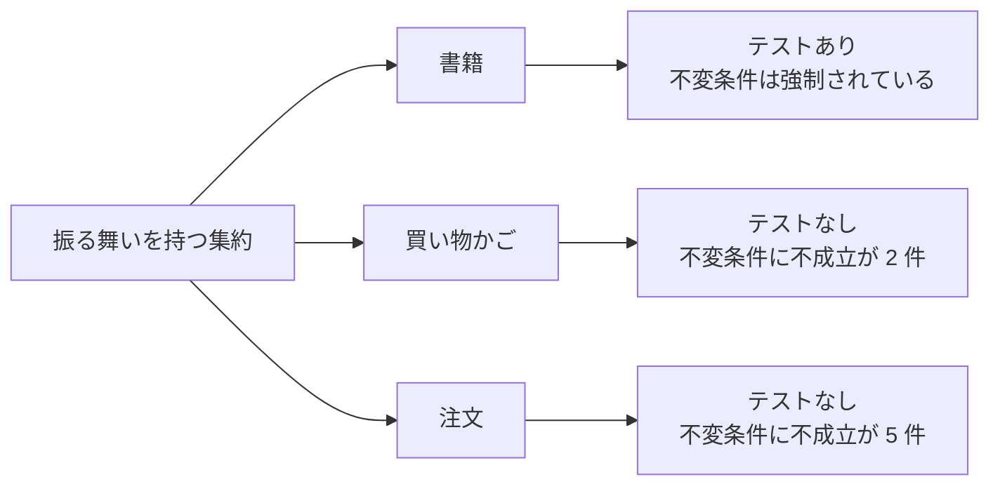

# 13. テストによる仕様

自動テストは、**ドメインが「これは必ず守る」と表明している仕様**の実行可能な記述である。本章は、テストとして固定されている仕様の内容と、その範囲の狭さを記録する。

## 1. 検証されている仕様の全件

現在テストが存在するのは**書籍集約の在庫に関する振る舞いのみ**である。

| ID | 仕様 | 対応する不変条件 |
| --- | --- | --- |
| `SPEC-BOOK-01` | 在庫数が 1 のとき「在庫あり」である | `INV-BOOK-02` |
| `SPEC-BOOK-02` | 在庫数が 0 のとき「在庫あり」ではない | `INV-BOOK-02` |
| `SPEC-BOOK-03` | 在庫数がしきい値未満のとき「在庫僅少」である | `INV-BOOK-03` |
| `SPEC-BOOK-04` | 在庫数がしきい値と等しいとき「在庫僅少」である | `INV-BOOK-03` |
| `SPEC-BOOK-05` | 在庫数がしきい値を超えるとき「在庫僅少」ではない | `INV-BOOK-03` |
| `SPEC-BOOK-06` | 在庫引き落としは、指定された数量だけ在庫を減らす | 振る舞いの定義 |
| `SPEC-BOOK-07` | 在庫引き落としは、在庫数を 0 未満にしない | `INV-BOOK-01` |

### 1.1 境界値の扱い

在庫僅少の判定は、**しきい値の前後 3 点**で固定されている。

```
しきい値 − 1  → 在庫僅少である
しきい値      → 在庫僅少である    ← 境界を含むことを明示
しきい値 + 1  → 在庫僅少ではない
```

しきい値そのものを含むかどうかは仕様上の曖昧さが生じやすい点であり、それを明示的に固定している。**設計判断として評価できる。**

なお、テストはしきい値を**具体的な数値 5 ではなくドメイン定数として参照**している。しきい値を変更しても仕様の意味は保たれる。これは「しきい値は 5 である」ではなく「しきい値以下で在庫僅少である」ことを仕様としている、正しい表現である。

### 1.2 在庫切れが在庫僅少に含まれることは検証されていない

`SPEC-BOOK-02` は在庫 0 で「在庫あり」でないことを確認するが、**在庫 0 で「在庫僅少」が真になること**（[ISSUE-01](14-design-issues.md)）を検証するテストはない。この重なりは意図的な仕様なのか見落としなのかが、テストからは判断できない。

### 1.3 在庫引き落としの飽和

`SPEC-BOOK-07` は、在庫 50 に対して 60 の引き落としを行っても在庫が 0 になることを固定している。

**これは「超過分は黙って切り捨てる」という挙動を仕様として承認したものである。** 例外を投げるべきではないか、という設計判断はここで決着済みと解釈できる。ただしその帰結（在庫を超えた注文が成立する、[ISSUE-03](14-design-issues.md)）は、この階層のテストでは見えない。

## 2. 検証されていない仕様

### 2.1 集約別のカバレッジ

| 集約 | 振る舞いの数 | 検証済み | 状況 |
| --- | --- | --- | --- |
| **書籍** | 2（在庫判定・引き落とし） | **2** | 完全 |
| 参照データ | 0 | — | 振る舞いなし |
| 顧客 | 0 | — | 振る舞いなし |
| 住所 | 0 | — | 振る舞いなし |
| **買い物かご** | 6 | **0** | **未検証** |
| **注文** | 1 ＋ 金額 3 | **0** | **未検証** |
| 買取オファー | 0 | — | 振る舞いなし |

### 2.2 未検証の重要な仕様

以下は業務上の意味が大きいにもかかわらず、テストで固定されていない。

| 未検証の仕様 | リスク |
| --- | --- |
| かごの小計が数量を乗じない（`RULE-CART-03`） | 修正時に「意図された仕様」か「欠陥」か判断できない |
| 注文の小計が数量を乗じない（`RULE-ORDER-02`） | 同上 |
| 税が小計の 10%（`RULE-ORDER-04`） | 税率変更の影響範囲が分からない |
| 合計＝小計＋税 | |
| 在庫切れ項目がかごの表示に含まれ、注文から除外される（`RULE-CART-01/02`） | **顧客体験に直結する分岐が無防備** |
| 欲しい物リストの項目が数量 1 で作られる（`INV-CART-03`） | |
| 欲しい物リストからの移動が、不在の項目に対して寛容である | |
| かご項目の削除が、不在の項目に対して非寛容である | |
| 配送予定日が 7 日後（`RULE-ORDER-01`） | |
| 注文が「受付待ち」で生成される（`INV-ORDER-01`） | |
| オファーが「承認待ち」で生成される（`INV-OFFER-01`） | |

**とくに `RULE-CART-03` と `RULE-ORDER-02`（数量を乗じない小計）が未検証であることは重大である。** これらが欠陥であることは本書の分析で明らかだが、テストがないため「直したときに何が壊れるか」が分からない。

### 2.3 検証の空白と設計の弱点の一致



**テストが存在する集約だけが、不変条件を強制できている。** これは偶然ではない。書籍の在庫判定は、テストによって仕様が固定されているからこそ、振る舞いとして集約の内側に留まっている。

## 3. テストの書き方に見える設計意図

### 3.1 生成の複雑さを隠す仕組み

書籍は 12 個の属性を持ち、そのうち 9 個が必須である。テストは**既定値を持つ生成補助**を用いて、検証したい属性だけを指定する。

```
書籍を用意する:
    在庫数 = 100          ← 検証したい属性だけ指定
    （他はすべて妥当な既定値）
```

| 効果 | 内容 |
| --- | --- |
| テストの意図が明確になる | 「在庫数が 100 のとき」という条件だけが目に入る |
| 属性の追加に強い | 必須属性が増えてもテストが壊れない |
| **設計上の示唆** | 生成に 9 個の必須属性を要求することが、そもそも重いことの裏返しでもある |

### 3.2 仕様の記述としての命名

テストは「**何が・いつ・どうなる**」の形式で命名されている。

```
在庫あり_真を返す_数量が 0 より大きいとき
在庫僅少_真を返す_数量がしきい値以下のとき
在庫引き落とし_指定量だけ数量を減らす
在庫引き落とし_数量を 0 未満にしない
```

**この命名規則により、テスト一覧がそのまま仕様一覧として読める。** ドメインの意図を伝える手段としてテストを使う姿勢が現れている。

## 4. 仕様の空白を埋める優先順位

未検証の仕様に対して、固定すべき優先順位を示す。

| 優先度 | 対象 | 理由 |
| --- | --- | --- |
| **1** | かご・注文の金額算出 | 金額は誤りが直接損害になる。かつ現状が欠陥のため、修正前に現状を固定する必要がある |
| **2** | 在庫切れ項目のかご表示と注文除外 | 顧客体験に直結する分岐で、テストがないと安全に変更できない |
| **3** | 注文成立の 3 集約同時変更 | 最も複雑な操作。在庫・かご・注文の事後条件を固定する |
| **4** | 生成時の既定値（状態・配送予定日） | 変更の影響が広い |
| **5** | 不在項目に対する寛容／非寛容の挙動 | 一貫していないため、現状を明示的に記録する価値がある |

> 優先度 1 について：**現状の（誤った）挙動をまずテストで固定してから修正する**ことを推奨する。修正時に、どの読み取り側が影響を受けるかを可視化するためである。
