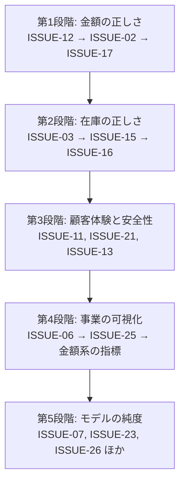

# 14. 設計上の課題

03〜13 で記述した**現状のモデル**に対する評価を、ここに隔離してまとめる。

## 1. 課題の一覧

重大度の基準：

| 記号 | 意味 |
| --- | --- |
| **致命** | 金銭・在庫の誤りを直接引き起こす。業務として成立しない |
| **重大** | 業務上ありえない状態を生む。または重要な業務機能が欠落している |
| **中** | モデルの整合性を損なう。将来の変更を困難にする |
| **軽微** | 設計の純度に関わる。動作には影響しない |

| ID | 課題 | 重大度 | 関係する集約 |
| --- | --- | --- | --- |
| [ISSUE-02](#issue-02) | 小計が数量を乗じていない | **致命** | かご・注文 |
| [ISSUE-17](#issue-17) | 注文金額が書籍の現在価格から毎回算出される | **致命** | 注文 |
| [ISSUE-03](#issue-03) | 在庫を超える注文が黙って成立する | **致命** | 書籍・注文 |
| [ISSUE-16](#issue-16) | キャンセルしても在庫が戻らない | **致命** | 注文・書籍 |
| [ISSUE-15](#issue-15) | 状態遷移が一切制約されていない | **重大** | 注文・オファー |
| [ISSUE-06](#issue-06) | 買取と販売がつながっていない | **重大** | オファー・書籍 |
| [ISSUE-11](#issue-11) | 在庫切れ項目が黙って除外され、空の注文が成立する | **重大** | かご・注文 |
| [ISSUE-12](#issue-12) | 同一書籍がかご内に複数行できる | **重大** | かご |
| [ISSUE-21](#issue-21) | オファーの照会が所有者に限定されていない | **重大** | オファー |
| [ISSUE-01](#issue-01) | 「在庫僅少」が在庫切れを包含する | 中 | 書籍 |
| [ISSUE-04](#issue-04) | 住所の有効フラグが機能していない | 中 | 住所 |
| [ISSUE-05](#issue-05) | 参照データの種別整合が保証されない | 中 | 参照データ・書籍・オファー |
| [ISSUE-07](#issue-07) | 金額・数量が値として表現されていない | 中 | 全集約 |
| [ISSUE-08](#issue-08) | 顧客の生成経路が統一されていない | 中 | 顧客 |
| [ISSUE-09](#issue-09) | 時点の基準が統一されていない | 中 | 注文 |
| [ISSUE-13](#issue-13) | 対象不在時の挙動が一貫していない | 中 | 全集約 |
| [ISSUE-14](#issue-14) | かごの寿命と引き継ぎが定義されていない | 中 | かご |
| [ISSUE-18](#issue-18) | 注文の成立が 3 集約を同時に変更する | 中 | 注文・かご・書籍 |
| [ISSUE-19](#issue-19) | 買取価格の交渉がモデル化されていない | 中 | オファー |
| [ISSUE-20](#issue-20) | オファーの講評・表紙画像が設定できない | 中 | オファー |
| [ISSUE-23](#issue-23) | 変更確定の共有が暗黙の前提になっている | 中 | 全集約 |
| [ISSUE-25](#issue-25) | 「期限超過注文」がドメインに定義されていない | 中 | 注文 |
| [ISSUE-10](#issue-10) | 誰が操作したかを追跡できない | 軽微 | 全集約 |
| [ISSUE-22](#issue-22) | 画像の安全性判定が正規化前の画像に対して行われる | 軽微 | 書籍 |
| [ISSUE-24](#issue-24) | 「今月」の起点が時刻を切り捨てない | 軽微 | 統計 |
| [ISSUE-26](#issue-26) | ページ分割の抽象がドメイン層にある | 軽微 | 読み取り |

## 2. 致命的な課題

<a id="issue-02"></a>
### ISSUE-02 — 小計が数量を乗じていない

| 項目 | 内容 |
| --- | --- |
| 関係するルール | `RULE-CART-03`, `RULE-ORDER-02` |
| 症状 | かごと注文の小計が、明細の数量を無視して書籍価格を単純に足し合わせる |
| 帰結 | **10 冊注文しても 1 冊分の代金しか請求されない。** 在庫は 10 冊減る |

```
現状:  小計 = Σ（書籍の価格）
あるべき: 小計 = Σ（書籍の価格 × 数量）
```

**改善方針**

1. まず現状の挙動をテストで固定する（[13 章 §4](13-specification-by-test.md) 参照）
2. かごと注文の**両方を同時に**修正する。片方だけ直すと表示金額と請求金額が食い違う
3. `ISSUE-12`（重複行）と併せて修正する。重複行が残ったまま数量を乗じると二重計上になる

<a id="issue-17"></a>
### ISSUE-17 — 注文金額が書籍の現在価格から毎回算出される

| 項目 | 内容 |
| --- | --- |
| 関係するルール | `RULE-ORDER-03` |
| 症状 | 注文明細が注文時点の価格を保持せず、書籍の現在価格を参照する |
| 帰結 | **書籍の価格を改定すると、過去の注文の金額がすべて変わる** |

注文は「その時点の合意」の記録である。事後に変動する注文は、注文として成立していない。

**改善方針**

注文明細に**注文時点の価格を写し取る**。集約境界の観点でも正しい方向である。注文が書籍の実体に依存しなくなり、識別子だけで参照できるようになる。

```
注文明細:
    書籍への参照（識別子）
    数量
    確定価格   ← 追加。注文成立時に書籍の価格を写す
```

<a id="issue-03"></a>
### ISSUE-03 — 在庫を超える注文が黙って成立する

| 項目 | 内容 |
| --- | --- |
| 関係する不変条件 | `INV-BOOK-01`（強制）, `INV-ORDER-05`（不成立）, `INV-CART-06`（不成立） |
| 症状 | 在庫引き落としが下限 0 で飽和し、不足を報告しない |
| 帰結 | 在庫 3 冊の書籍を 10 冊注文でき、注文は成立し、在庫は 0 になる。**7 冊分の履行不能が検知されない** |

`INV-BOOK-01` が守られていることが、かえって問題を隠している。

**改善方針**

書籍集約に**引き落とし可能かの判断**を持たせ、不可能な場合は操作を失敗させる。

```
在庫引き落とし(数量):
    数量 > 在庫数 ならば 失敗（在庫不足）
    在庫数 ← 在庫数 − 数量
```

飽和させる現在の挙動は `SPEC-BOOK-07` として仕様に固定されているため、**仕様の変更を伴う**。テストの更新が必要である。

かご投入時点（`INV-CART-06`）でも数量を検査すれば、顧客に早く伝えられる。ただし在庫はかごでは拘束されないため、**最終的な判定は注文成立時に必要**である。

<a id="issue-16"></a>
### ISSUE-16 — キャンセルしても在庫が戻らない

| 項目 | 内容 |
| --- | --- |
| 関係するルール | `RULE-ORDER-05` |
| 症状 | 注文のキャンセルが状態を変えるだけで、引き落とした在庫を戻さない |
| 帰結 | **キャンセルのたびに在庫が恒久的に失われる**。中古書店は同一商品が 1 点しかないことが多く、影響が大きい |

**改善方針**

キャンセルを状態の書き換えではなく**振る舞い**としてモデル化し、在庫の返却を副作用として組み込む。

```
注文.キャンセルする():
    状態が 発送済・配送完了・キャンセル ならば 失敗   ← ISSUE-15 も同時に解決
    状態 ← キャンセル
    各明細について: 書籍の在庫を数量分だけ戻す
```

在庫の返却は書籍集約への操作であるため、[ISSUE-18](#issue-18) と同じ「複数集約の同時変更」の問題を持つ。

## 3. 重大な課題

<a id="issue-15"></a>
### ISSUE-15 — 状態遷移が一切制約されていない

| 項目 | 内容 |
| --- | --- |
| 関係する不変条件 | `INV-ORDER-02/03/04`, `INV-OFFER-02/03/04`（すべて不成立） |
| 症状 | 注文状態・オファー状態が任意の値に書き換えられる |
| 帰結 | 配送完了した注文を受付待ちに戻せる。**現物を受け取らずに買取代金を支払える** |

**改善方針**

状態を持つ 2 つの集約に、**遷移を表す振る舞い**を導入する。

| 集約 | 導入すべき振る舞い |
| --- | --- |
| 注文 | 受理する・発送する・配送完了を記録する・キャンセルする |
| オファー | 承認する・却下する・受領を確認する・支払を記録する |

各振る舞いが、現在の状態を検査してから遷移する。状態属性は外部から書き換えられないようにする。

これにより `ISSUE-16`（キャンセル時の在庫返却）と `ISSUE-06`（支払完了時の在庫化）を、遷移の副作用として自然に組み込める。

<a id="issue-06"></a>
### ISSUE-06 — 買取と販売がつながっていない

| 項目 | 内容 |
| --- | --- |
| 症状 | 支払完了した買取オファーを書籍（在庫）にする経路がドメインに存在しない |
| 帰結 | 仕入元が追跡できない。買取価格と販売価格の関係が失われ、**粗利が算出できない** |

これは欠陥ではなく**機能の欠落**である。本ドメインの事業モデル（安く買って高く売る）の中核が表現されていない。

**改善方針**

オファーの「支払完了」への遷移に、書籍の生成を伴わせる。

```
オファー.支払を記録する():
    状態が 受領確認済 でなければ 失敗
    状態 ← 支払完了
    → 「買取が成立した」ことを表明する

書籍を在庫化する（オファーから）:
    オファーの書名・著者・ISBN・4 分類を引き継ぐ
    販売価格は店舗が決める（買取価格ではない）
    在庫数 = 1
    仕入元としてオファーへの参照を保持する
```

在庫化を自動にするか、店舗担当者の確認を挟むかは業務判断である。少なくとも**オファーと書籍を結ぶ参照**を持たせるだけでも、仕入元の追跡と粗利の算出が可能になる。

<a id="issue-11"></a>
### ISSUE-11 — 在庫切れ項目が黙って除外され、空の注文が成立する

| 項目 | 内容 |
| --- | --- |
| 関係するルール | `RULE-CART-02`, `INV-ORDER-06`（不成立） |
| 症状 | 注文成立時、在庫切れの項目が通知なく除外される。全項目が在庫切れなら明細 0 件の注文が成立する |
| 帰結 | 顧客は「注文完了」と表示されながら、何も注文できていない状態になりうる |

**改善方針**

1. 明細が 0 件の注文の成立を拒否する（`INV-ORDER-06` を強制する）
2. 除外された項目を**結果として返す**。「在庫切れのため次の商品は注文に含まれませんでした」と伝えられるようにする
3. 除外された項目をかごに残すか消すかを明示的に決める（現状は残る）

<a id="issue-12"></a>
### ISSUE-12 — 同一書籍がかご内に複数行できる

| 項目 | 内容 |
| --- | --- |
| 関係する不変条件 | `INV-CART-04`（不成立） |
| 症状 | 同じ書籍を 2 回追加すると、数量が合算されず 2 行になる |
| 帰結 | 注文明細も 2 行になり、在庫が 2 回引き落とされる。`ISSUE-02` 修正後は金額が二重計上になる |

**改善方針**

かごへの追加時に既存項目を探し、あれば数量を加算する。

```
かごへの追加(書籍, 数量):
    同一書籍かつ購入意思ありの項目があれば その数量に加算
    なければ 新規項目を追加
```

欲しい物リストについても同様に重複を防ぐ（数量が常に 1 のため、単に追加しないだけでよい）。

<a id="issue-21"></a>
### ISSUE-21 — オファーの照会が所有者に限定されていない

| 項目 | 内容 |
| --- | --- |
| 関係するルール | `RULE-CUST-01` がオファーに適用されていない |
| 症状 | 識別子だけでオファーを 1 件取得できる。所有者の検査がない |
| 帰結 | 他人の買取申込（書名・買取希望額・状態）が識別子だけで見える |

住所と注文には所有者限定の照会が用意されているのに、オファーだけない。**モデルの一貫性の欠如が、そのまま情報の露出になっている。**

**改善方針**

注文と同じ形の照会（主体識別子＋識別子）をオファーにも用意し、顧客向けの経路ではそちらを使う。

## 4. 中程度の課題

<a id="issue-01"></a>
### ISSUE-01 — 「在庫僅少」が在庫切れを包含する

在庫 0 の書籍は「在庫あり = 偽」かつ「在庫僅少 = 真」になる。統計では両者が別々に数えられるため、**同じ言葉が 2 つの意味で使われている**。

**改善方針**：ユビキタス言語として「在庫僅少」を「1 以上しきい値以下」と定義し直すか、統計側の名称を「補充が必要な書籍数（在庫切れを含む）」と改める。**言葉を先に決めること。**

<a id="issue-04"></a>
### ISSUE-04 — 住所の有効フラグが機能していない

住所は有効フラグを持つが、偽に変える振る舞いがない。一方で削除操作が存在する。論理削除と物理削除のどちらを意図したのか判別できない。

過去の注文が参照する住所を物理削除すると、注文の配送先が失われる（`INV-ADDR-05`）。

**改善方針**：論理削除に統一する。削除操作を「無効化する」振る舞いに置き換え、有効な住所だけを照会に載せる。

<a id="issue-05"></a>
### ISSUE-05 — 参照データの種別整合が保証されない

4 つの分類軸を単一の概念で表しているため、ジャンルの位置に出版社を指定してもモデルは拒まない（`INV-BOOK-05`, `INV-OFFER-07`）。さらに更新操作が種別の変更を許すため、参照されている項目の種別が変わりうる（`INV-REFDATA-03`）。

**改善方針**：軽い順に 3 案。

1. 更新操作から種別の変更を除く（`INV-REFDATA-03` を強制する）
2. 書籍・オファーの生成時に、指定された項目の種別を検査する
3. 分類軸ごとに概念を分ける（構造の変更を伴う）

<a id="issue-07"></a>
### ISSUE-07 — 金額・数量が値として表現されていない

価格・買取価格・小計・税・合計はすべて素の数値であり、通貨・丸め規則・負値の禁止といった性質を持たない。数量も同様で、負値を拒む仕組みがない（`INV-BOOK-06`, `INV-CART-05`, `INV-OFFER-06`）。

**改善方針**：金額と数量を値として定義し、生成時に妥当性を保証する。`ISSUE-02` の修正（価格 × 数量）を行う際に、乗算の意味を型として表現できる利点もある。

<a id="issue-08"></a>
### ISSUE-08 — 顧客の生成経路が統一されていない

顧客は 2 つの経路で作られ、それぞれ異なる完全性を持つ（[05 章 §4](05-aggregate-customer-address.md)）。さらに買取の申込では顧客が未登録の場合に失敗する（`INV-OFFER-08`）。

**改善方針**：顧客を同定する単一の操作（なければ作る）をドメインサービスに設け、住所・注文・オファーのすべてがそれを経由する。主体識別子なしで顧客を生成できないようにし、`INV-CUST-01` を **[強制]** に引き上げる。

<a id="issue-09"></a>
### ISSUE-09 — 時点の基準が統一されていない

各集約の作成日時・更新日時は世界標準の基準で記録されるが、**配送予定日だけが実行環境の地域時刻を基準に算出される**。

**改善方針**：ドメイン内の時点の基準を 1 つに定め、文書化する。「現在時刻」をドメインが直接読むのではなく、外部から与えられる形にすると、期間に関する仕様をテストで固定できるようになる（`RULE-ORDER-01`, `RULE-PERIOD-02`）。

<a id="issue-13"></a>
### ISSUE-13 — 対象不在時の挙動が一貫していない

同じ「対象が見つからない」状況に対して、寛容な操作と非寛容な操作が混在する（[10 章 §3](10-use-cases.md)）。

| 寛容（何もしない） | 非寛容（失敗する） |
| --- | --- |
| 欲しい物リストの 1 件を移す | かご項目の削除 |
| 全件をかごへ移す | 注文の確定（かご不在） |
| 注文のキャンセル | |

**改善方針**：方針を 1 つ決める。推奨は「**照会は寛容、更新は非寛容**」。ただし冪等性が求められる操作（キャンセルなど）は例外として明示する。

<a id="issue-14"></a>
### ISSUE-14 — かごの寿命と引き継ぎが定義されていない

かごは相関識別子だけで識別され、顧客を参照しない。そのため以下がドメインに存在しない。

- 匿名で作ったかごを、ログイン後に顧客へ引き継ぐ
- 同一顧客の複数のかごを統合する
- 放置されたかごを破棄する

**改善方針**：かごに顧客への任意の参照を持たせ、引き継ぎの振る舞いを定義する。破棄については「最終更新から一定期間で失効する」という規則をドメインに置く。

<a id="issue-18"></a>
### ISSUE-18 — 注文の成立が 3 集約を同時に変更する

注文の成立は、注文・かご・書籍を一括で変更する。DDD の「1 トランザクション 1 集約」の原則から逸脱している。

ただし**在庫の即時性を優先する判断は、中古書店のドメインでは合理的**である（同一商品が 1 点しかないことが多く、二重販売の損害が大きい）。

**改善方針**：現状の強い整合性を維持することを推奨する。ただし [ISSUE-23](#issue-23) を解決し、**どこまでが 1 つの整合性の範囲なのかを明示**すること。結果整合に移す場合は、在庫の引き当て（予約）という概念の導入が前提になる。

<a id="issue-19"></a>
### ISSUE-19 — 買取価格の交渉がモデル化されていない

買取価格は申込時に一度だけ設定され、変更できない（`RULE-OFFER-01`）。店舗が査定額を提示する余地がなく、コンディションと価格の関係も表現されない（`RULE-OFFER-02`）。

**改善方針**：業務として交渉が必要かをまず確認する。必要なら「顧客希望額」と「店舗提示額」を別の属性とし、承認の振る舞いで提示額を確定させる。

<a id="issue-20"></a>
### ISSUE-20 — オファーの講評・表紙画像が設定できない

両属性はモデルに存在するが、設定する経路がない（[08 章 §6.1](08-aggregate-offer.md)）。

とくに表紙画像は、**顧客が投稿する画像であるにもかかわらず安全性の判定を経ない**。書籍側には仕組みが整っているのに使われていない。

**改善方針**：講評は状態更新の振る舞い（とくに却下）の入力に含める。表紙画像は申込の入力に加え、書籍と同じポリシー（`POL-IMAGE-SAFETY`, `POL-IMAGE-RESIZE`, `POL-FILE-STORAGE`）を適用する。

<a id="issue-23"></a>
### ISSUE-23 — 変更確定の共有が暗黙の前提になっている

すべてのリポジトリが「変更の確定」を持ち、**どれで確定しても全集約の変更が確定される**。この前提がなければ注文の成立は成り立たないが、モデルの見た目からは読み取れない（[09 章 §4.2](09-domain-services-and-policies.md)）。

**改善方針**：整合性の範囲を明示的な概念（作業単位）として切り出し、リポジトリから分離する。「注文リポジトリで確定する」ではなく「この作業単位を確定する」と読めるようにする。

<a id="issue-25"></a>
### ISSUE-25 — 「期限超過注文」がドメインに定義されていない

統計にのみ現れ、判定規則がドメインにない（[12 章 §2.2](12-read-models-and-statistics.md)）。配送予定日を過ぎた未配送の注文なのか、状態を問わないのかが不明である。

**改善方針**：ユビキタス言語に加え、注文集約の派生属性として定義する。`RULE-ORDER-01`（配送予定日 = 7 日後）と対になる規則である。

## 5. 軽微な課題

<a id="issue-10"></a>
### ISSUE-10 — 誰が操作したかを追跡できない

各集約は作成者を記録する枠を持つが、既定値のまま用いられる。店舗担当者がドメイン上の実体を持たないため、「誰が承認したか」「誰が在庫を登録したか」が記録されない。

**改善方針**：状態遷移の履歴（いつ・誰が・どの状態へ）を持たせる。`ISSUE-15` の改善と同時に行うのが効率的である。

<a id="issue-22"></a>
### ISSUE-22 — 画像の安全性判定が正規化前の画像に対して行われる

判定の対象は正規化前の画像だが、保管されるのは正規化後の画像である（[09 章 §3.4](09-domain-services-and-policies.md)）。正規化が内容を変えないという前提に立っている。

**改善方針**：判定を正規化後の画像に対して行う。または判定を先に行い、不合格なら正規化を行わない（無駄な処理を省ける利点もある）。

<a id="issue-24"></a>
### ISSUE-24 — 「今月」の起点が時刻を切り捨てない

`RULE-PERIOD-02` は月初の日付を返すが時刻を保持する。8 月 15 日 14 時に集計すると「今月」は 8 月 1 日 14 時からとなり、**8 月 1 日午前の記録が漏れる**。

**改善方針**：月の始まりを「同月 1 日の 0 時 0 分 0 秒」と定義し直す。

<a id="issue-26"></a>
### ISSUE-26 — ページ分割の抽象がドメイン層にある

ページ分割、とりわけ「表示すべきページ番号の並び」は画面描画の関心であり、業務ドメインの概念ではない（[12 章 §3.3](12-read-models-and-statistics.md)）。

**改善方針**：ドメインは「絞り込み条件と件数の範囲」だけを扱い、ページャの表現は上位層に移す。

## 6. 改善の順序

依存関係を踏まえた推奨順序。



| 段階 | 課題 | なぜこの順か |
| --- | --- | --- |
| 1 | `ISSUE-12` → `ISSUE-02` → `ISSUE-17` | 重複行を先に解消しないと、数量の乗算が二重計上になる。価格の確定は数量の修正後に行う |
| 2 | `ISSUE-03` → `ISSUE-15` → `ISSUE-16` | 状態遷移の振る舞いを導入してから、その副作用として在庫の返却を組み込む |
| 3 | `ISSUE-11`, `ISSUE-21`, `ISSUE-13` | 段階 1・2 の完了後に、顧客に見える挙動を整える |
| 4 | `ISSUE-06` → `ISSUE-25` | 買取と販売をつないでから、事業指標を定義する |
| 5 | 残り | 動作に影響しないため最後 |

**いずれの段階でも、着手前に現状の挙動をテストで固定すること**（[13 章 §4](13-specification-by-test.md)）。とくに段階 1 は、修正によって既存の注文金額の見え方が変わるため、影響範囲の把握が不可欠である。
