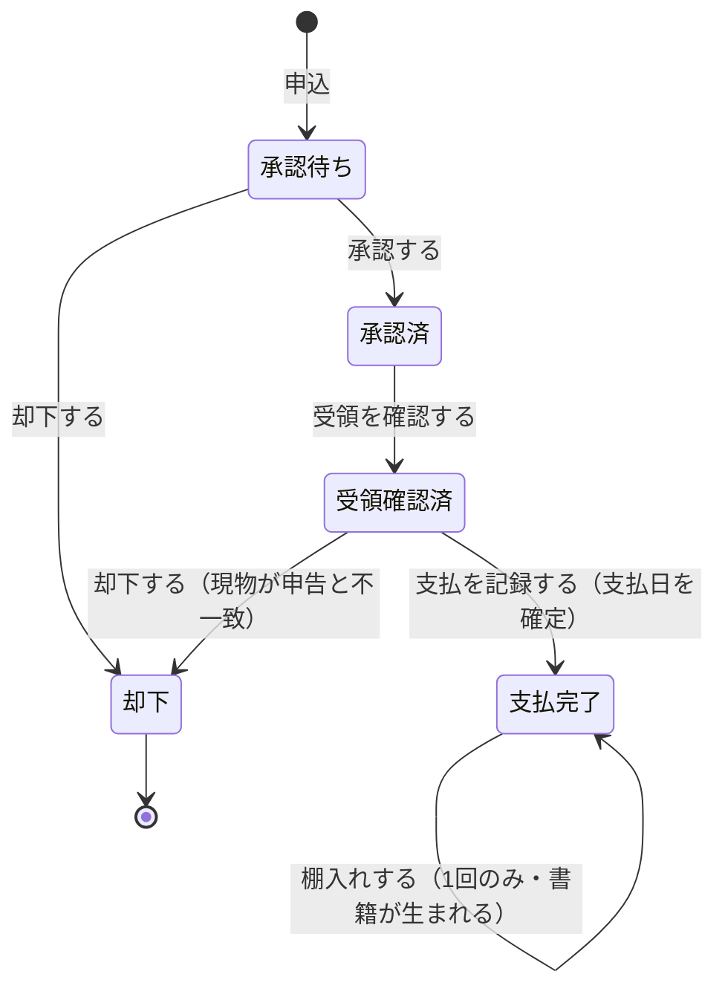

# 09. AGG-OFFER — 買取オファー集約

## 1. 責務

顧客から店への「**この本を買い取ってほしい**」という申込と、その審査・支払・棚入れまでの
一連の過程を表す。買取サブドメインの唯一の集約であり、
**支払完了後の棚入れによってのみ**販売サブドメインへ接続する。

## 2. 構造

### 2.1 集約ルート: 買取オファー (Offer)

| 属性 | 論理型 | 要否 | 意味 |
| --- | --- | --- | --- |
| 識別子 | 識別子 | ● | |
| 申込顧客 | 参照 | ● | 売り手 |
| 書名 | テキスト | ● | 顧客の申告 |
| 著者 | テキスト | ● | 顧客の申告 |
| ISBN | テキスト | ● | 顧客の申告 |
| 分類 | [VO-CLASSIFICATION](03-building-blocks.md) | ● | 出版社・書籍種別・ジャンル・状態。**生成後は外部から変更できない** |
| 買取価格 | [VO-MONEY](03-building-blocks.md) | ● | 店が顧客に支払う（支払った）金額 |
| 表紙画像 | 外部資源参照 | ○ | 顧客が撮影した現物の写真 |
| 概要 | テキスト | ○ | |
| 状態 | 列挙 | ● | 既定 承認待ち |
| 備考 | テキスト | ○ | スタッフの記録 |
| **支払日** | 日時 | ○ | 店が顧客に支払った時点。未払なら未設定 |
| **棚入れ済** | 真偽 | ● | 既定 偽 |
| （内部数値属性） | | ▲ | 買取価格の素の数（[03](03-building-blocks.md) §8） |
| （基底属性） | | | [03](03-building-blocks.md) §1 |

### 2.2 支払日が独立した属性である理由

支払日は「**店から金が出た時点**」を表す。買取側の金額指標はこの日付で期間に割り当てられる。

ある月に申し込まれ、翌月に支払われたオファーは、**支払われた月の支出**である。
申込日で数えると、まだ払っていない金を払ったことにしてしまう。

支払日は**外部から渡される**。したがって「店が期間内にいくら使ったか」は
オファー自身の事実であり、報告書がいつ実行されたかには依存しない。

### 2.3 棚入れ済が独立した属性である理由

状態が「支払完了」であることと、「販売在庫になった」ことは別の事実である。
支払は済んだが、まだ棚に出していない本が存在しうる。
棚入れ済を独立した真偽値にすることで、**支払済のオファーが二度棚入れされること**を防いでいる。

## 3. 振る舞い

### 3.1 生成

| 操作 | 引数 | 効果 |
| --- | --- | --- |
| 生成 | 顧客識別子、書名、著者、ISBN、分類、買取価格 | 承認待ちのオファーを作る |

### 3.2 状態遷移

| 操作 | 遷移元 | 遷移先 | 副作用 |
| --- | --- | --- | --- |
| 承認する (Approve) | 承認待ち | 承認済（発送待ち） | — |
| 却下する (Reject) | 承認待ち **または** 受領確認済 | 却下 | — |
| 受領を確認する (ConfirmReceipt) | 承認済 | 受領確認済 | — |
| 支払を記録する (RecordPayment) | 受領確認済 | 支払完了 | **支払日を記録** |
| 棚入れ済にする (MarkAsStocked) | 支払完了 | （状態は変わらない） | **棚入れ済を立てる**。すでに立っていれば拒否 |

遷移元の状態が一致しなければ**拒否される**。

### 3.3 却下が二箇所から可能な理由

| 却下の契機 | 状態 | 業務上の意味 |
| --- | --- | --- |
| 申込内容を見て断る | 承認待ち | 現物を受け取る前に断る |
| 現物を見て断る | 受領確認済 | 届いた本が申告と一致しなかった |

中古書籍の買取では、**現物を見るまで最終判断ができない**。
そのため受領確認後も却下できる必要がある。

### 3.4 棚入れは集約の外から直接呼べない

棚入れ済にする操作は**書籍集約の生成操作からのみ**呼び出される
（[AGG-BOOK](05-aggregate-book.md) §4.2）。オファーを棚入れ済にすることと、
実際に販売在庫を作ることは分離できない。

## 4. 不変条件

| 識別子 | 不変条件 | 強制レベル | 根拠 |
| --- | --- | --- | --- |
| `INV-OFFER-01` | オファーは顧客・書名・著者・ISBN・分類・買取価格を必ず持つ | **[強制]** | 生成時に必須 |
| `INV-OFFER-02` | 生成されたオファーの状態は承認待ち | **[強制]** | 既定値 |
| `INV-OFFER-03` | 状態は 承認待ち→承認済→受領確認済→支払完了 の順にのみ進む | **[強制]** | 各遷移が遷移元を検査する |
| `INV-OFFER-04` | 却下は承認待ちまたは受領確認済からのみ可能 | **[強制]** | 却下操作が検査する |
| `INV-OFFER-05` | 支払は受領確認済からのみ可能であり、支払日が同時に記録される | **[強制]** | 支払操作が検査し、日付を必ず設定する |
| `INV-OFFER-06` | 棚入れは支払完了からのみ、かつ 1 回だけ可能 | **[強制]** | 状態と棚入れ済フラグの両方を検査する |
| `INV-OFFER-07` | 状態・支払日・棚入れ済は集約の振る舞いを通じてのみ変化する | **[強制]** | いずれも外部から書き換えられない |
| `INV-OFFER-08` | 買取価格は 0 以上、通貨最小単位に丸められている | **[強制]** | [VO-MONEY](03-building-blocks.md) が保証 |
| `INV-OFFER-09` | 分類の4軸は検証済みであり、生成後変更されない | **[強制]** | 分類は [VO-CLASSIFICATION](03-building-blocks.md) 経由でのみ設定され、外部から書き換えられない |
| `INV-OFFER-10` | 却下されたオファーは支払われず、棚入れもされない | **[強制]** | 却下からの遷移が存在しない |
| `INV-OFFER-11` | 買取価格は支払後変化しない | **[不成立]** | 買取価格は外部から書き換えられる（[ISSUE-07](15-design-issues.md)） |

## 5. 状態遷移

### 5.1 遷移可否の一覧

| 現在の状態＼操作 | 承認する | 却下する | 受領確認 | 支払記録 | 棚入れ |
| --- | --- | --- | --- | --- | --- |
| 承認待ち | ✓ | ✓ | ✗ | ✗ | ✗ |
| 承認済 | ✗ | ✗ | ✓ | ✗ | ✗ |
| 受領確認済 | ✗ | ✓ | ✗ | ✓ | ✗ |
| 支払完了 | ✗ | ✗ | ✗ | ✗ | ✓（未棚入れなら 1 回） |
| 却下 | ✗ | ✗ | ✗ | ✗ | ✗ |

### 5.2 状態と業務上の意味

| 状態 | 支払日 | 現物の所在 | 販売可能か |
| --- | --- | --- | --- |
| 承認待ち | 未設定 | 顧客の手元 | ✗ |
| 承認済（発送待ち） | 未設定 | 顧客が発送中 | ✗ |
| 受領確認済 | 未設定 | 店 | ✗（まだ買っていない） |
| 支払完了（未棚入れ） | **設定済** | 店 | ✗（まだ棚に出していない） |
| 支払完了（棚入れ済） | 設定済 | 店の在庫 | ✓（書籍として） |
| 却下 | 未設定 | 顧客に返却（ドメイン外） | ✗ |

**`RULE-OFFER-01`**: 店は**買っていない本を売らない**。棚入れが支払完了を要求するのはこのためである。

## 6. 他の集約との関係

| 関係先 | 関係 |
| --- | --- |
| AGG-CUSTOMER | 申込顧客を識別子で参照する |
| AGG-REFDATA | 分類4軸として参照する |
| AGG-BOOK | 棚入れによって書籍を生成する。書籍から棚入れ済フラグを立てられる |

## 7. 照会

| 照会 | 引数 | 対象アクター |
| --- | --- | --- |
| 一覧取得（絞り込み） | 絞り込み条件、頁番号、頁サイズ | スタッフ |
| 一覧取得（顧客別） | 主体識別子 | 顧客 |
| 単件取得（絞り込みなし） | 識別子 | **スタッフのみ** |
| 単件取得（所有者で絞り込み） | 主体識別子、識別子 | **顧客** |
| 統計 | — | スタッフ |

### 7.1 絞り込み条件

| 条件 | 論理型 |
| --- | --- |
| 書名 | テキスト（部分一致。照合方式はドメイン未定義） |
| 著者 | テキスト |
| ジャンル | 参照 |
| 状態（コンディション） | 参照 |
| 状態（ステータス） | 列挙 |

## 8. 未定義の事項

| 事項 | 現状 |
| --- | --- |
| 買取価格の算定基準 | ドメインに存在しない。誰がどう決めるかは外部 |
| 却下時の現物返送 | 概念なし |
| 顧客への支払手段 | 概念なし。支払日のみ記録 |
| 申込の取り下げ | 顧客側から取り消す手段がない |
| 1オファーあたりの冊数 | 常に 1 冊とみなされる（[ISSUE-08](15-design-issues.md)） |
| 備考の用途 | 属性はあるが、更新する振る舞いがドメインサービスに存在しない |
