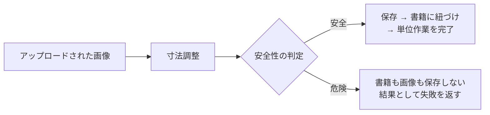
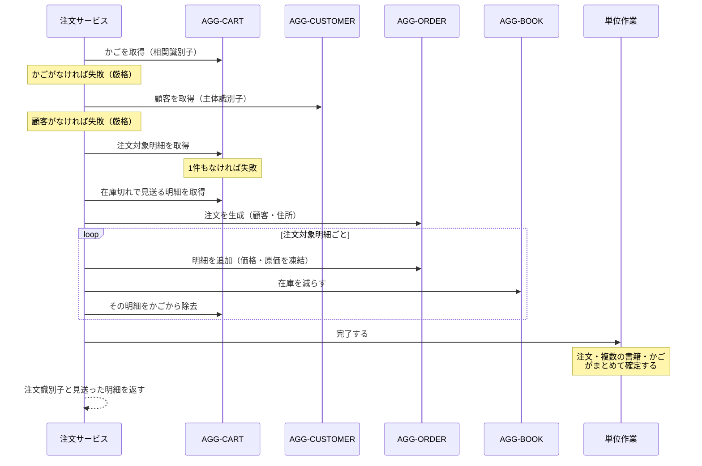
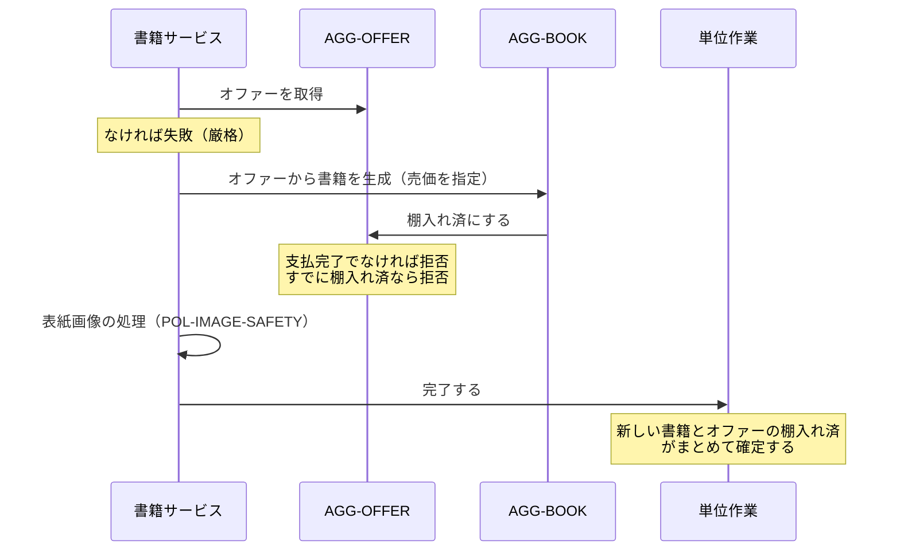
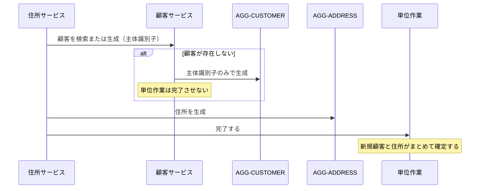

# 10. ドメインサービスとポリシー

## 1. 位置づけ

サービスは、**単一の集約に属さない振る舞い**を担う。具体的には次の三つである。

1. 複数の集約にまたがる操作の**手順**を定める
2. 変更を確定する**単位作業の境界**を宣言する
3. 集約の外にある資源（リポジトリ、外部サービス）を**集約に届ける**

サービスは業務ルールそのものを持たない。ルールは集約と値オブジェクトにある。

## 2. サービス一覧

| サービス | 主な責務 | 触れる集約 |
| --- | --- | --- |
| 参照データサービス | 分類選択肢の登録・改名・照会 | AGG-REFDATA |
| 書籍サービス | 書籍の登録・更新・棚入れ、表紙画像の処理、照会 | AGG-BOOK, AGG-OFFER, AGG-REFDATA |
| 顧客サービス | 顧客の識別と登録・更新 | AGG-CUSTOMER |
| 住所サービス | 住所の登録・更新・削除・照会 | AGG-ADDRESS, AGG-CUSTOMER |
| 買い物かごサービス | かご・欲しい物リストの操作 | AGG-CART |
| 注文サービス | 注文の確定と履行、取消、照会 | AGG-ORDER, AGG-CART, AGG-BOOK, AGG-CUSTOMER |
| 買取オファーサービス | オファーの受付と審査・支払、照会 | AGG-OFFER, AGG-CUSTOMER, AGG-REFDATA |

## 3. POL-NOTFOUND — 対象が見つからないときの方針

**このドメインで最も体系的に適用されている方針**である。二つの規則がある。

### 3.1 規則

| 規則 | 対象 | 振る舞い |
| --- | --- | --- |
| **厳格な更新** | **個別に指定された対象**を変更する操作 | 対象が存在しなければ**失敗させる** |
| **寛容な操作** | 照会、および対象を個別に指定しない操作 | 対象が存在しなければ**何もせず成功**とする |

### 3.2 根拠

個別に指定された対象を変更しようとして、その対象がない——これは
**呼び出し側が誤った前提を持っている**ことを意味する。黙って何もしなければ、
その誤りは発見されないまま残る。

一方、照会にとって「まだ何もない」は正当な結果である。また、
本質的にべき等な操作（すでに取り消された注文を取り消す、
空のリストを全件移動する）にとって、対象の不在は
「すでにその状態である」ことと区別できない。

### 3.3 適用の一覧

| 操作 | 方針 | 対象不在時 |
| --- | --- | --- |
| かごの取得 | 寛容 | 空として扱う |
| かご明細の追加 | 寛容 | **かごを新規に作る** |
| 欲しい物明細の個別移動 | **厳格** | かごがなければ失敗。明細がなければ失敗 |
| 欲しい物明細の一括移動 | 寛容 | かごがなければ何もしない |
| かご明細の削除 | **厳格** | かごがなければ失敗。明細がなければ失敗 |
| 住所の更新 | **厳格** | 失敗 |
| 住所の削除 | **厳格** | 失敗 |
| 住所の登録 | 寛容（顧客について） | **顧客がいなければ作る** |
| 参照データ項目の更新 | **厳格** | 失敗 |
| 注文の確定 | **厳格** | かご不在・顧客不在いずれも失敗 |
| **注文の取消** | **寛容** | 何もしない（本質的にべき等） |
| 棚入れ | **厳格** | オファーがなければ失敗 |

**一括移動と取消が寛容である**のは、いずれも「個別の対象を指していない」または
「べき等である」という上記の根拠に合致するためである。

## 4. リポジトリ

### 4.1 位置づけ

リポジトリは集約の取得と登録を担う抽象である。**ドメイン層はインタフェースのみを知る**。

| リポジトリ | 対応集約 |
| --- | --- |
| 参照データリポジトリ | AGG-REFDATA |
| 書籍リポジトリ | AGG-BOOK |
| 顧客リポジトリ | AGG-CUSTOMER |
| 住所リポジトリ | AGG-ADDRESS |
| 買い物かごリポジトリ | AGG-CART |
| 注文リポジトリ | AGG-ORDER |
| 買取オファーリポジトリ | AGG-OFFER |

### 4.2 公開範囲

リポジトリの操作は**ドメイン層と永続化層の内部にのみ公開される**。
ドメイン層の外側（画面など）はリポジトリを直接呼べず、必ずサービスを経由する。

例外として、統計取得の一部はドメイン層の外にも公開されている。
この不統一は [ISSUE-17](15-design-issues.md) を参照。

### 4.3 顧客向け照会と業務向け照会の対

**`RULE-ACCESS-01`**: 顧客向けの照会は必ず主体識別子で絞り込まれなければならない。

| 集約 | スタッフ向け（絞り込みなし） | 顧客向け（所有者で絞り込み） |
| --- | --- | --- |
| AGG-ORDER | 識別子のみ | 主体識別子 ＋ 識別子 |
| AGG-OFFER | 識別子のみ | 主体識別子 ＋ 識別子 |
| AGG-ADDRESS | **存在しない** | 主体識別子 ＋ 識別子 |

顧客向けの照会は、対象が呼び出し元のものでなければ**未取得として振る舞う**。

## 5. POL-IMAGE-SAFETY — 表紙画像の安全性

書籍の表紙画像は、**保存される直前の状態**で安全性を判定される。

**判定の対象は寸法調整後の画像である。** 調整前を検査して調整後を保存すると、
実際に棚に載るものが検査されていないことになる。

判定に失敗した場合、**書籍そのものが保存されない**。単位作業が完了しないため、
画像だけでなく書籍の登録・更新も含めて何も残らない。

| 協力者 | 責務 |
| --- | --- |
| 寸法調整サービス | 画像を表示に適した寸法へ変換する |
| 安全性判定サービス | 画像が安全かどうかを判定する。**判定基準はドメイン外** |
| ファイルサービス | 画像を保存し、外部資源参照を返す。古い画像を削除する |

## 6. 主要な操作の手順

### 6.1 注文の確定

**最も多くの集約が関与する操作**である。

| 段階 | 保証されること |
| --- | --- |
| かご・顧客の取得 | いずれかが不在なら**何も変更されない** |
| 注文対象の抽出 | 在庫のある購入明細が 1 件以上ある（[INV-CART-08](07-aggregate-shopping-cart.md)） |
| 在庫の引き当て | 在庫を超える引き当ては拒否される（[INV-BOOK-03](05-aggregate-book.md)） |
| 単位作業の完了 | 注文・在庫・かごが**すべて確定するかすべて破棄される** |

**在庫切れで見送られた明細は呼び出し側に返される**。顧客に「これは在庫切れでした」と
伝えるための情報であり、かごには残る。

### 6.2 棚入れ

オファーの状態が不適切な場合、**書籍は作られず、何も確定しない**。

### 6.3 住所の登録

**顧客の生成と住所の生成は一つの変更である。** 顧客を先に確定させてしまうと、
住所の登録が失敗したときに、住所を持たない顧客が残る。

### 6.4 注文・オファーの状態遷移

いずれも同じ形をとる。

| 段階 | 内容 |
| --- | --- |
| 1 | 対象を取得する |
| 2 | 集約の遷移操作を呼ぶ（**状態の検査は集約が行う**） |
| 3 | 更新日時を記録する |
| 4 | 単位作業を完了する |

サービスは**遷移可能かどうかを判断しない**。判断は集約の責務である。

## 7. RULE-SERVICE-01 — 顧客の存在前提

| 操作 | 顧客が存在しないとき |
| --- | --- |
| 住所の登録 | **顧客を作る** |
| プロフィールの登録・更新 | **顧客を作る** |
| 注文の確定 | **失敗する** |
| 買取オファーの申込 | （検査されていない — [ISSUE-04](15-design-issues.md)） |

住所登録が顧客を作るのは、**顧客の最初の住所登録が、その顧客のドメインへの
初回接触であることが多い**ためである。一方、注文と買取申込は
**すでに知られている顧客であることを前提とする**操作である。

## 8. ドメイン外の関心事

以下はドメイン層に配置されているが、業務モデルではない。

| 要素 | 内容 |
| --- | --- |
| データベース接続情報 (DbSecrets) | 接続先・資格情報の保持。基盤設定である（[ISSUE-16](15-design-issues.md)） |
| 列挙の表示名取得 | 列挙値を人間可読の文言に変換する。表示の関心事 |
