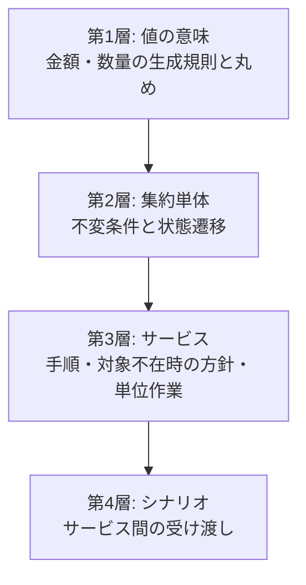

# 14. テストによる仕様

## 1. 位置づけ

`Bookstore.Domain.Tests` は、本書に記した不変条件とルールのうち
**どれが自動的に検証されているか**を示す。テストで固定されている仕様は、
変更したときに必ず気づける仕様である。

| 指標 | 値 |
| --- | --- |
| テストメソッド数 | 128 |
| 実行されるテストケース数 | **176**（パラメータ化されたテストを展開した数） |
| 検証方式 | 単体テスト、モックによるサービステスト、状態を持つ模擬永続化によるシナリオテスト |

## 2. 検証の四層

| 層 | 対象 | 手法 | メソッド数 | ケース数 |
| --- | --- | --- | --- | --- |
| 第1層 | 値オブジェクトの規則 | 直接生成 | 10 | 10 |
| 第2層 | 集約の不変条件・状態遷移・算出 | ビルダーによる直接生成 | 74 | **122** |
| 第3層 | サービスの手順と方針 | リポジトリのモック | 36 | 36 |
| 第4層 | サービス間の受け渡し | 状態を持つ模擬永続化 | 5 | 5 |
| 補助 | 期間計算 | 直接呼び出し | 3 | 3 |
| | | **合計** | **128** | **176** |

第2層のケース数が突出しているのは、状態遷移の検証が
**遷移元となりうる全状態を網羅する**形で書かれているためである。

| 集約 | メソッド数 | ケース数 |
| --- | --- | --- |
| 注文 | 26 | 56 |
| 買取オファー | 10 | 22 |
| 買い物かご | 19 | 19 |
| 書籍 | 12 | 18 |
| 参照データ・分類 | 5 | 5 |
| 住所 | 2 | 2 |

## 3. SPEC-VALUE — 値の意味

| 検証内容 | 対応する不変条件 |
| --- | --- |
| 負の売価で書籍を作れない | `INV-MONEY-01`, `INV-BOOK-02` |
| 負の在庫数で書籍を作れない | `INV-QTY-01`, `INV-BOOK-01` |
| **在庫 0 の書籍は作れる**（空の棚は正当な在庫水準） | `INV-QTY-01` |
| 負の買取価格でオファーを作れない | `INV-MONEY-01`, `INV-OFFER-08` |
| 数量 0 のかご明細を追加できない | `INV-CART-04` |
| 数量は負になれない | `INV-QTY-01` |
| 明細用の数量は 1 以上でなければならない | `INV-QTY-03` |
| 金額は生成時に通貨最小単位へ丸められ、合計にも端数が蓄積しない | `INV-MONEY-02`, `RULE-MONEY-01` |
| 税も通貨最小単位へ丸められる | `RULE-ORDER-03` |
| **粗利見込は負になりうる**（仕入値より安く売った場合） | `INV-MONEY-04`, `RULE-BOOK-01` |

## 4. SPEC-BOOK — 書籍集約

| 検証内容 | 対応 |
| --- | --- |
| 在庫あり判定が在庫数 1 以上で真になる | — |
| 在庫僅少判定がしきい値以下で真になる（境界値を含む） | `RULE-STOCK-04` |
| 在庫を減らすと在庫数がその分減る | `RULE-STOCK-01` |
| **在庫を超える出庫は拒否される** | `INV-BOOK-03`, `RULE-STOCK-03` |
| 在庫を戻すと在庫数がその分増える | `RULE-STOCK-02` |
| 棚入れがオファーの書誌情報をそのまま引き継ぐ | — |
| 棚入れが 1 冊を店の決めた売価で在庫化する | `INV-BOOK-06`, `RULE-TRADE-03` |
| 棚入れが供給元オファーと仕入原価を記録する | `INV-BOOK-05` |
| 棚入れがオファーを棚入れ済にする | `INV-OFFER-06` |
| **未支払のオファーは棚入れできない**（承認待ち・承認済・受領確認済・却下のすべて） | `INV-OFFER-06`, `RULE-TRADE-01` |
| **棚入れ済のオファーは二度棚入れできない** | `INV-OFFER-06`, `RULE-TRADE-02` |
| オファー由来でない書籍の粗利見込は未定義 | `RULE-BOOK-01` |

## 5. SPEC-ORDER — 注文集約

**最も厚く検証されている集約**（26 メソッド）。

### 5.1 金額

| 検証内容 | 対応 |
| --- | --- |
| 明細の小計が価格 × 数量 | `RULE-ORDER-02` |
| 複数明細の小計が合算される | `RULE-ORDER-02` |
| 税が小計の 10% | `RULE-ORDER-03` |
| 合計が小計 ＋ 税 | `RULE-ORDER-04` |
| **注文後に書籍の売価を変えても注文の小計は変わらない** | `INV-ORDER-12`, `RULE-TRADE-05` |
| 明細追加時に書籍の売価が記録される | `INV-ORDER-07` |

### 5.2 状態遷移

| 検証内容 | 対応 |
| --- | --- |
| 生成直後の状態が受付待ち | `INV-ORDER-02` |
| 受付待ちからのみ受け付けられる（他の全状態から拒否） | `INV-ORDER-03` |
| 受付済からのみ出荷できる（他の全状態から拒否） | `INV-ORDER-03` |
| 出荷済からのみ配達完了にできる（他の全状態から拒否） | `INV-ORDER-03` |
| 受付待ち・受付済からのみ取り消せる | `INV-ORDER-04` |
| **出荷済・配達済・取消済からは取り消せない** | `INV-ORDER-04` |
| 取消時に各書籍へ在庫が戻る | `INV-ORDER-08`, `RULE-STOCK-02` |
| **二重取消は拒否され、在庫が二度戻ることはない** | `INV-ORDER-09` |

### 5.3 原価と粗利

| 検証内容 | 対応 |
| --- | --- |
| オファー由来の書籍を注文すると仕入原価が記録される | `INV-ORDER-07` |
| オファー由来でない書籍の粗利は**未定義**（0 ではない） | `RULE-ORDER-05`, `RULE-SALES-04` |
| **書籍が別の原価で再入荷しても、既存注文の粗利は変わらない** | `INV-ORDER-12`, `RULE-TRADE-05` |

### 5.4 読み取り側との一致

| 検証内容 | 対応 |
| --- | --- |
| 売上計上対象が取消済のみを除外する | `RULE-SALES-01` |
| **売上絞り込みが売上計上対象と全状態で一致する** | [13](13-read-models-and-statistics.md) §3.3 |
| 納品予定日が UTC から 7 日後 | `RULE-PERIOD-03` |
| 納期超過が未配達かつ期日超過で真、配達済・取消済で偽 | `RULE-PERIOD-04` |
| 期日前は納期超過にならない | `RULE-PERIOD-04` |
| **納期超過絞り込みが納期超過判定と全状態・両方の期日で一致する** | [13](13-read-models-and-statistics.md) §3.3 |

「絞り込み形式と判定形式の一致」を検証するテストが二つあることが重要である。
これにより、ダッシュボードの数字が集約の定義から乖離することが構造的に防がれている。

## 6. SPEC-OFFER — 買取オファー集約

| 検証内容 | 対応 |
| --- | --- |
| 生成直後の状態が承認待ち | `INV-OFFER-02` |
| 承認待ちからのみ承認できる | `INV-OFFER-03` |
| **却下は承認待ちと受領確認済の両方から可能** | `INV-OFFER-04` |
| 承認済・支払完了・却下済からは却下できない | `INV-OFFER-04` |
| 承認済からのみ受領確認できる | `INV-OFFER-03` |
| 受領確認済からのみ支払できる | `INV-OFFER-05` |
| **支払時に支払日が記録される** | `INV-OFFER-05`, `RULE-PERIOD-05` |

## 7. SPEC-CART — 買い物かご集約

| 検証内容 | 対応 |
| --- | --- |
| 同じ書籍を二度かごに入れると 1 行の数量が増える | `INV-CART-02` |
| 別の書籍は別の行になる | `INV-CART-02` |
| **かごへの追加は同じ書籍の欲しい物明細に触れない** | `INV-CART-05` |
| 同じ書籍を二度欲しい物リストに入れても行は増えない | `INV-CART-03` |
| 欲しい物明細の数量は 1 | `INV-CART-03` |
| 移動時、既にかごにある書籍なら数量が合流する | `INV-CART-02` |
| 移動時、かごにない書籍なら明細が転換される | `INV-CART-02` |
| **存在しない明細の移動・削除は失敗する** | `INV-CART-06` |
| 小計が売価 × 数量 | `RULE-CART-01` |
| 合流した行は一度だけ数えられる | `RULE-CART-02` |
| 在庫切れ除外フィルタが在庫切れを除く | — |
| **小計は欲しい物明細を含まない** | `RULE-CART-02` |
| 注文対象抽出が在庫のある明細のみを返す | `INV-CART-08` |
| **かごが空、または全明細が在庫切れなら注文対象抽出が失敗する** | `INV-CART-08`, `RULE-TRADE-06` |
| 注文対象の判定に欲しい物明細は関与しない | `INV-CART-08` |
| 在庫切れ明細の抽出が在庫切れのもののみを返し、欲しい物明細を含まない | `RULE-STOCK-06` |

## 8. SPEC-REFDATA — 参照データと分類

| 検証内容 | 対応 |
| --- | --- |
| **改名しても種別は変わらない** | `INV-REFDATA-02` |
| 分類は各位置が要求する種別の項目を受け入れる | `INV-CLASS-01` |
| **種別が一致しない項目は拒否され、期待した種別と実際の種別が理由に含まれる** | `INV-CLASS-01` |
| 実在しない項目は拒否される | `INV-CLASS-01` |
| 棚入れされた書籍はオファーの分類をそのまま引き継ぐ | `INV-BOOK-04` |

## 9. SPEC-ADDRESS / SPEC-CUSTOMER

| 検証内容 | 対応 |
| --- | --- |
| 生成された住所は有効 | `INV-ADDR-02` |
| 無効化で住所が無効になる | `INV-ADDR-03` |
| 住所登録が顧客の検索または生成を用いる | `RULE-SERVICE-02` |
| 住所行2 は省略できる | `INV-ADDR-05` |
| **住所が見つからなければ更新・削除は失敗する** | `RULE-SERVICE-03` |
| 住所が見つかれば全項目を更新して確定する | — |
| プロフィール更新が顧客不在時に主体識別子付きで顧客を生成する | `INV-CUST-01`, `RULE-SERVICE-02` |
| プロフィール更新が既存顧客を更新する | — |
| 顧客の検索または生成が、既存顧客を返す／なければ**主体識別子のみで**生成する | `INV-CUST-01` |

## 10. SPEC-SERVICE — サービスの手順と方針

| 検証内容 | 対応 |
| --- | --- |
| 注文確定はかご不在で失敗する | `RULE-SERVICE-03` |
| 注文確定は顧客不在で失敗する | `RULE-SERVICE-01`, `RULE-SERVICE-03` |
| 注文確定が在庫のある明細ごとに明細を追加し在庫を減らす | `RULE-STOCK-01` |
| **在庫切れ明細は注文から見送られ、かごに残る** | `RULE-STOCK-06` |
| かごの全明細が在庫切れなら注文確定が失敗する | `INV-CART-08` |
| 受付・出荷・配達完了が遷移して確定する | `INV-ORDER-03` |
| **注文取消は対象が見つからなければ何もしない** | `RULE-SERVICE-05` |
| 注文取消は対象が見つかれば取り消して確定する | — |
| 所有者で絞り込んだ注文取得がリポジトリに委譲される | `RULE-ACCESS-01` |
| 統計が取得できないとき空の統計が返る | [13](13-read-models-and-statistics.md) |
| かご追加が相関識別子に対応するかごを生成する／既存があれば使う | `RULE-SERVICE-04` |
| 欲しい物リスト追加が数量 1 の明細を作る | `INV-CART-03` |
| **個別移動・削除はかご不在で失敗する** | `RULE-SERVICE-03` |
| **一括移動はかご不在で何もしない** | `RULE-SERVICE-04` |
| 一括移動がすべての欲しい物明細を移す | — |
| **画像の安全性判定は寸法調整後の画像に対して行われる** | `POL-IMAGE-SAFETY` |
| 判定を通れば寸法調整後の画像が保存される | `POL-IMAGE-SAFETY` |
| **判定に失敗すれば書籍も画像も保存されない** | `POL-IMAGE-SAFETY` |

## 11. SPEC-PERIOD — 期間計算

| 検証内容 | 対応 |
| --- | --- |
| 月の起点が当月 1 日の 0 時である | `RULE-PERIOD-02` |
| **日中に問うても、1 日の午前中の記録が期間に含まれる** | `RULE-PERIOD-02` |
| 月の起点は与えられた時刻の種別（UTC 等）を保つ | `RULE-PERIOD-01` |

## 12. SPEC-SCENARIO — サービス間の受け渡し

他のテストはすべて集約単体またはサービス単体を、モックした依存先とともに検証する。
そのため**サービス間の受け渡しの欠陥**——棚入れした書籍が実は購入できない、
価格が注文に正しく伝わらない、といった不具合——はどこにも現れない。

シナリオテストは、5 つのサービス（顧客・オファー・書籍・かご・注文）を
**状態を保持する模擬永続化**の上で、実際の要求と同じ順序で駆動する。

| シナリオ | 検証内容 |
| --- | --- |
| **買取 → 販売 → 取消 → 再販の一巡** | 支払済オファーが 1 冊の在庫になり、書誌・仕入原価・供給元が引き継がれる／別の顧客がそれを購入でき、価格と原価が注文明細に凍結される／売り切れた状態で別の顧客が注文すると拒否される／取消により在庫が戻り、**待たされていた顧客が実際に同じ本を購入できる** |
| **却下されたオファーは在庫にならない** | 受領確認後の却下で支払日も棚入れ済も立たない／後から棚入れを試みても拒否され、**書籍が 1 冊も作られない** |
| **支払済オファーの二重棚入れ** | 二度目の棚入れが拒否され、**重複した書籍が残らず、既存の書籍も変化しない** |
| **出荷済注文の取消** | 出荷済からの取消が失敗し、状態が変わらず、**すでに出荷された在庫が戻らない** |
| **二つのオファー由来の書籍を含む注文** | 各明細の価格・原価・粗利が互いに独立している／注文の小計・税・合計が正しく合算される |

**「取消により在庫が戻り、待たされていた顧客が実際に購入できる」**という検証は、
在庫数という数字が変わったことではなく、**戻った在庫が本当に販売可能である**ことを
確かめている点で重要である。

## 13. 検証されていない仕様

以下は本書に記されているが、**テストで固定されていない**。

| 領域 | 状況 |
| --- | --- |
| 買取オファーサービスの手順 | 専用の単体テストがない。シナリオテスト経由でのみ実行される |
| 参照データサービスの手順 | 専用の単体テストがない。**対象不在時に失敗すること**が固定されていない |
| 統計の集計内容 | 永続化層の責務であり、ドメインのテスト範囲外 |
| 一覧照会の絞り込み・並べ替え | 同上 |
| ページ化の境界 | ページ化された結果の属性そのものを検証するテストがない |
| 金額の合計操作 | 集約経由でのみ検証され、直接の検証がない |
| `INV-BOOK-07` / `INV-CART-07` / `INV-ORDER-11` | **[表明]** であり、破る操作が存在するため固定できない |
| `INV-OFFER-11` | **[不成立]**。買取価格の書き換えを防ぐテストがない |
| `INV-CART-06b` | **[不成立]**。移動操作に**購入明細の識別子を渡す経路が検証されていない**。この経路が黙って明細を削除することは、既存のテストでは発見できない（[ISSUE-21](15-design-issues.md)） |
| `INV-CUST-03` 以外の顧客属性の扱い | 氏名の導出など未検証 |

## 14. テスト支援構造

| 構造 | 役割 |
| --- | --- |
| 書籍ビルダー・オファービルダー・かごビルダー | 既定値を持つ生成器。テストが関心のある属性だけを指定できる |
| テスト用参照データ | 4 種別それぞれ 1 件の項目。**分類は参照データを引かなければ作れない**ため必要 |
| 模擬永続化 | シナリオテスト専用。前段の書き込みを後段が読める、状態を持つ実装 |

模擬永続化は**シナリオが実際に通る経路だけ**を実装しており、
それ以外は例外を投げる。未実装の経路に依存し始めたテストが、
黙って空の結果を受け取るのではなく明示的に失敗するようにするためである。
