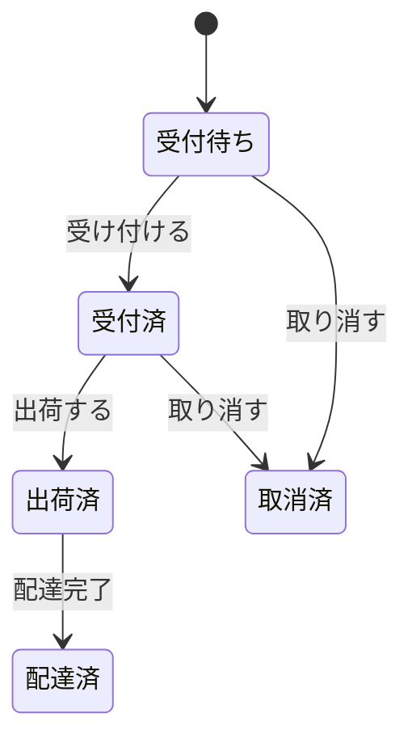
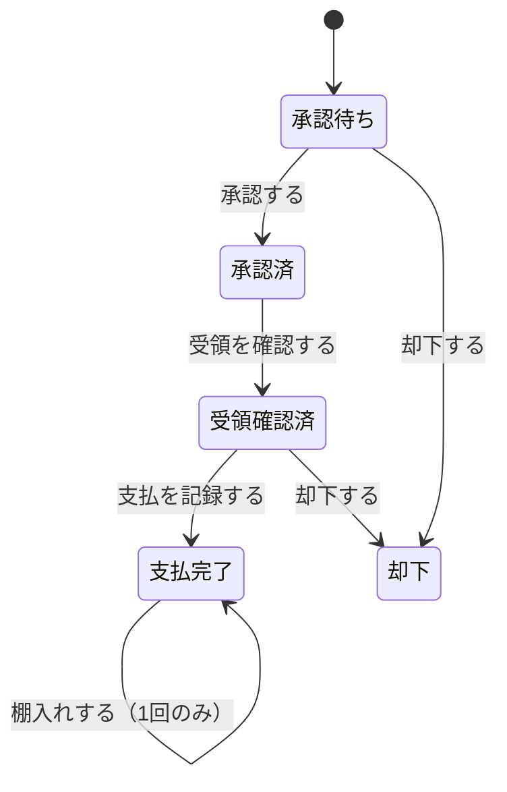
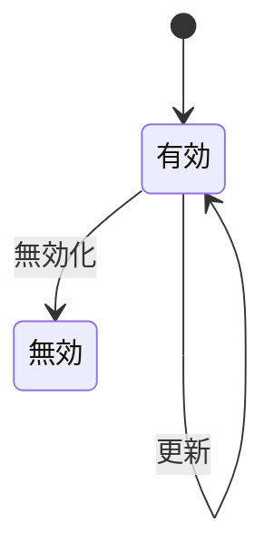
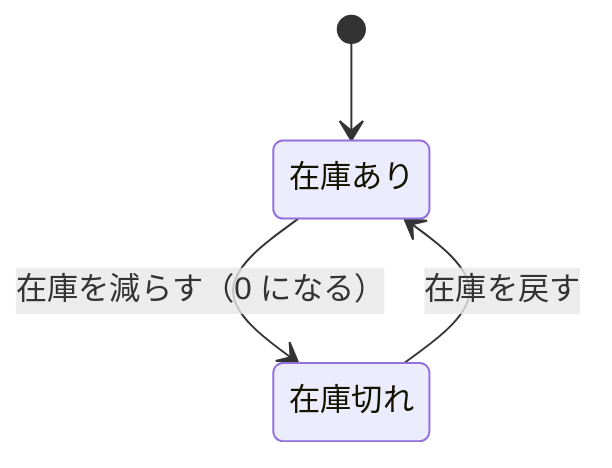

# 業務ルール

店が業務として取り決めているルールの総覧。**顧客が「変えたい」と言いうるもの**をここに置く。

税率も納期もしきい値も、店が決めれば変わる。一方「金額が負にならない」ことは店が決めることではなく、
モデルが守る性質である。後者は [不変条件](../design/domain/invariants.md) にある。

用語は [用語集](../glossary.md) を正とする。

## 1. 金額に関するルール

| 識別子 | ルール |
| --- | --- |
| `RULE-MONEY-01` | 金額は生成時に通貨最小単位へ四捨五入（絶対値を大きくする方向）される |
| `RULE-CART-01` | かご明細の小計 ＝ 書籍の**現在の**売価 × 数量 |
| `RULE-CART-02` | かごの小計 ＝ 対象となる購入明細の小計の合計。**欲しい物明細は含まない** |
| `RULE-ORDER-01` | 注文金額は 小計 → 税 → 合計 の順に導出され、各段階で丸められる |
| `RULE-ORDER-02` | 注文明細の小計 ＝ **凍結された価格** × 数量 |
| `RULE-ORDER-03` | 税 ＝ 小計 × 税率 (0.1) |
| `RULE-ORDER-04` | 合計 ＝ 小計 ＋ 税 |
| `RULE-ORDER-05` | 注文明細の粗利 ＝ (価格 − 原価) × 数量。原価が未知なら**粗利も未知**（0 ではない） |
| `RULE-BOOK-01` | 書籍の粗利見込 ＝ 売価 − 仕入原価。仕入原価が未知なら**未定義** |

## 2. 在庫に関するルール

| 識別子 | ルール |
| --- | --- |
| `RULE-STOCK-01` | 注文確定時、注文された各明細の数量が対応する書籍の在庫から引かれる |
| `RULE-STOCK-02` | 注文取消時、各明細の数量が対応する書籍の在庫に戻される |
| `RULE-STOCK-03` | 在庫を超える出庫は拒否される。0 に飽和させない |
| `RULE-STOCK-04` | 在庫僅少（仕入判断）＝ 在庫数 ≦ 5。**在庫 0 を含む** |
| `RULE-STOCK-05` | 在庫切れの書籍は注文できないが、かごには入れられる |
| `RULE-STOCK-06` | 在庫切れで注文から見送られた明細はかごに残る |

## 3. 取引の成立に関するルール

| 識別子 | ルール |
| --- | --- |
| `RULE-TRADE-01` | 店は買っていない本を売らない（棚入れは支払完了を要求する） |
| `RULE-TRADE-02` | 1件の買取オファーは 1 冊の書籍になる。二重の棚入れは拒否される |
| `RULE-TRADE-03` | 売価は買取価格から導出されない。店の独立した決定である |
| `RULE-TRADE-04` | 仕入原価は棚入れ時に確定し、以後の変更に追随しない |
| `RULE-TRADE-05` | 注文明細の価格・原価は注文確定時に確定し、以後の変更に追随しない |
| `RULE-TRADE-06` | 注文は最低 1 明細を要する |

## 4. 期間と日付に関するルール

| 識別子 | ルール |
| --- | --- |
| `RULE-PERIOD-01` | すべての時点は UTC を基準とする |
| `RULE-PERIOD-02` | 「今月」は当月 1 日の 0 時 0 分 0 秒から始まる。**問い合わせ時刻の時分秒は用いない** |
| `RULE-PERIOD-03` | 納品予定日 ＝ 注文時点の UTC ＋ 7 日 |
| `RULE-PERIOD-04` | 納期超過 ＝ 納品予定日を過ぎ、かつ配達済でも取消済でもない |
| `RULE-PERIOD-05` | 買取側の支出は**支払日**で期間に割り当てられる。申込日ではない |

**`RULE-PERIOD-02` の要点**: 15日の14時に「今月」を問うたとき、期間の開始が
「1日の14時」であってはならない。1日の午前中に記録された取引が期間から
漏れてしまうためである。

## 5. 売上計上に関するルール

| 識別子 | ルール |
| --- | --- |
| `RULE-SALES-01` | 取消済**以外**のすべての注文が売上に計上される |
| `RULE-SALES-02` | 売上は**税抜**である（税は他者のために徴収するものであるため） |
| `RULE-SALES-03` | 粗利は、原価が既知の売上（＝オファー由来の書籍）に限って算出される |
| `RULE-SALES-04` | 原価が未知の書籍は粗利の計算から除外される。**純利益として数えない** |

**`RULE-SALES-01` の根拠**: 注文は確定した時点で合意である。
出荷前でも受付前でも、それは成立した取引である。取り消されたものだけが
「取引ではなかった」ものになる。

## 6. アクセスに関するルール

| 識別子 | ルール |
| --- | --- |
| `RULE-ACCESS-01` | 顧客向けの照会は必ず主体識別子で絞り込まれる |
| `RULE-ACCESS-02` | 絞り込みなしの単件照会はスタッフ専用である |
| `RULE-ACCESS-03` | 住所には絞り込みなしの照会が存在しない |

## 7. 操作方針に関するルール

| 識別子 | ルール |
| --- | --- |
| `RULE-SERVICE-01` | 注文と買取申込は、顧客がすでに存在することを前提とする |
| `RULE-SERVICE-02` | 住所登録とプロフィール登録は、顧客が存在しなければ生成する |
| `RULE-SERVICE-03` | 個別に指定された対象を変更する操作は、対象が不在なら失敗する |
| `RULE-SERVICE-04` | 照会および対象を個別に指定しない操作は、対象が不在でも成功する |
| `RULE-SERVICE-05` | 注文の取消はべき等である（対象不在時は成功、状態違反時は失敗） |

どの操作を厳格側・寛容側に割り当てるかは差し替えられる（[POL-NOTFOUND](../design/domain/services-and-policies.md)）。

## 8. 状態遷移

### 8.1 注文

| 状態 | 売上計上 | 納期超過の対象 | 在庫 |
| --- | --- | --- | --- |
| 受付待ち | ○ | ○ | 引当済 |
| 受付済 | ○ | ○ | 引当済 |
| 出荷済 | ○ | ○ | 店にない |
| 配達済 | ○ | ✗ | 顧客の手元 |
| 取消済 | ✗ | ✗ | 返却済 |

### 8.2 買取オファー

| 状態 | 支払日 | 棚入れ可能 |
| --- | --- | --- |
| 承認待ち | 未設定 | ✗ |
| 承認済 | 未設定 | ✗ |
| 受領確認済 | 未設定 | ✗ |
| 支払完了 | 設定済 | ✓（未棚入れなら 1 回） |
| 却下 | 未設定 | ✗ |

### 8.3 住所

### 8.4 書籍（在庫の観点）

この順序をモデルが強制していることは [不変条件](../design/domain/invariants.md) が定める。
本節が定めるのは**業務としての流れ**であり、各状態が売上・在庫にとって何を意味するかである。

## 9. ルールが存在しない領域

以下について、**何も取り決めがない**。「取り決めがない」ことも仕様である。

| 領域 | 状態 |
| --- | --- |
| 買取価格の算定 | 基準なし。外部で決まる |
| 売価の算定 | 基準なし。店の裁量 |
| 在庫僅少しきい値の根拠 | 定数 5 の由来は不明 |
| 税率の適用対象・地域差 | 定数 10% のみ |
| 納品予定日の 7 日の根拠 | 定数 |
| 送料・割引・決済 | 概念自体が存在しない |
| 参照データ名称の一意性 | 検査なし |
| 文字列項目の書式・長さ | 検査なし |
| 並行更新の解決 | 楽観的並行制御のトークンは存在するが、衝突時の業務判断は未定義 |
| 統計の集計式 | 属性の形だけが定義され、算出は永続化層に委ねられている |

これらは業務担当者に確認すべき事項である（[未決事項](../product/open-questions.md)）。
