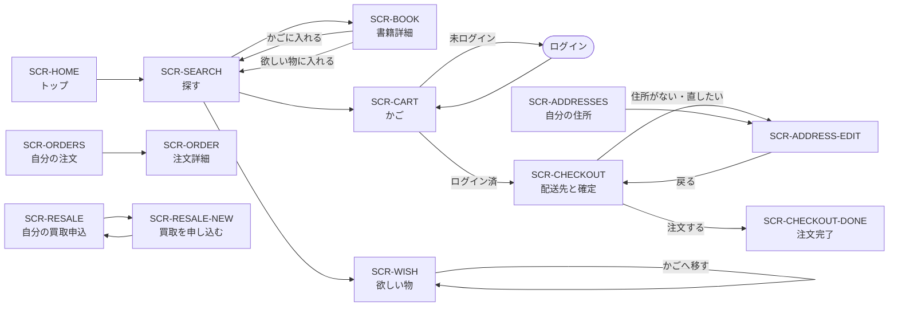
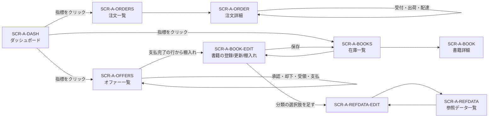

# 画面

この Web アプリケーションが持つ画面の一覧と遷移。`SCR-` は**ワイヤーフレーム文書との接続点**であり、
**画面の増減はこの一覧を正とする**。

誰がこれらの画面を使うかは [アクター](../product/actors.md) にある。

## 1. 画面一覧

`SCR-` はワイヤーフレーム文書との接続点である。**画面の増減はこの表を正とする。**

### 1.1 店頭（顧客向け）

| 画面 | 名称 | 経路 | ログイン | 主なユースケース |
| --- | --- | --- | --- | --- |
| [`SCR-HOME`](wireframes/customer/SCR-HOME.html) | トップ | `/` | 不要 | [UC-CUST-01](use-cases/customer-browse.md) |
| [`SCR-SEARCH`](wireframes/customer/SCR-SEARCH.html) | 書籍を探す | `/Search` | 不要 | [UC-CUST-02](use-cases/customer-browse.md) |
| [`SCR-BOOK`](wireframes/customer/SCR-BOOK.html) | 書籍の詳細 | `/Search/Details/{id}` | 不要 | [UC-CUST-03](use-cases/customer-browse.md) |
| [`SCR-CART`](wireframes/customer/SCR-CART.html) | 買い物かご | `/ShoppingCart` | 不要 | [UC-CUST-06〜07](use-cases/customer-cart.md) |
| [`SCR-WISH`](wireframes/customer/SCR-WISH.html) | 欲しい物リスト | `/Wishlist` | 不要 | [UC-CUST-08〜11](use-cases/customer-cart.md) |
| [`SCR-CHECKOUT`](wireframes/customer/SCR-CHECKOUT.html) | 配送先の選択と注文確定 | `/Checkout` | **必要** | [UC-CUST-12](use-cases/customer-checkout.md) |
| [`SCR-CHECKOUT-DONE`](wireframes/customer/SCR-CHECKOUT-DONE.html) | 注文完了 | `/Checkout/Finished` | **必要** | [UC-CUST-13](use-cases/customer-checkout.md) |
| [`SCR-ADDRESSES`](wireframes/customer/SCR-ADDRESSES.html) | 自分の住所 | `/Address` | **必要** | [UC-CUST-14](use-cases/customer-checkout.md) |
| [`SCR-ADDRESS-EDIT`](wireframes/customer/SCR-ADDRESS-EDIT.html) | 住所の登録／更新 | `/Address/Create`, `/Address/Update/{id}` | **必要** | [UC-CUST-15〜16](use-cases/customer-checkout.md) |
| [`SCR-ORDERS`](wireframes/customer/SCR-ORDERS.html) | 自分の注文 | `/Orders` | **必要** | [UC-CUST-18](use-cases/customer-orders.md) |
| [`SCR-ORDER`](wireframes/customer/SCR-ORDER.html) | 注文の詳細 | `/Orders/Details/{id}` | **必要** | [UC-CUST-19](use-cases/customer-orders.md) |
| [`SCR-RESALE`](wireframes/customer/SCR-RESALE.html) | 自分の買取申込 | `/Resale` | **必要** | [UC-CUST-22](use-cases/customer-resale.md) |
| [`SCR-RESALE-NEW`](wireframes/customer/SCR-RESALE-NEW.html) | 買取を申し込む | `/Resale/Create` | **必要** | [UC-CUST-21](use-cases/customer-resale.md) |
| [`SCR-PRIVACY`](wireframes/customer/SCR-PRIVACY.html) | プライバシー | `/Home/Privacy` | 不要 | — |
| [`SCR-ERROR`](wireframes/customer/SCR-ERROR.html) | エラー | `/Home/Error` ほか | 不要 | [横断的な約束事](conventions.md) §5 |

### 1.2 管理（スタッフ向け）

すべて**管理者グループに属していること**が条件。満たさない場合は画面に到達できない。

| 画面 | 名称 | 経路 | 主なユースケース |
| --- | --- | --- | --- |
| [`SCR-A-DASH`](wireframes/admin/SCR-A-DASH.html) | ダッシュボード | `/Admin/Dashboard` | [UC-STAFF-01](use-cases/staff-dashboard.md) |
| [`SCR-A-ORDERS`](wireframes/admin/SCR-A-ORDERS.html) | 注文一覧 | `/Admin/Orders`（管理画面の既定） | [UC-STAFF-02](use-cases/staff-orders.md) |
| [`SCR-A-ORDER`](wireframes/admin/SCR-A-ORDER.html) | 注文の詳細 | `/Admin/Orders/Details/{id}` | [UC-STAFF-03〜06](use-cases/staff-orders.md) |
| [`SCR-A-OFFERS`](wireframes/admin/SCR-A-OFFERS.html) | 買取オファー一覧 | `/Admin/Offers` | [UC-STAFF-07〜11](use-cases/staff-offers.md) |
| [`SCR-A-BOOKS`](wireframes/admin/SCR-A-BOOKS.html) | 在庫一覧 | `/Admin/Inventory` | [UC-STAFF-12](use-cases/staff-catalog.md) |
| [`SCR-A-BOOK`](wireframes/admin/SCR-A-BOOK.html) | 書籍の詳細 | `/Admin/Inventory/Details/{id}` | [UC-STAFF-13](use-cases/staff-catalog.md) |
| [`SCR-A-BOOK-EDIT`](wireframes/admin/SCR-A-BOOK-EDIT.html) | 書籍の登録／更新／棚入れ | `/Admin/Inventory/Create`, `/Update/{id}`, `/CreateFromOffer/{id}` | [UC-STAFF-14〜16](use-cases/staff-catalog.md) |
| [`SCR-A-REFDATA`](wireframes/admin/SCR-A-REFDATA.html) | 参照データ一覧 | `/Admin/ReferenceData` | [UC-STAFF-17](use-cases/staff-catalog.md) |
| [`SCR-A-REFDATA-EDIT`](wireframes/admin/SCR-A-REFDATA-EDIT.html) | 参照データの登録／改名 | `/Admin/ReferenceData/Create`, `/Update/{id}` | [UC-STAFF-18〜19](use-cases/staff-catalog.md) |
| [`SCR-A-ERROR`](wireframes/admin/SCR-A-ERROR.html) | エラー（管理） | `/Admin/Error` | [横断的な約束事](conventions.md) §5 |

> **[`SCR-A-BOOK-EDIT`](wireframes/admin/SCR-A-BOOK-EDIT.html) は 1 画面 3 モード**である。ただし**版面は 2 つ**でよい。
> 「新規登録」と「更新」は同じ見出し・同じ項目で、初期値の有無だけが違う。
> 「オファーからの棚入れ」だけが書き換えられる項目を変える（[ユースケース](use-cases/staff-catalog.md) §2）。

## 2. 画面遷移

> この図は合意のための**使い捨てのプロジェクション**である。正はこのページの画面一覧と各ユースケースの記述。

### 2.1 店頭

**常時到達できる導線（ヘッダ）**: 探す／欲しい物／かごは常に。注文一覧と買取申込は**ログイン時のみ**表示。
自分の住所へは、ヘッダの利用者名から到達する。

### 2.2 管理

**ダッシュボードは「数える画面」であると同時に「仕事を配る画面」**である。
各指標が、その指標に一致する絞り込み済み一覧へ直接つながる（[ユースケース](use-cases/staff-dashboard.md)）。

## 3. 店頭と管理の関係

同一の利用者が両方を使いうる。スタッフとしてログインしている間も、店頭側の画面はそのまま使える
（ヘッダに「管理画面へ」の導線が現れる）。

**店頭と管理を分けているのは照会の作法である。**
店頭側の照会は必ず本人の主体識別子で絞り込まれ、管理側は絞り込まない
（[RULE-ACCESS-01 / 02](rules.md)）。
